# Manual test report — Issue #204: share your full setup

| | |
|---|---|
| **Date** | 2026-08-23 |
| **Issue** | [#204 — Surface "Share your full setup" (question set + all lists) as a first-class feature](https://github.com/timgent/pack-me-up/issues/204) |
| **PR** | _(to be linked when raised)_ |
| **Branch under test** | `claude/issue-204-3s3gun` @ `9d14341` |
| **Tester** | Claude Code (agent), driving a real Chromium against a production build |
| **Result** | ✅ All success criteria met. Two issues found during the walkthrough were fixed and re-verified (§8); one pre-existing nav-crowding observation (§9). |

## How this was tested

Not a mocked render: the built app (`npm run build`, served by `vite preview` on
`http://localhost:4173`) driven in a real Chromium, against a real
[Community Solid Server](https://github.com/CommunitySolidServer/CommunitySolidServer)
on `http://localhost:4001`. Two real pod accounts were used so the share could be
checked from both ends:

| Role | Pod | WebID |
|---|---|---|
| **User A** (shares) | `guser` | `http://localhost:4001/guser/profile/card#me` |
| **User B** (receives) | `collabuser` | `http://localhost:4001/collabuser/profile/card#me` |

Every browser context started empty — no local data, no session, no storage. The
sign-in half was the real OIDC flow (provider selector → CSS login → consent →
callback), not a stubbed session.

Viewports: **1280×900** (desktop) and **390×844** (iPhone-class phone).

---

## 1. The entry point is discoverable, logged out

`Sharing` is now in the top nav for signed-out visitors too — it used to be
hidden behind `isLoggedIn`, which is exactly what made whole-setup sharing
invisible.

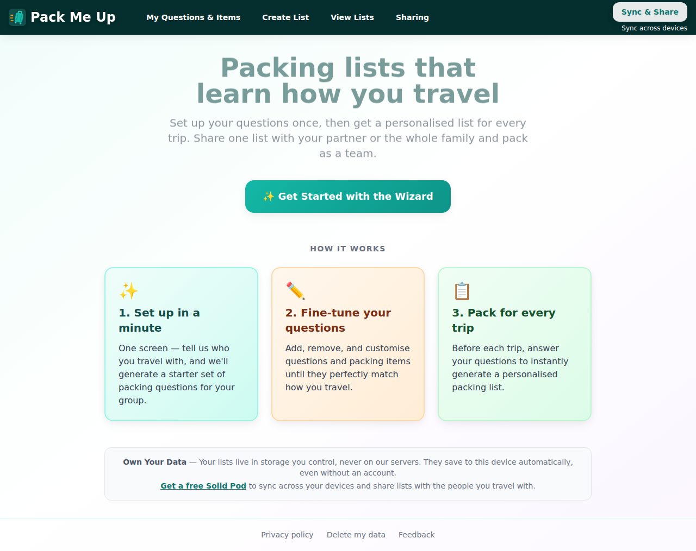

Following it lands on a page that leads with the benefit rather than a wall:

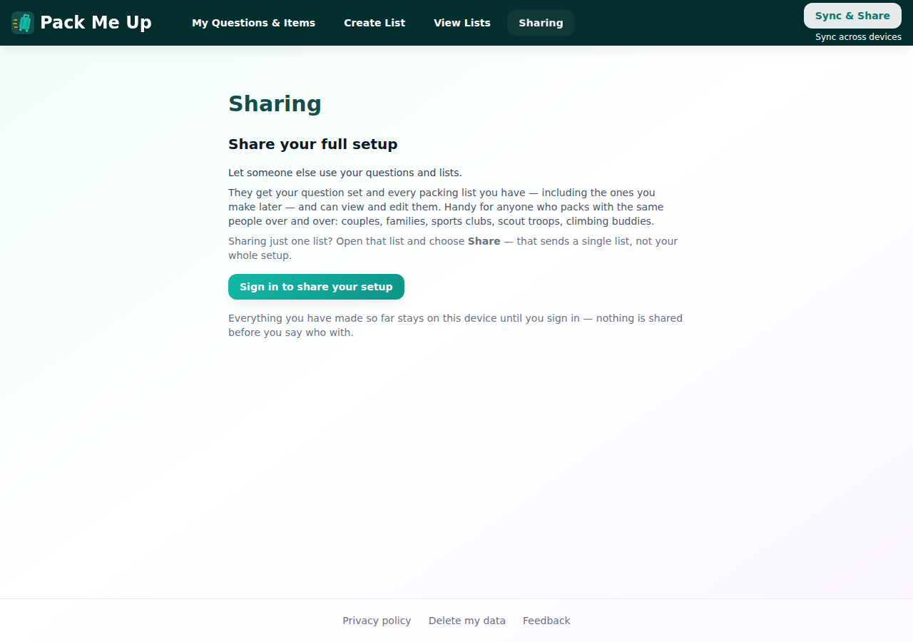

> **Share your full setup**
> Let someone else use your questions and lists.
> They get your question set and every packing list you have — including the ones
> you make later — and can view and edit them. Handy for anyone who packs with the
> same people over and over: couples, families, sports clubs, scout troops,
> climbing buddies.
> Sharing just one list? Open that list and choose **Share** — that sends a single
> list, not your whole setup.

The old copy — *"Please log in to manage sharing settings."* — is gone.

✅ *A discoverable "share your full setup" entry point exists in settings.*

---

## 2. Logged-out users get the benefit-framed sign-in, not a dead end

**Sign in to share your setup** opens the contextual prompt from #202, framed
around this payoff:

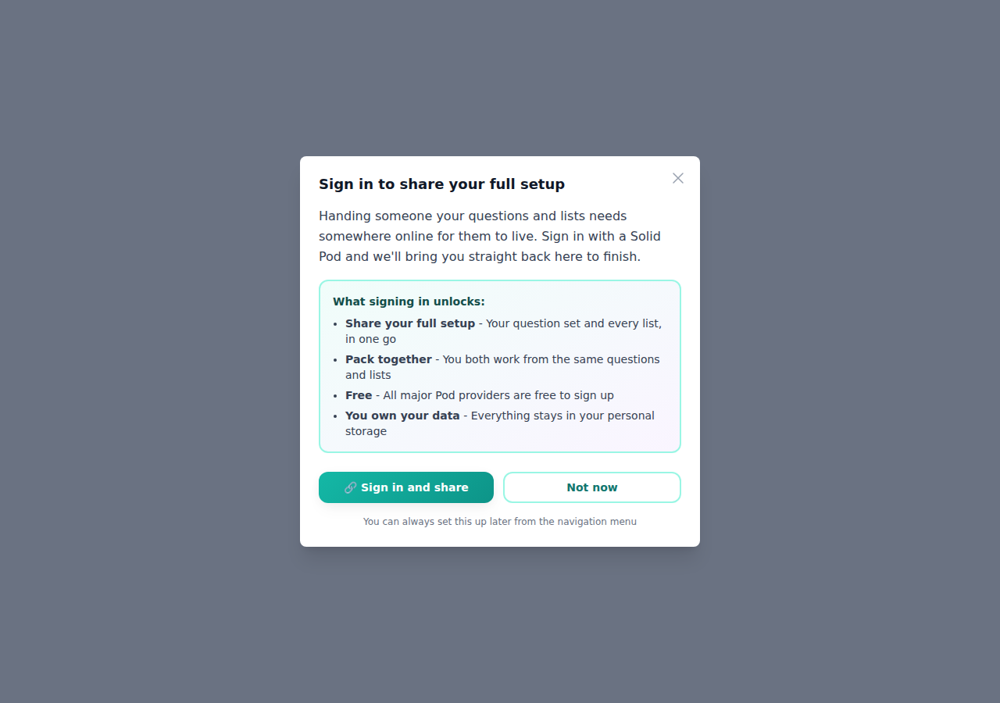

Backing out with **Not now** closes it and leaves nothing behind — `sessionStorage`
holds no `pending-sign-in-action`, asserted in the run:

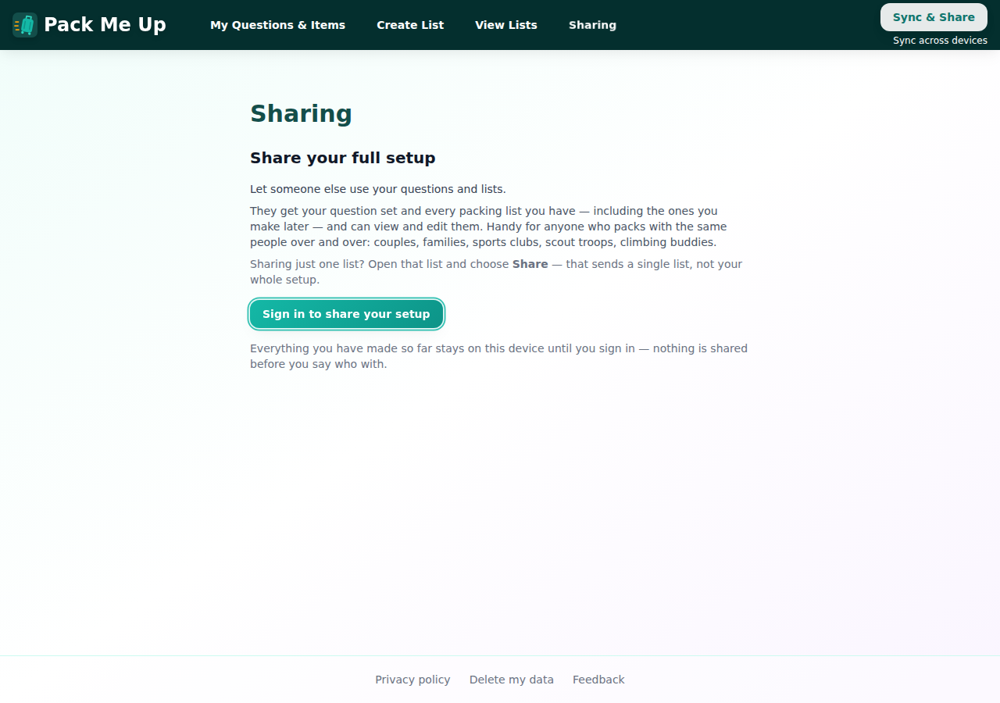

✅ *Logged-out users are routed to benefit-framed sign-in first.*

---

## 3. Signing in brings you back to where you were going

Going through the prompt again and completing the real CSS login returns to
`#/sharing` with the WebID field already focused (green focus ring), so the
intent survives the round trip to the provider:

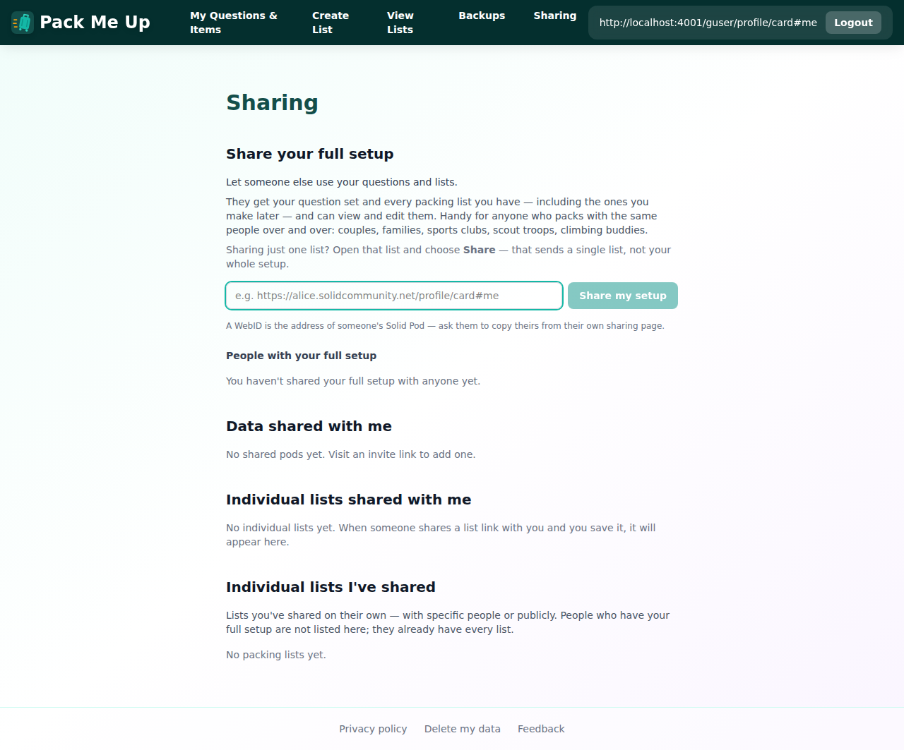

The pending action is consumed, so a later visit does not steal focus again
(covered by unit test *"picks the share back up once the user returns signed in"*).

---

## 4. Signed in: the same pitch, with the controls

After running the wizard and creating a list ("Alps hut trip"), the signed-in
page shows the identical framing plus the WebID field, a short explanation of
what a WebID is, and the people-with-access list:

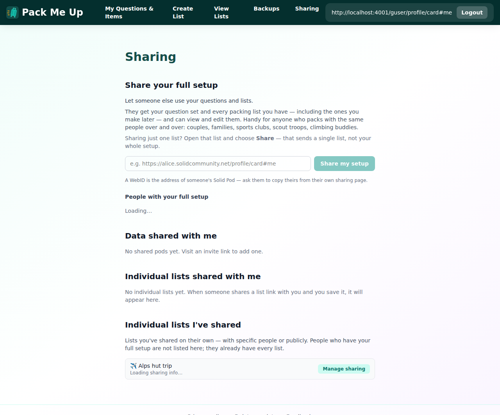

---

## 5. Sharing end to end, with a clear confirmation

Entering User B's WebID and pressing **Share my setup**:

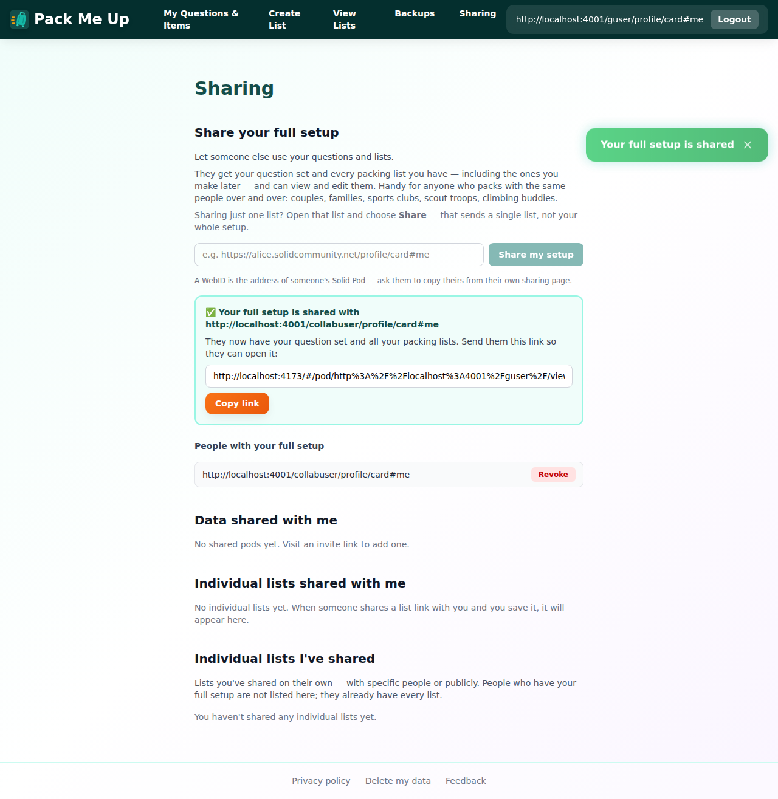

> ✅ **Your full setup is shared with http://localhost:4001/collabuser/profile/card#me**
> They now have your question set and all your packing lists. Send them this link
> so they can open it:

The confirmation names *who* it went to and *what* they got, with the invite link
in a selectable field. **Copy link** puts it on the clipboard — verified by
reading `navigator.clipboard.readText()` back and comparing it to the field, plus
the toast:

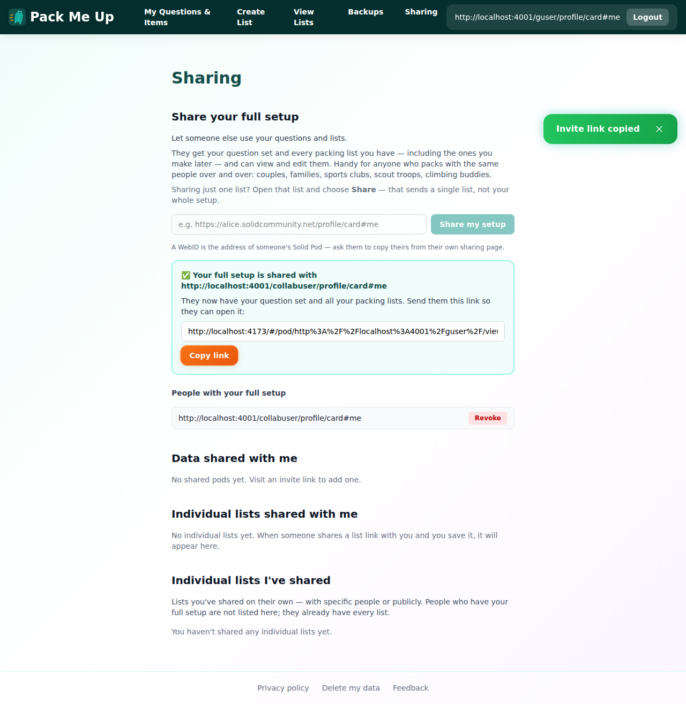

After a full page reload the collaborator persists under **People with your full
setup**, with a Revoke button — so the grant really is on the pod, not just in
component state:

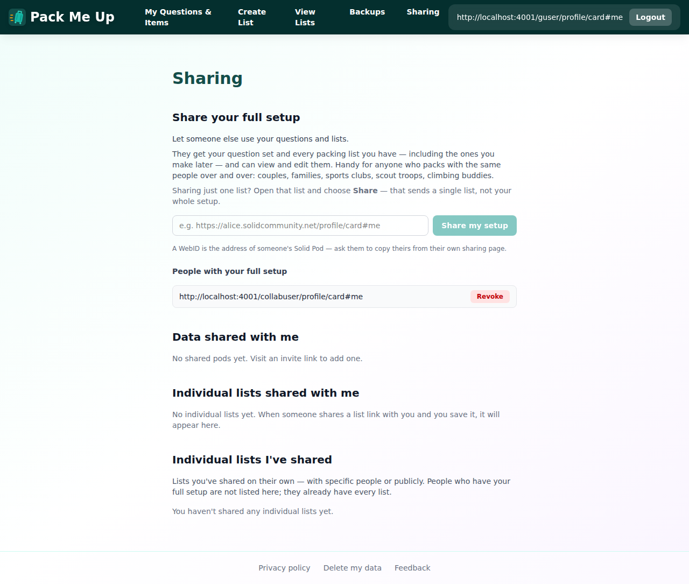

✅ *Logged-in users can share their full question set + lists end-to-end with clear confirmation.*

---

## 6. The other person actually receives both halves

User B signed in on their own pod in a separate browser context and opened the
invite link. They see User A's **lists**:

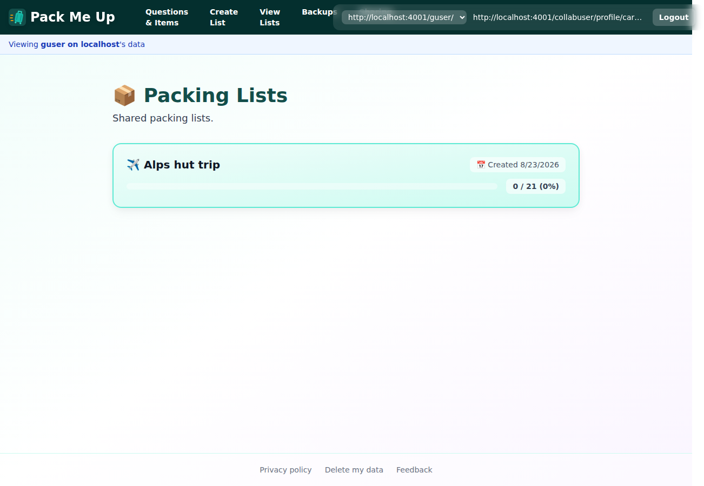

…and User A's **question set**, in full:

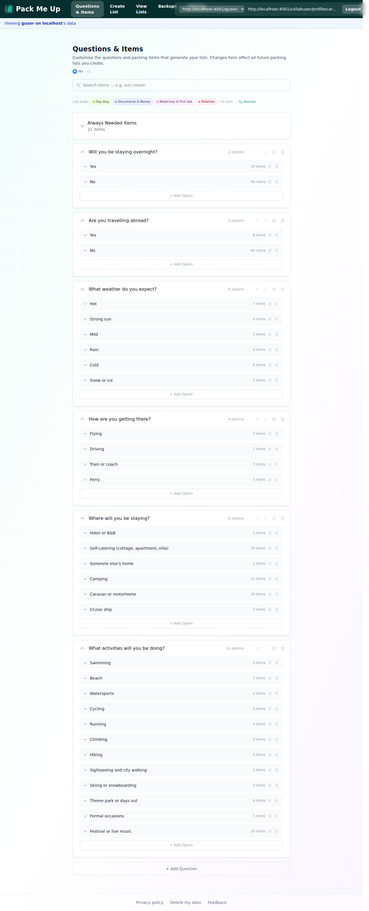

That is the whole claim of the feature — questions *and* lists, in one action —
confirmed from the receiving side rather than inferred from an ACL call.

---

## 7. Mobile (390×844)

Signed in, the WebID field and button stack instead of squeezing, and the page
does not scroll horizontally (asserted: `scrollWidth - clientWidth <= 0`):

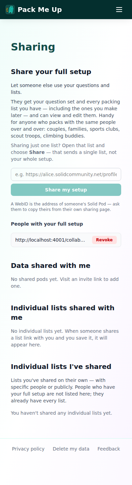

Logged out, `Sharing` is reachable in the hamburger menu:

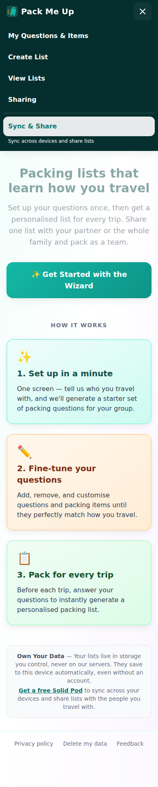

…leading to the same benefit-framed page and prompt, both fitting the viewport:

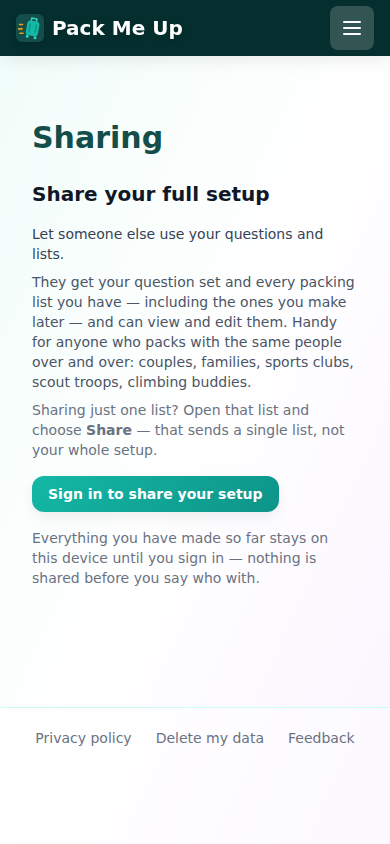

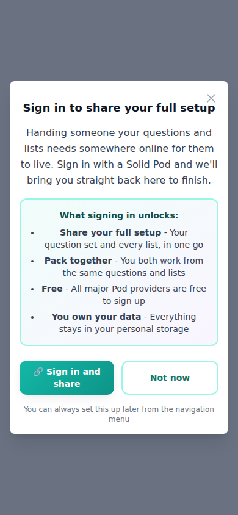

✅ *Verified on desktop and on mobile at 390px.*

---

## 8. Bugs found (and fixed in this branch)

Two things the unit tests could not see, both found by driving the real app:

1. **A full-setup share made every list look individually shared.** The whole-set
   grant sits on the `pack-me-up/` container with `acl:default`, so the ACL check
   on each child list reported the same person. "Alps hut trip" therefore appeared
   under *Individual lists I've shared — 👤 1 person* immediately after sharing the
   setup, which is precisely the distinction success criterion 5 asks the UI to
   draw. Fixed: section 4 subtracts the full-setup collaborators before deciding
   whether a list is individually shared, and now says *"People who have your full
   setup are not listed here; they already have every list."* Screenshot §7 shows
   the corrected state (`You haven't shared any individual lists yet.`).
2. **The success toast still spoke the plumbing's language** — *"Access granted
   successfully"* on a screen that now talks about setups. Now *"Your full setup is
   shared"*, and the failure path reads *"Failed to share your setup: …"*.

Both are pinned by unit tests (`sharing-settings.test.tsx` → *"does not count a
full-setup collaborator as an individual list share"*, *"confirms the share in the
language of the feature, not the plumbing"*) and re-verified in the app afterwards.

## 9. Observation, not a bug

At 1280px, when signed in *and* viewing a shared pod, the nav's pod switcher and
WebID chip overlap the `Sharing` link (visible in §6's first screenshot). This is
pre-existing crowding in the logged-in desktop nav — the `Sharing` link was
already there before this change — and only shows up with a long WebID plus a
context switcher. Worth a separate issue if it bothers anyone; it does not affect
the logged-out entry point, which is what this issue is about.

---

## Automated checks

| Check | Result |
|---|---|
| `npm test` (typecheck + vitest) | ✅ 1723 passed / 91 files |
| `npx eslint` on changed files | ✅ clean |
| `npm run build` | ✅ builds |
| Scripted walkthrough (throwaway Playwright spec, deleted after the run) | ✅ 2 passed |

New unit coverage added with the change:

- `pendingSignInAction.test.ts` — the `share-full-setup` intent round-trips.
- `sharing-settings.test.tsx` — 11 tests across the heading, the what-gets-shared
  copy, relationship-agnostic wording (asserts the page never says "partner"), the
  single-list signpost, the confirmation + clipboard copy, the logged-out
  benefit-framed path, remembering the intent through sign-in, resuming on return,
  and the full-setup/individual-list distinction.
- `Navigation.test.tsx` — the Sharing link stays reachable when logged out.

---

## Success criteria

| Criterion | Result |
|---|---|
| A discoverable "share your full setup" entry point exists in settings/profile | ✅ §1 |
| Logged-in users can share their full question set + lists end-to-end with clear confirmation | ✅ §5, §6 |
| Copy is relationship-agnostic and does not assume "partner" | ✅ §1 (asserted in unit test too) |
| Logged-out users are routed to benefit-framed sign-in first | ✅ §2, §3 |
| The distinction between this and single-list sharing (#203) is clear | ✅ §1, §8.1 |
| Verified on desktop | ✅ §1–§6 |
| Verified on mobile (reachable in settings; usable at 390px) | ✅ §7 |
