# Manual test report — issue #302: nav restructure, profile + account menu

| | |
|---|---|
| **Date** | 2026-08-23 |
| **Issue** | [#302 — Navigation restructure: show profile photo and name, move WebID/Backups/Sharing into an account dropdown](https://github.com/timgent/pack-me-up/issues/302) |
| **PR** | _(linked from the PR description)_ |
| **Branch** | `claude/issue-302-8rib8j` |
| **Commit under test** | `8297323` — *Name the signed-in account in the nav, and put the WebID behind it* |
| **Result** | ✅ **Pass** — all 7 acceptance criteria met. One pre-existing issue found outside this change's scope (see [Bugs found](#bugs-found)). |

---

## How it was tested

| | |
|---|---|
| Build | `npm run build` → `npm run preview` (production bundle, http://localhost:4173) |
| Solid server | Local Community Solid Server on `http://localhost:4000` (`/solid-dev`), in-memory |
| Driver | Playwright with the pre-installed Chromium, driving the real app through the real OIDC login flow |
| Viewports | Desktop **1280×900**, mobile **390×844** |

Two pod accounts, chosen to exercise both sides of the degradation:

| Account | Profile card | What it proves |
|---|---|---|
| `alice` (`http://localhost:4000/alice/profile/card#me`) | `foaf:name "Alice Adams"` + `vcard:hasPhoto` (128×128 PNG, publicly readable) | The good path — photo and name |
| `test` (`http://localhost:4000/test/profile/card#me`) | Exactly as CSS creates it: **no name, no photo** | The fallback — generic icon + pod username |

`test` was also granted collaborator access to `alice`'s `pack-me-up/` container, so foreign-pod
context was exercised against a real shared pod rather than a mocked one.

---

## AC 1 — Product decisions resolved and recorded

Settled with @timgent before any code was written, and
[recorded on the issue](https://github.com/timgent/pack-me-up/issues/302#issuecomment-5388359591):

1. **Create List leaves the nav**, and the foreign lists page gains the "New List" button it never had.
2. **Backups moves into the account menu; Sharing stays top-level** — #204 promoted sharing deliberately.
3. **"View Lists" → "Lists"**.

The issue also mentions moving a theme toggle into the mobile menu. **There is no theme toggle in
this repo** — it existed only on #281's branch — so there was nothing to move.

✅ **Pass.**

---

## AC 2 — Nav shows profile photo + name, degrades gracefully

Signed in as `alice`, whose card carries both. The nav bar draws the photo, ringed, with the name beside it:

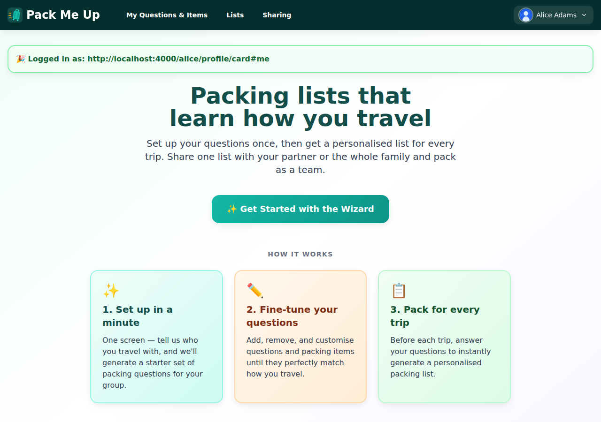

Nav bar text read back from the DOM:

```
Pack Me Up | My Questions & Items | Lists | Sharing | Account menu | Alice Adams
```

The photo is genuinely loaded, not a broken image — `naturalWidth` is 128, matching the PNG in the pod,
and `src` is `http://localhost:4000/alice/profile/alice.png`.

Signed in as `test`, whose card has neither a name nor a photo, the same control degrades to the generic
person icon plus the username the WebID carries — **`test`**, never the WebID:

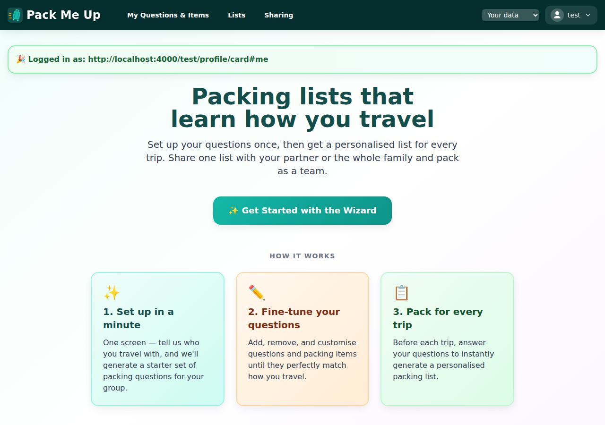

```
Pack Me Up | My Questions & Items | Lists | Sharing | Your data | Alice Adams | Account menu | test
```

(The `Your data / Alice Adams` dropdown is the existing context switcher, kept in the bar rather than
buried in the menu — whose data you are looking at should be answerable without opening anything.)

✅ **Pass**, both the good path and the degradation.

---

## AC 3 — WebID reachable, but not shown raw in the nav bar

Scoped to the nav bar element itself, a search for `/profile/card#me` returns **0 matches** while the
menu is shut. One click into the account menu and it is right there, under "SIGNED IN AS":

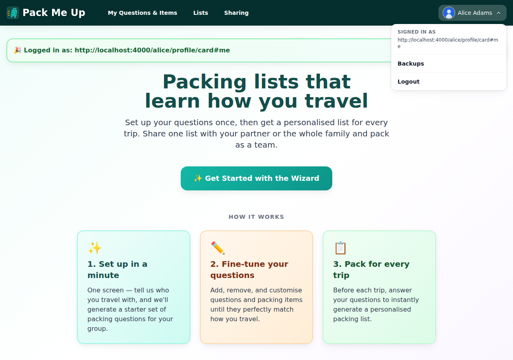

✅ **Pass.**

---

## AC 4 — Account dropdown is keyboard accessible and closes on Escape

Escape while the menu is open closes it **and returns focus to the trigger** — verified by reading
`document.activeElement` back, not just by eye:

```
after Escape, Logout visible?        false
after Escape, focus is the trigger?  true
```

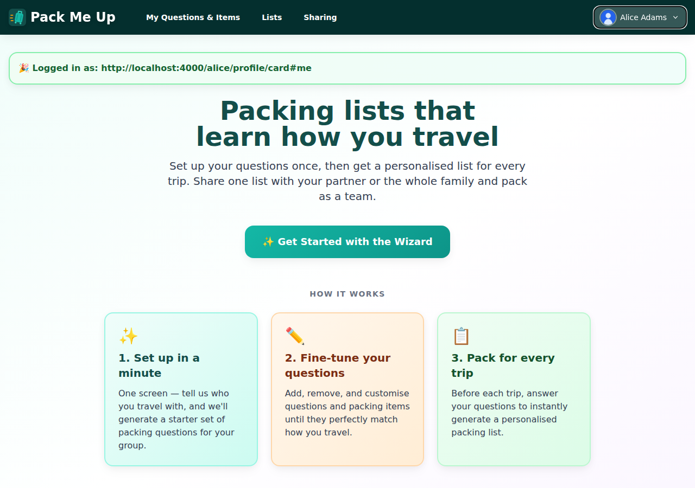

Opened again with the keyboard alone (Enter on the focused trigger), the first Tab lands inside the panel:

```
keyboard-opened, first Tab lands on: Backups
```

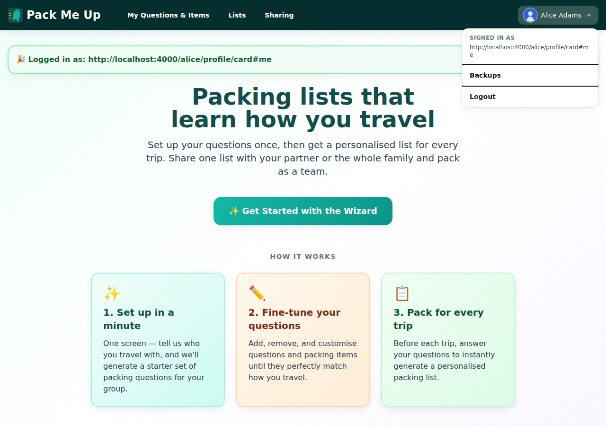

Enter on that item navigates:

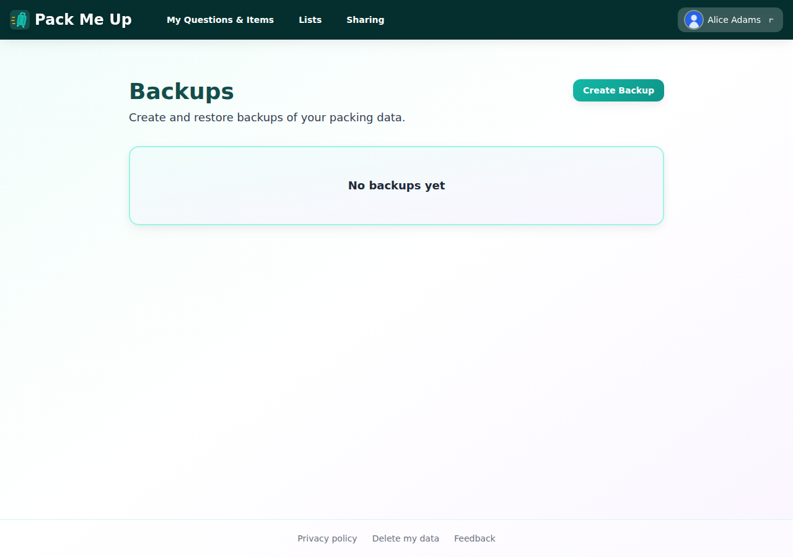

Deliberately **not** a `role="menu"`: that would promise roving arrow keys and a typeahead this does not
implement. It is a disclosure — three controls reached by Tab — and is labelled as one.

✅ **Pass.**

---

## AC 5 — Mobile menu covers the same affordances

At 390×844 the account menu is not in the bar (it is `hidden md:flex`); the hamburger carries it instead.
Opening it shows the profile block, the WebID under "SIGNED IN AS", Backups and Logout — flat, with no
dropdown inside a dropdown:

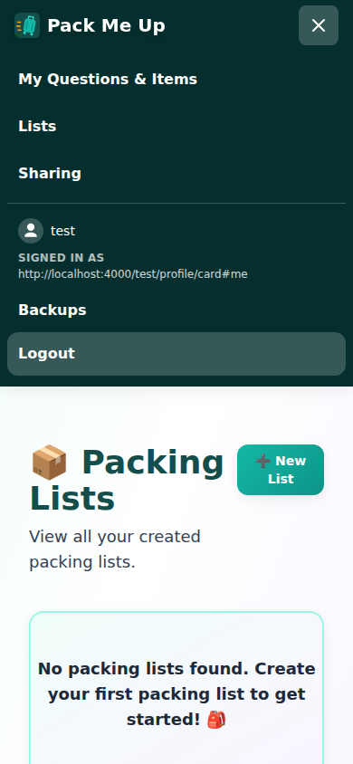

```
My Questions & Items | Lists | Sharing | test | SIGNED IN AS |
http://localhost:4000/test/profile/card#me | Backups | Logout
```

Logging out from there works, and the menu comes back in its signed-out shape:

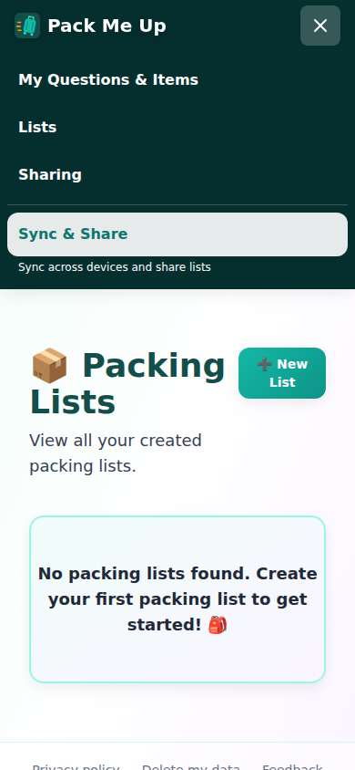

```
My Questions & Items | Lists | Sharing | Sync & Share | Sync across devices and share lists
```

One thing to know rather than a defect: the mobile menu **closes on logout** (it did before this change
too), so "Sync & Share" is behind the hamburger again rather than on screen. The nav bar itself is
correct.

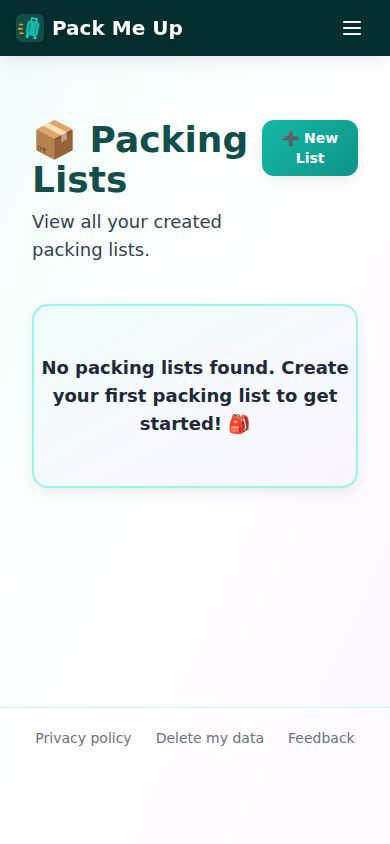

✅ **Pass.**

---

## AC 6 — Profile fetch uses the shared cached path

The nav reads through `getSolidProfile` (`src/services/solidPod.ts`), the same promise-caching,
per-WebID path the person avatars use via `usePersonPhotos` — so the signed-in user's card is fetched
once for the whole app, not once per component mount. Asserted directly in
`Navigation.test.tsx` ("reads the profile through the shared cached path") and by the hook's own tests.

✅ **Pass.**

---

## AC 7 — Tests updated to match

Covered in [Automated checks](#automated-checks) below.

✅ **Pass.**

---

## The three product decisions, exercised in the app

### Create List has left the nav — and Lists is the way in

Signed out, the desktop nav reads `My Questions & Items | Lists | Sharing`. No Create List:

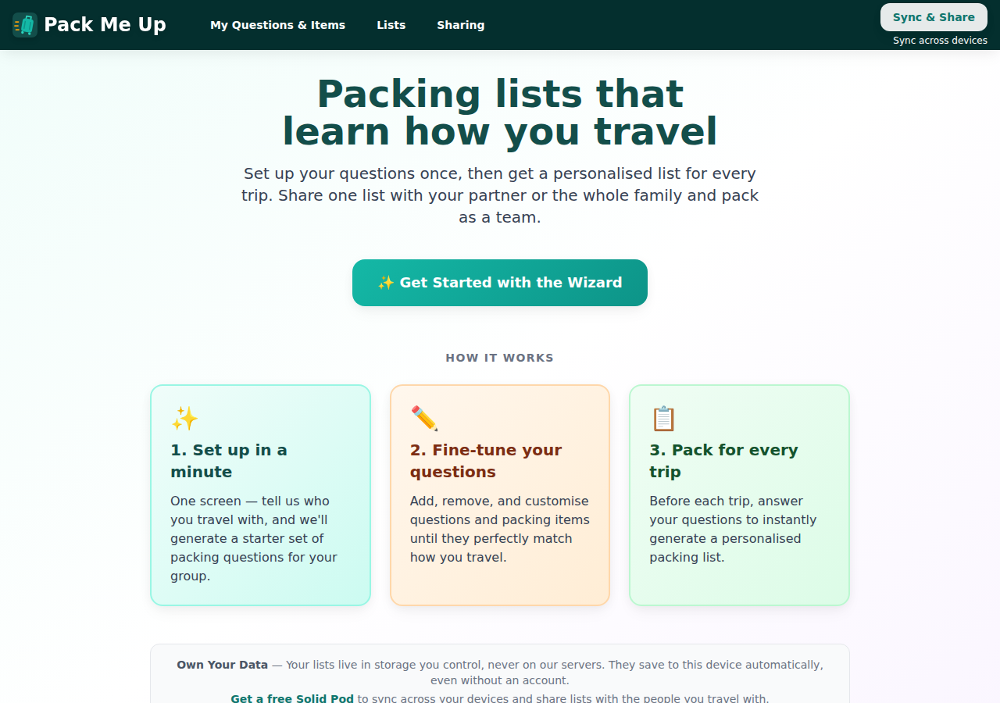

The Lists page carries "➕ New List", which is now the entry point:

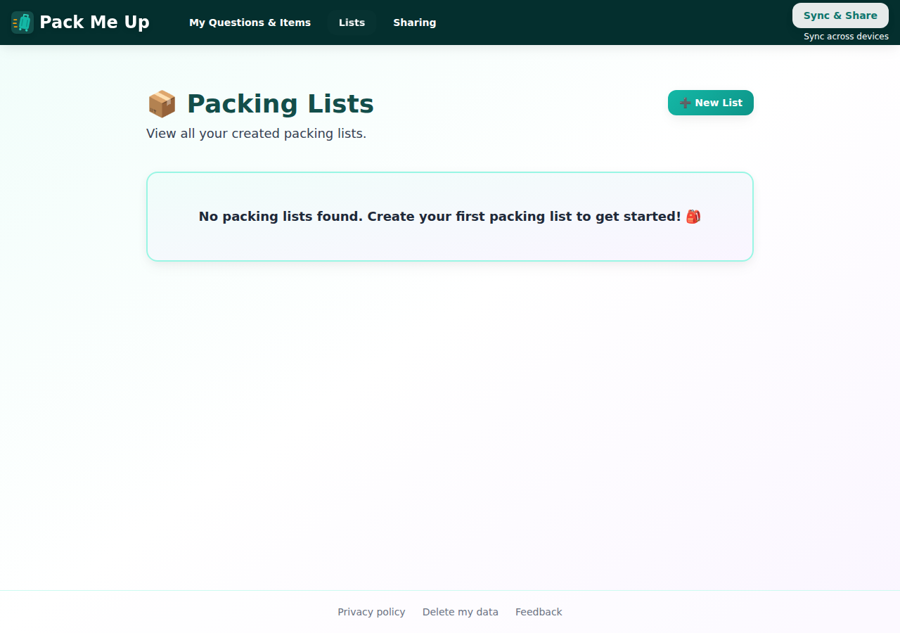

Clicking it lands on `#/create-packing-list`:

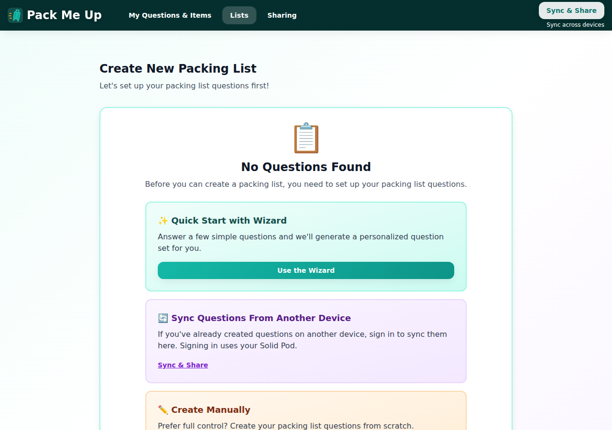

**In foreign-pod context — the gap #281 left.** Viewing Alice's pod as `test`, the page now has the same
button. Before this change there was no create-list affordance here at all: a collaborator could edit a
shared list but never start one.

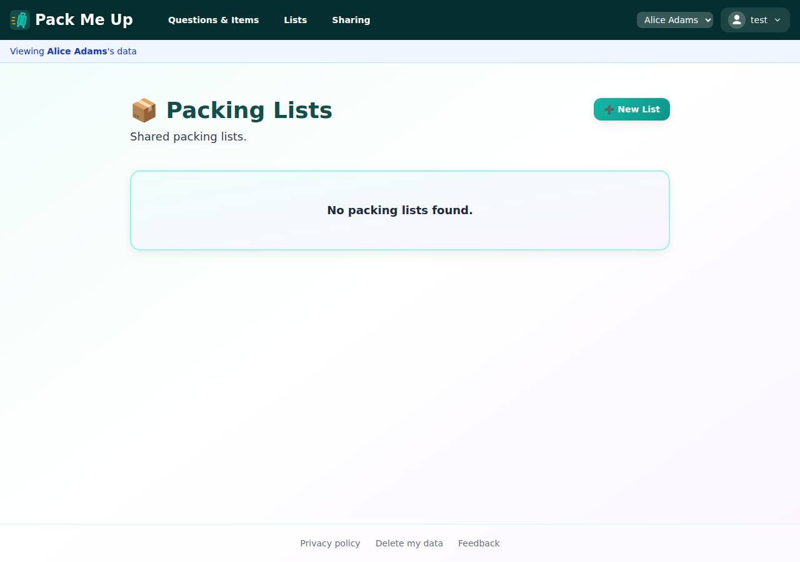

It creates into the pod being viewed, not your own —
`#/pod/http%3A%2F%2Flocalhost%3A4000%2Falice%2F/create-packing-list`:

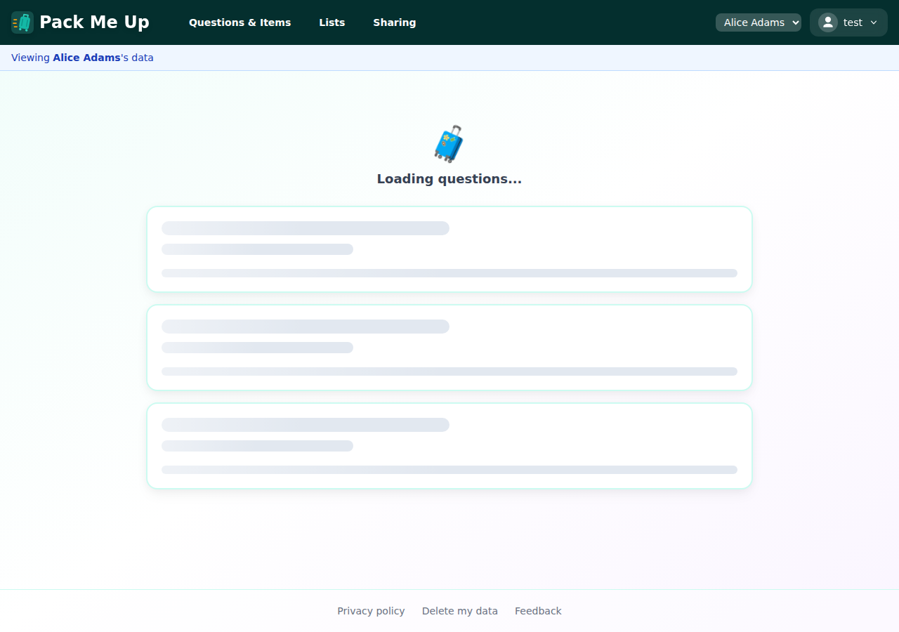

### Backups is in the menu, Sharing stayed in the bar

Visible in every signed-in screenshot above: `Sharing` sits in the link row; `Backups` is one click into
the account menu.

### "View Lists" is now "Lists"

Visible in the nav of every screenshot.

---

## Success criteria

| # | Criterion | Result |
|---|---|---|
| 1 | Product decisions resolved and recorded on the issue | ✅ Pass |
| 2 | Nav shows profile photo + name when available, degrades gracefully when not | ✅ Pass |
| 3 | WebID reachable but not shown raw in the nav bar | ✅ Pass |
| 4 | Account dropdown is keyboard accessible and closes on Escape | ✅ Pass |
| 5 | Mobile menu covers the same affordances | ✅ Pass |
| 6 | Profile fetch uses the shared cached path | ✅ Pass |
| 7 | `Navigation.test.tsx` and the navigation e2e spec updated to match | ✅ Pass |

---

## Automated checks

| Check | Command | Result |
|---|---|---|
| Type check + unit tests | `npm test` | ✅ **1803 passed** across 97 files |
| Lint | `npm run lint` | ✅ 0 errors (11 pre-existing warnings, none in files this change touches) |
| Affected e2e suites | `npx playwright test d-navigation e-auth k-schema-compat z-verify-offline-share` | ✅ **14 passed** |
| Full e2e suite | `npx playwright test` | ✅ **88 passed** |

New unit coverage added with this change:

- `podUsernameFromWebId` — 6 cases (CSS/NSS, per-user subdomain, identity-provider WebID, no-username host, service subdomain, junk)
- `useSolidProfile` — 6 cases, including the unauthenticated read and no state write after unmount
- `AccountMenu` / `ProfileBadge` — 11 cases, including Escape + focus return, outside click, and photo `onError` fallback
- `Navigation` — 7 new cases for the account menu, the fallback, and the mobile block
- `foreign-packing-lists` — 2 new cases for the create entry point
- e2e: `D1b`, `E1b`, `E1c` added; `E1`–`E4`, `D1`, `K3`, `Z1` updated for the moved Logout

> **Note on the first full e2e run:** `F6` failed once under 4-worker load, waiting for the transient
> "Saved" indicator to disappear within 8s. It passes on its own and passed on a clean re-run of the
> full suite (88/88). It touches no nav code — the failure is in the questions page's save indicator
> timing, not this change.

---

## Bugs found

**One, pre-existing and outside this change's scope.**

**The landing page still prints the raw WebID.** Directly under the now-fixed nav bar, the landing page
shows a banner reading *"🎉 Logged in as: http://localhost:4000/test/profile/card#me"* — the exact
"developer output standing in for a signed-in state" problem #302 was opened about, on a different
component (`src/pages/landing-page.tsx`, not `Navigation.tsx`). Visible in
[the signed-in](images/04-desktop-signed-in-photo-and-name.png) and
[the fallback](images/09-desktop-fallback-icon-and-username.png) screenshots.

It is not in #302's acceptance criteria and was left alone rather than widening the PR, but it
undercuts the change sitting immediately above it and is worth its own issue. The pieces to fix it
already exist: `useSolidProfile` + `podUsernameFromWebId` + `ProfileBadge`.

**Nothing else.** No defects found in the change under test.
