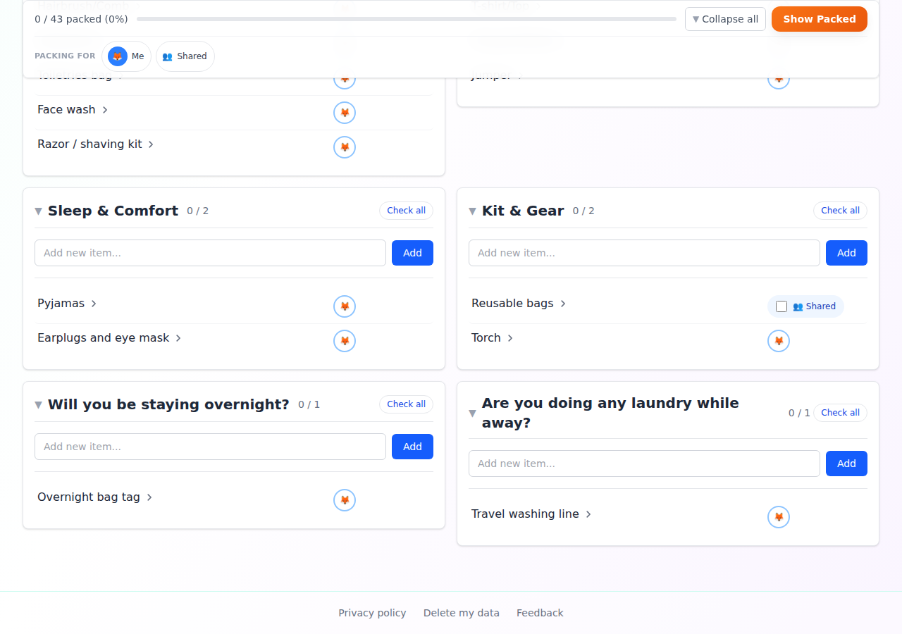
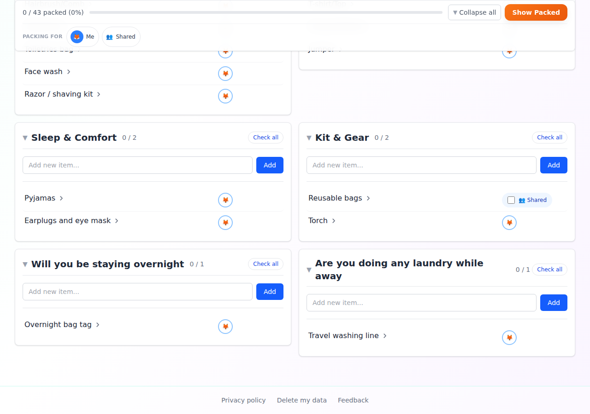
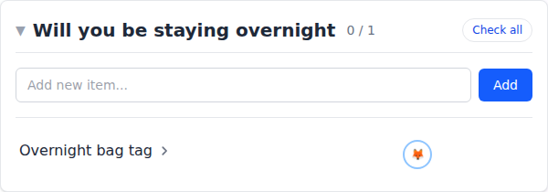
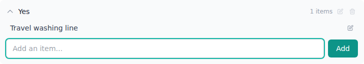
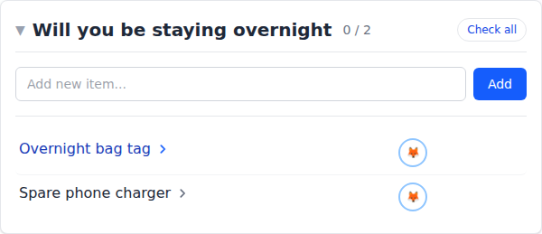
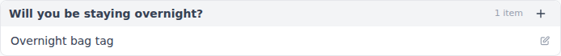
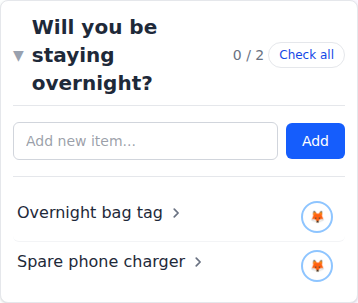
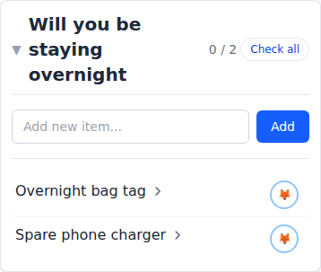
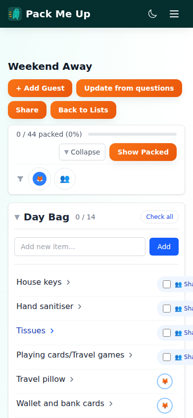

# Manual test report — issue #206: strip trailing "?" from question-text category headings

| | |
|---|---|
| **Date** | 2026-08-24 |
| **Issue** | [#206 — Strip trailing "?" from question-text category headings in generated lists](https://github.com/timgent/pack-me-up/issues/206) |
| **PR** | _(not yet raised — branch pushed for review)_ |
| **Branch** | `claude/pack-me-up-issue-206-j641dr` |
| **Commit under test** | `0e7e340` — *Write question-named section headings without the question mark* |
| **Result** | ✅ **Pass** — every success criterion met. No bugs found. |

---

## How it was tested

| | |
|---|---|
| Build | `npm run build` → `vite preview` (production bundle, http://localhost:4173) |
| Solid server | None. Nothing here touches sign-in or sync — the transform is display-only and the list was created and edited locally |
| Driver | Playwright with the pre-installed Chromium, driving the real built app |
| Viewports | Desktop **1280×900**, mobile **390×844** |
| Data | The wizard's built-in question set for one adult, plus two edits made through the UI (below) |

The walkthrough was a throwaway Playwright script, run on its own and deleted afterwards, so it
never lands in the committed e2e suite.

Out of the box no heading is a question: every item in the built-in template carries a category of
its own, so the question-text fallback never shows. Two edits were made through the editor to
produce the case the issue describes:

1. An item (**Overnight bag tag**) added to the *built-in* question "Will you be staying
   overnight?" in that question's **own default section** — the section named with the question's
   text.
2. A *user-written* question, "Are you doing any laundry while away?", with a Yes answer and one
   item (**Travel washing line**) — no section chosen, so it falls into the question's own section
   too.

Then a list, **Weekend Away**, was generated with Yes to both.

---

## Before

Both cards were headed with the raw question, question mark and all — the same build, with the two
changed files reverted to their previous versions:



Read out of the DOM, the eight headings on that list were:

```
Day Bag, Medicines & First Aid, Toiletries, Clothes, Sleep & Comfort, Kit & Gear,
Will you be staying overnight?, Are you doing any laundry while away?
```

---

## Success criterion 1 — No section heading in a generated list ends with `?`



Same list, same two cards, on the build under test:

```
Day Bag, Medicines & First Aid, Toiletries, Clothes, Sleep & Comfort, Kit & Gear,
Will you be staying overnight, Are you doing any laundry while away
```

Headings ending in `?`: **none**. The other six are untouched, so the only thing that changed is the
two that were questions.

The controls that name the section follow the heading, which matters for anyone using the list by
voice or screen reader — their accessible names came back as:

```
"Collapse Will you be staying overnight list"
"Check all in Will you be staying overnight"
```



---

## Success criterion 2 — User-added questions benefit too, with no extra input

"Are you doing any laundry while away?" was typed into **+ Add Question** during this pass, given a
Yes answer and one item, and nothing else. Its card is headed "Are you doing any laundry while away"
in the screenshot above — no second "short name" field, no migration, nothing asked of the user.

The item was added with no section chosen at all:



---

## Success criterion 3 — Existing list rendering is otherwise unchanged

The transform is display-only: the stored category keeps its question mark, and the two places that
read a card's heading as data now read the section's key instead. The check that this holds is to
type an item into the question-named card and reload:

- **Spare phone charger** typed into the "Will you be staying overnight" card
- After a reload: cards with that heading = **1** (not two), and the card holds the typed item



Had the stored category been stripped instead, the typed item would have started a second card
beside the first with a heading that read identically. That case is pinned by a unit test as well
(`view-packing-list.test.tsx` → "a section named after a question").

The editor is deliberately left showing the stored name — it is the question's own text, sitting
directly under the question, and it is the string the section picker offers:



---

## Mobile

390×844. The heading wraps to three lines rather than truncating, and the count, **Check all** and
the fold chevron all stay on the card:

| Before | After |
|---|---|
|  |  |

The whole list at that width:



---

## Success criteria

| Criterion | Result |
|---|---|
| No section heading in a generated list ends with `?` | ✅ Pass |
| User-added questions benefit without extra input | ✅ Pass |
| Existing list rendering otherwise unchanged | ✅ Pass |
| Headings verified on desktop list view | ✅ Pass |
| Headings verified on mobile (no wrapping/truncation issues) | ✅ Pass — wraps to three lines, nothing clipped |

---

## Automated checks

| Check | Result |
|---|---|
| `npm test` (type check + vitest) | ✅ 1899 passed, 102 files |
| `npm run lint` | ✅ 0 errors (11 pre-existing warnings, none in the changed lines) |
| `npm run build` | ✅ built |

New tests: `src/utils/sectionHeading.test.ts` (6), plus "a section named after a question" in
`view-packing-list.test.tsx` (3) and one case in `AddItemComposer.test.tsx`.

---

## Bugs found

**None** attributable to this change.

One pre-existing observation, unrelated: at 390px the "👥 Shared" chips on the Day Bag card are
clipped at the right edge of the viewport. It is identical on the before build (compare
`01-before-desktop.png`'s mobile counterpart — both runs produced the same clipping), so it is not
caused by this change and was left alone.
