# Manual test report — issue #299: card click-to-open plus a Duplicate/Delete kebab menu

| | |
|---|---|
| **Date** | 2026-08-24 |
| **Issue** | [#299 — Rework packing list cards: click-to-open plus a Duplicate/Delete kebab menu](https://github.com/timgent/pack-me-up/issues/299) |
| **PR** | _(linked from the PR description)_ |
| **Branch** | `claude/issue-workflow-automation-jkx7na` |
| **Commit under test** | `920f8c8` — *Gather packing list card actions behind a kebab menu* |
| **Result** | ✅ **Pass** — every acceptance criterion met. No bugs found. |

---

## How it was tested

| | |
|---|---|
| Build | `npm run build` → `npm run preview` (production bundle, http://localhost:4173) |
| Solid server | Local Community Solid Server on `http://localhost:4001` (e2e global setup). Not signed in for this pass — every action on the card is local-first, and the pod paths are covered by the F and G e2e suites |
| Driver | Playwright with the pre-installed Chromium, driving the real built app |
| Viewports | Desktop **1280×900**, mobile **390×844** |
| Themes | Light and dark (dark via the app's own stored `theme` preference) |
| Data | Two lists — *Iceland Road Trip* and *Weekend in Bath* — created through the wizard, 21 items each |

The walkthrough was a throwaway Playwright spec under `e2e/tests/`, run on its own and deleted
afterwards, so it never lands in the committed suite.

---

## What changed

The three sibling action buttons on each card (`✏️ Rename`, `📋 Duplicate`, `🗑️ Delete`), each
stopping its own click from reaching the card underneath, are gone. In their place is one kebab
button opening a portalled Radix dropdown with **Rename**, **Duplicate** and **Delete**.

**Before** — three buttons on the card, three `stopPropagation` handlers.
**After** — one kebab, one menu:

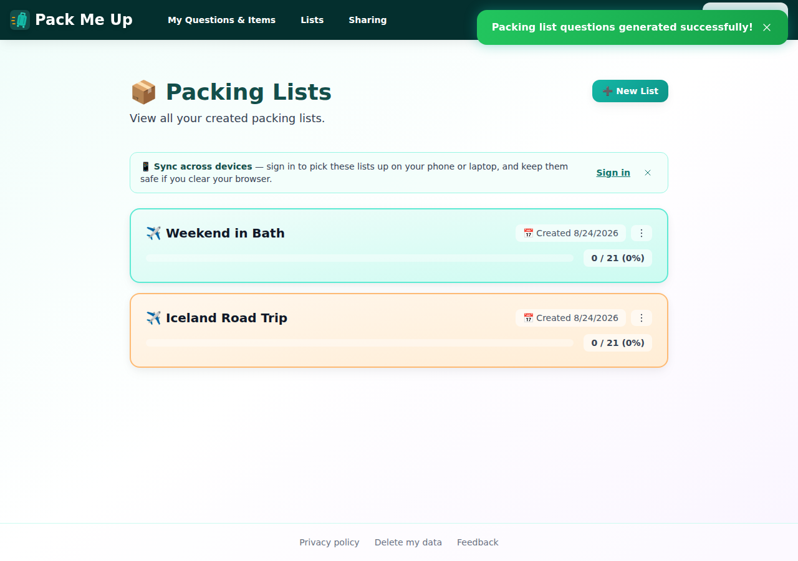

---

## AC 1 — Clicking the card body navigates to the list; clicking the kebab does not

The kebab opens the menu and the URL stays on `#/view-lists`:


Clicking the card body — both the title and empty space at the card's top-left corner — opens the
list:

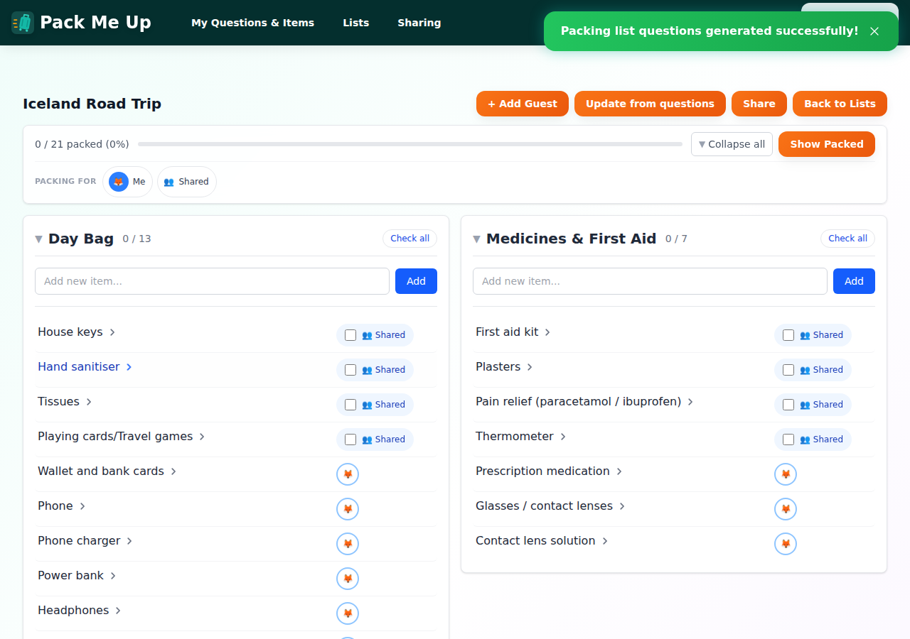

Choosing an item from the menu does not open the list either. This is worth calling out because the
menu is rendered through a React portal, and a portal still propagates events **up the React tree**
even though the menu sits outside the card in the DOM — so the card's `onClick` would otherwise fire
on every menu item click. The menu stops that at the content, once, rather than once per action.

**Unhappy path:** while the menu is open, a click on the *other* card only dismisses the menu — it
does not open that list. Radix's modal layer takes pointer events off the rest of the page while the
menu is up, which Playwright reported as `<html> intercepts pointer events` when a normal
`.click()` was attempted; a raw `page.mouse.click()` at the same coordinates dismissed the menu and
left the URL unchanged.


---

## AC 2 — Dropdown offers Duplicate and Delete, is keyboard navigable, closes on Escape

The menu carries **Rename, Duplicate, Delete** — Rename joins them because it was a third loose
button on the card doing the same `stopPropagation` dance.

Arrow keys move the highlight through the items:

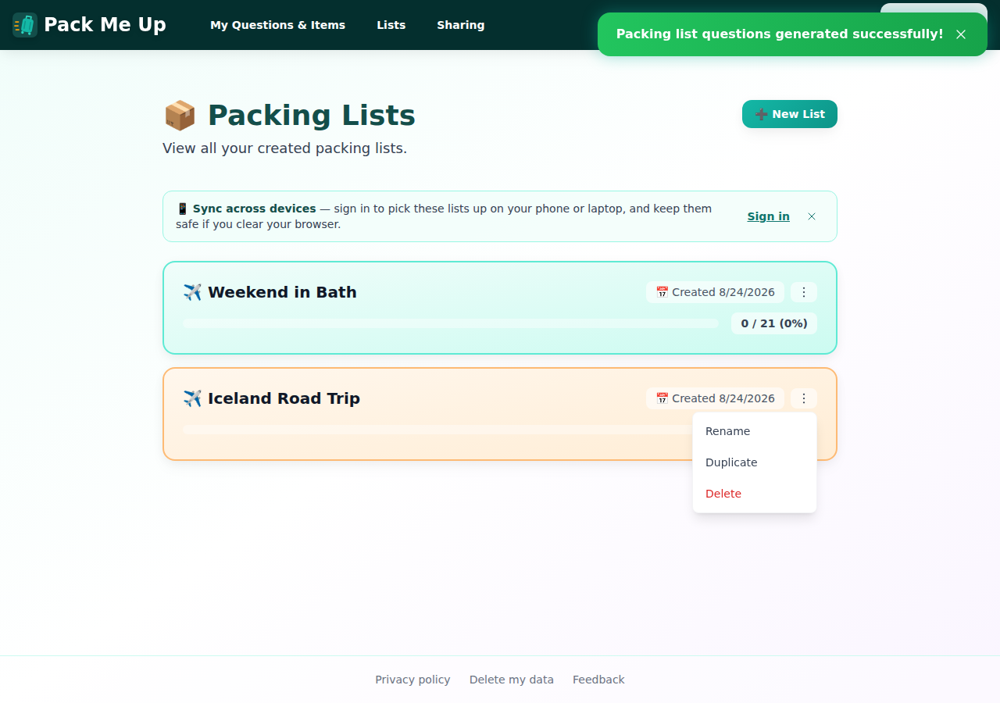

Escape closes the menu, and does not open the list:

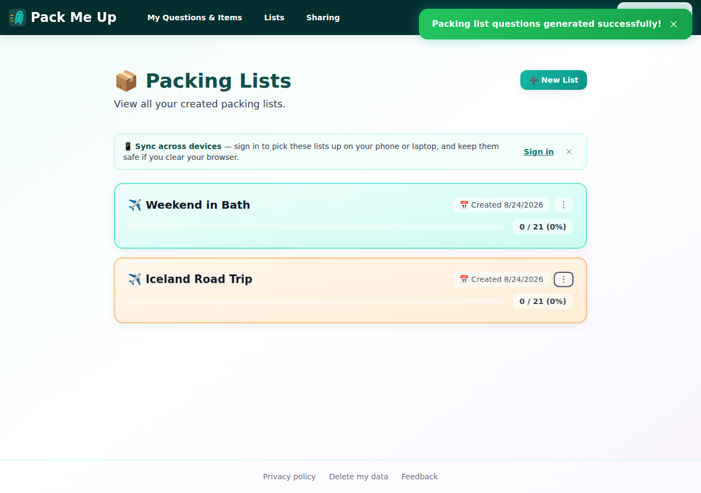

---

## AC 3 — Delete confirmation names the list and is required

**Duplicate** puts "Copy of Iceland Road Trip" at the top of the list:

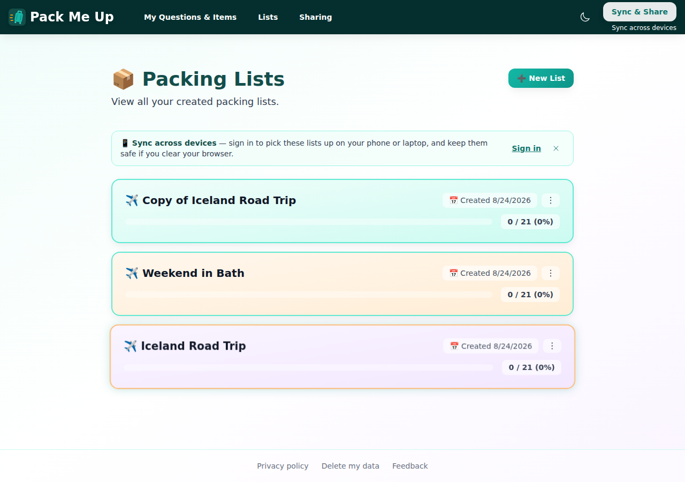

**Rename** opens the modal pre-filled with the current name:

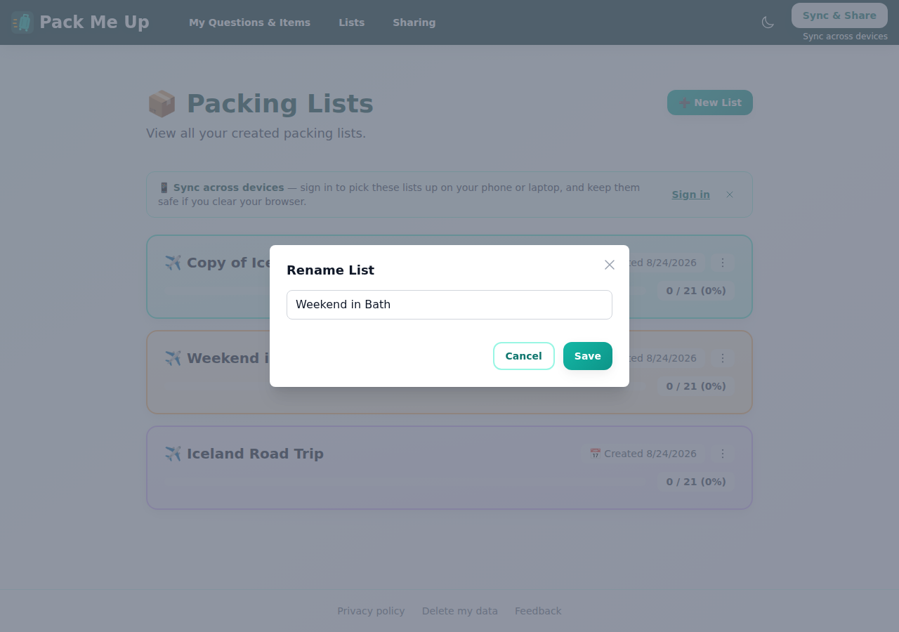

**Delete** names the list in the confirmation:

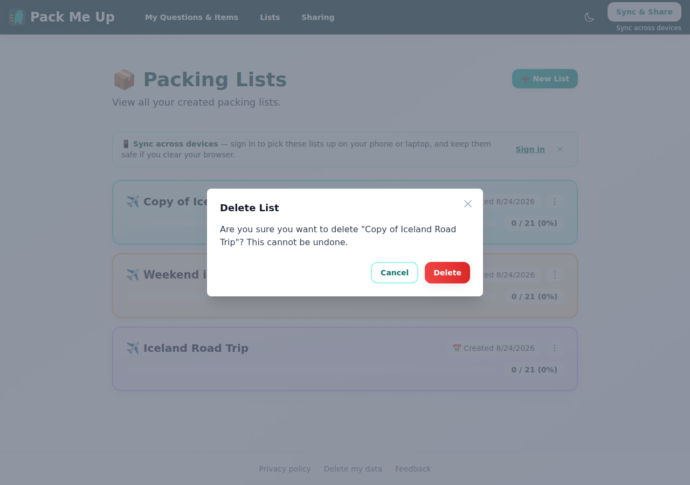

Cancel leaves the list in place…


…and only confirming removes it:

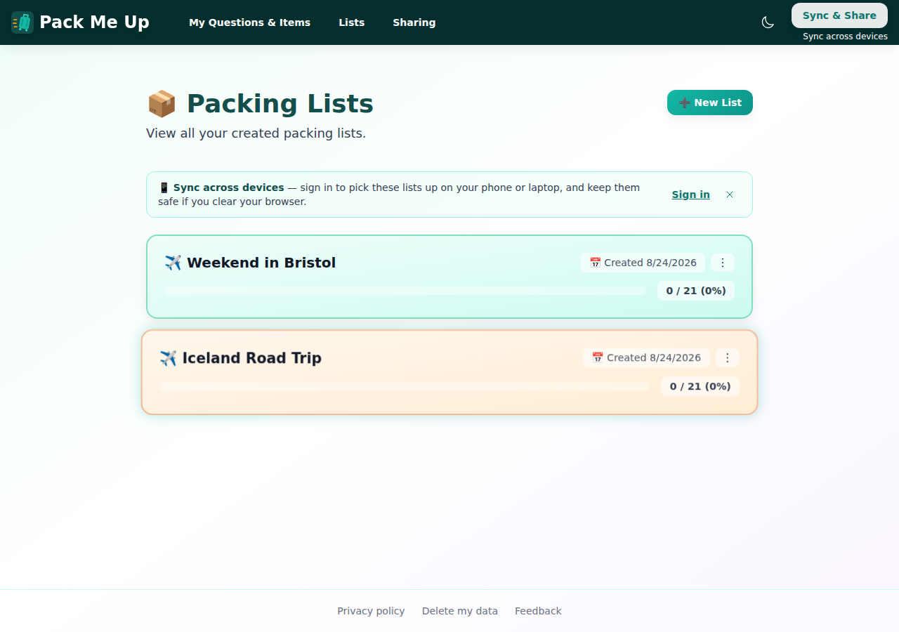

---

## Dark mode

Both of the dark-mode faults the issue asked to be fixed on the re-land were checked.

**The kebab is visible in dark mode** — it uses `bg-white/60 dark:bg-white/10` with a
`dark:text-gray-200` glyph, not a white-only badge:

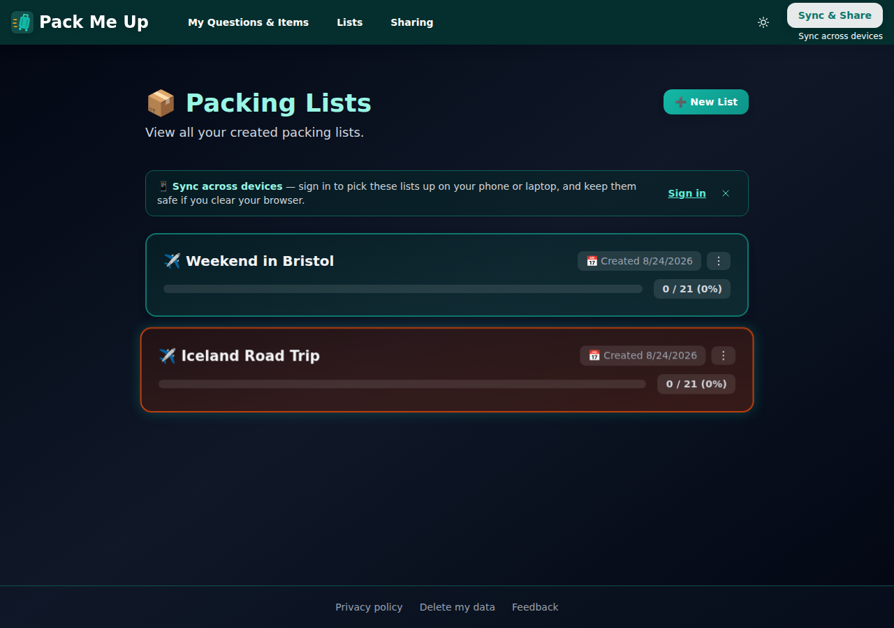

**The Delete row is only tinted on hover.** The original wrote `dark:bg-danger-950/40` where
`dark:hover:bg-danger-950/40` was meant, which left the row permanently red in dark mode. At rest:

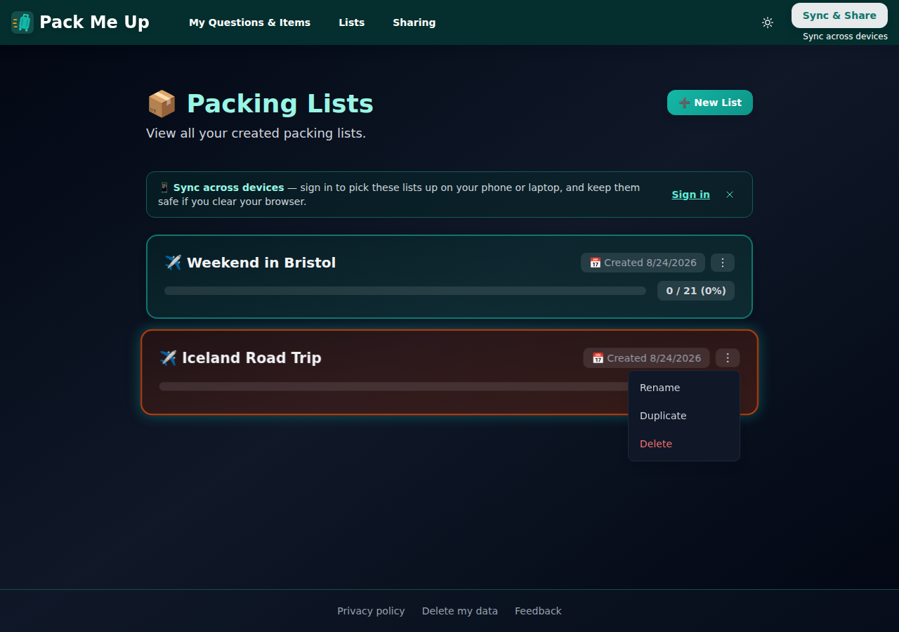

On hover:

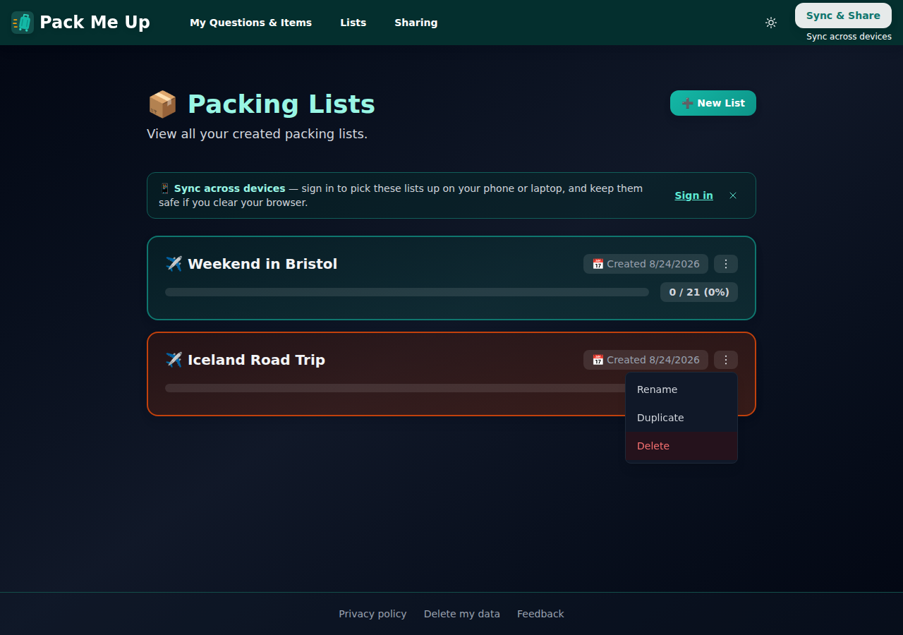

---

## Mobile — 390×844

The card header wraps, the kebab stays on the date row, and the menu opens against the right edge:

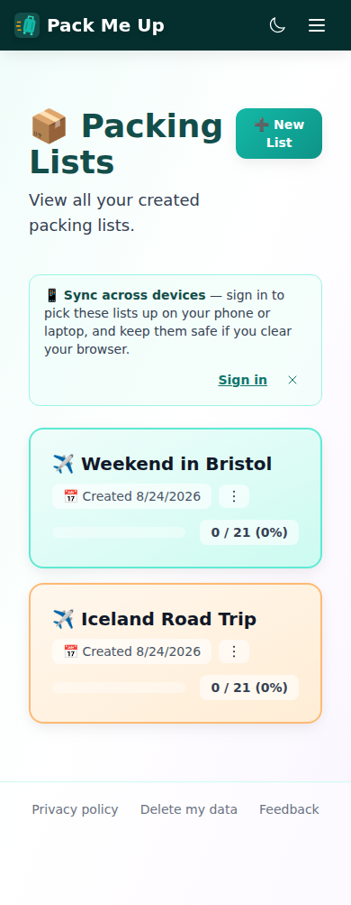

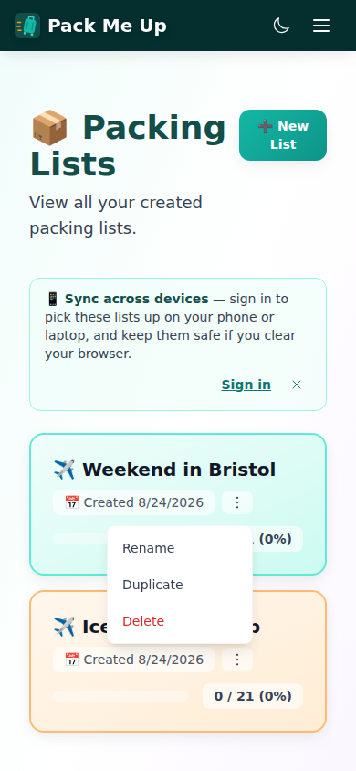

Tapping the card body opens the list:

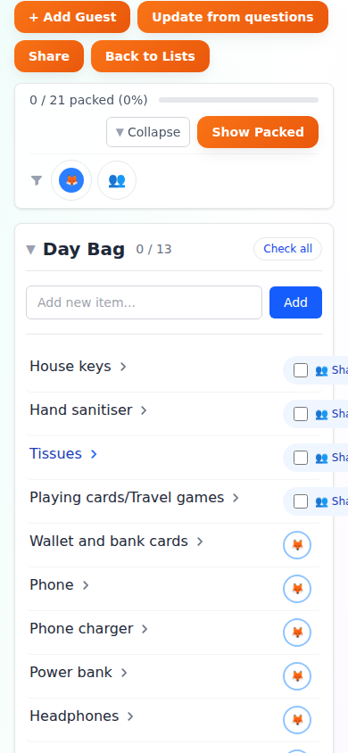

---

## Success criteria

| # | Criterion | Result |
|---|---|---|
| 1 | Clicking the card body navigates to the list; clicking the kebab does not | ✅ Pass |
| 2 | Dropdown offers Duplicate and Delete, keyboard navigable, closes on Escape | ✅ Pass (Rename is in the menu too) |
| 3 | Delete confirmation names the list and is required before deletion | ✅ Pass |
| 4 | Component tests cover card click, kebab click, duplicate, delete-with-confirm | ✅ Pass — 7 new tests in `src/pages/packing-lists.test.tsx` |
| 5 | Same treatment applied to `foreign-packing-lists.tsx` or explicitly deferred | ✅ **Deferred, with a reason** — that page's cards carry no per-card actions at all (no Rename/Duplicate/Delete), so there is nothing to gather behind a kebab. Its whole card is already the click target. |

### Notes against the issue as written

- **`lucide-react` was not added.** The issue anticipated it as a new runtime dependency for the
  kebab icon, but the repo already draws this exact icon as an inline SVG in `questions-page.tsx`,
  and `@radix-ui/react-dropdown-menu` is already a dependency. The menu follows that existing
  pattern, so the change adds no new packages.
- **Rename joined the menu.** The issue named Duplicate and Delete; Rename was added to the card
  after the issue was written and was a third loose button with the same propagation handling, so
  leaving it outside would have defeated the point.

---

## Automated checks

```
npm test          →  101 files, 1896 tests passed  (typecheck first, then vitest)
npx eslint …      →  0 errors
```

E2E, in a real browser against the built app:

```
✓ C4: rename a packing list           (4.0s)
✓ C5: duplicate a packing list        (3.8s)
✓ C6: delete a packing list with confirmation  (3.8s)
```

`e2e/tests/c-packing-lists.spec.ts` (C4–C6), `f-sync.spec.ts` (F3, F7) and `g-cross-context.spec.ts`
were updated to drive the kebab, since the buttons they used to click no longer exist.

---

## Bugs found

**None.** The two dark-mode faults listed on the issue were fixed as part of the change and verified
above; nothing new surfaced during the pass.
