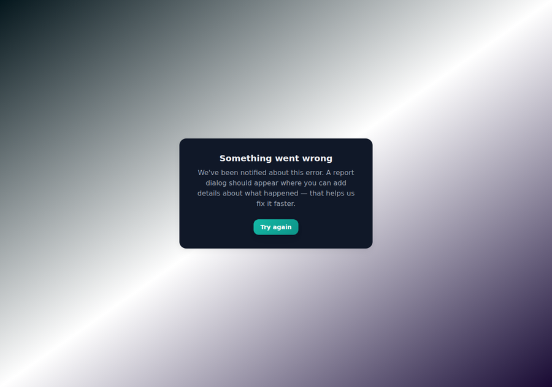
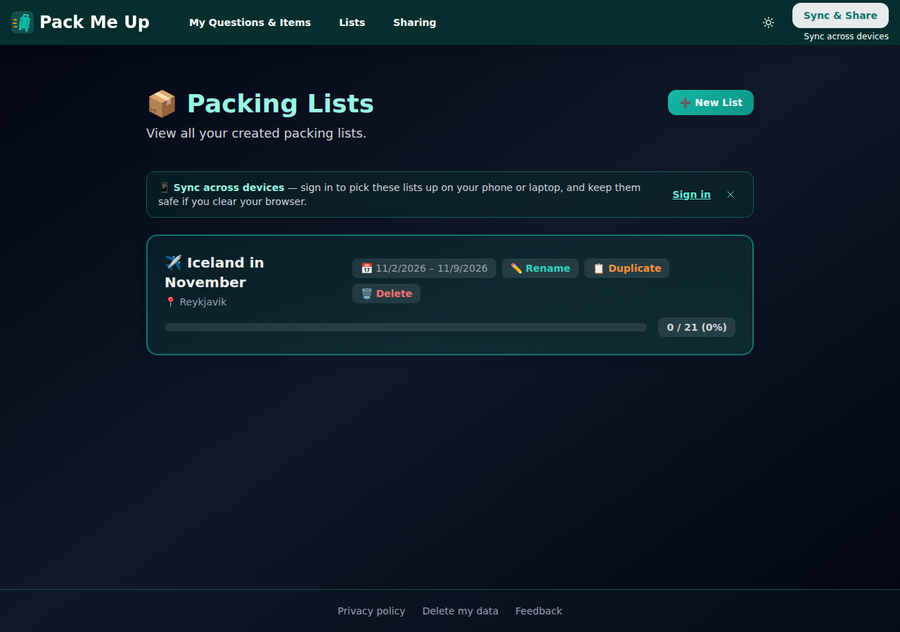
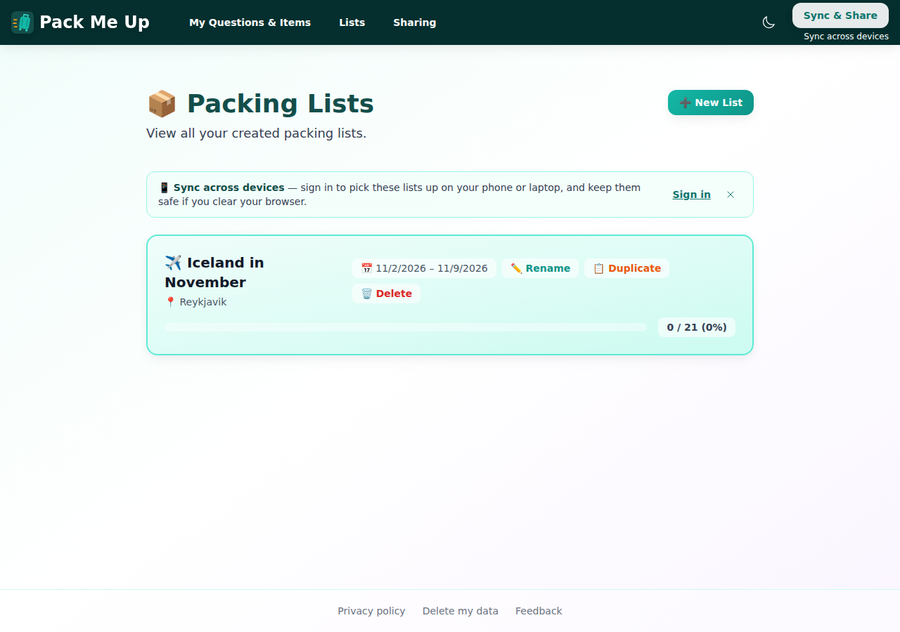
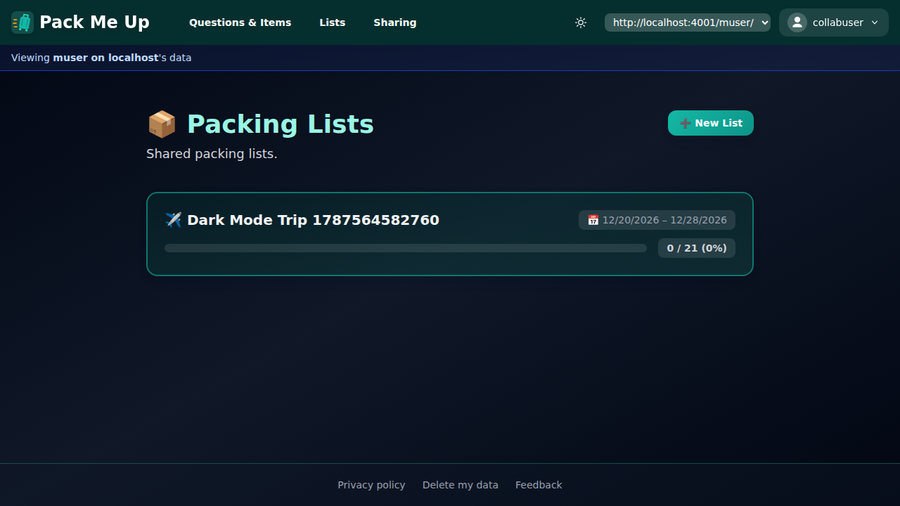
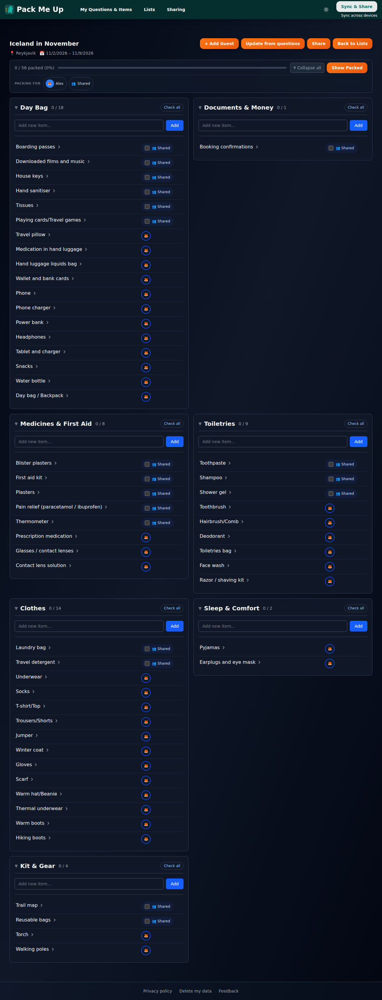
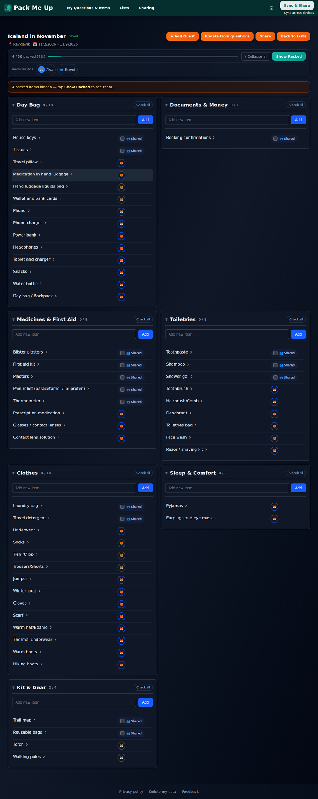
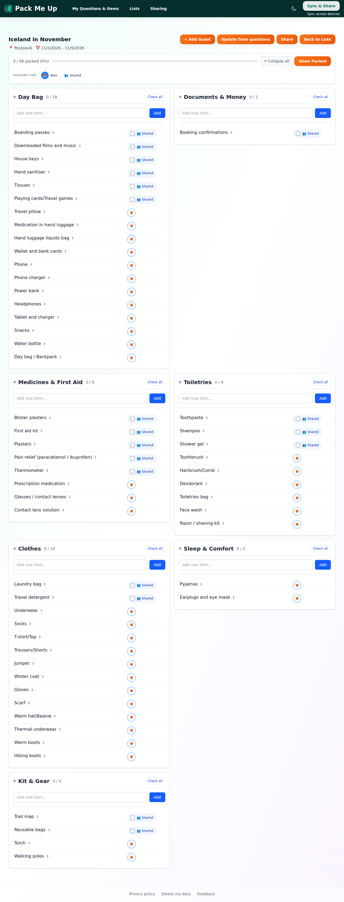
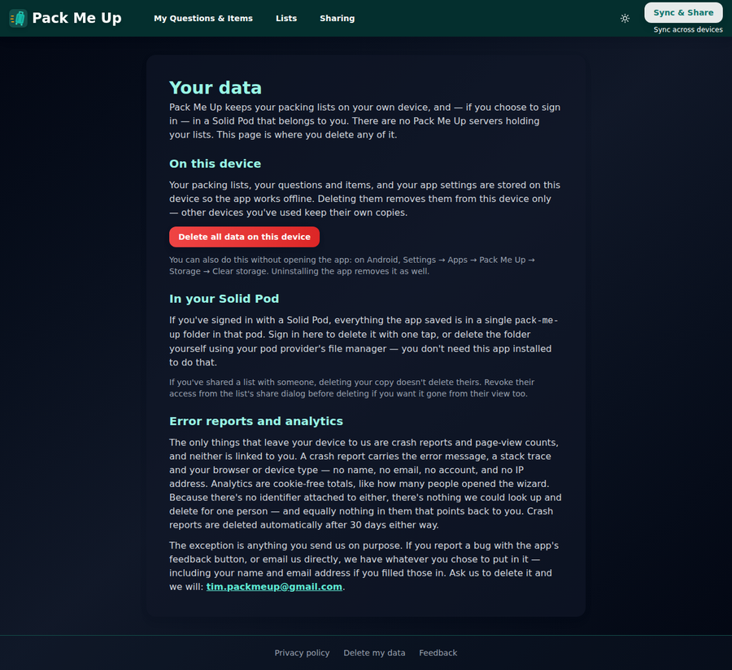
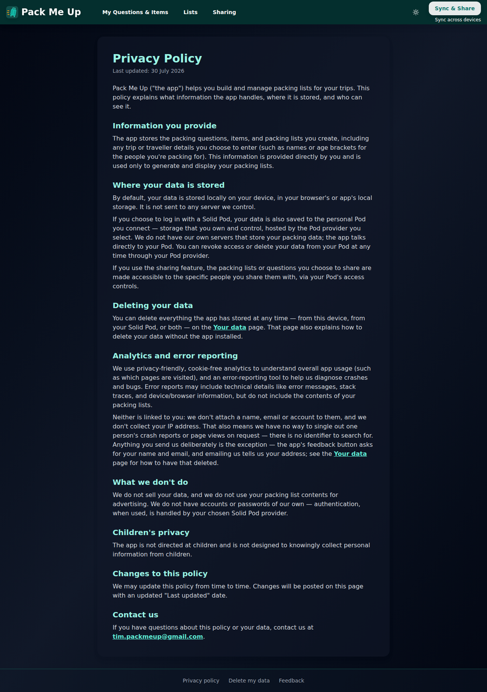
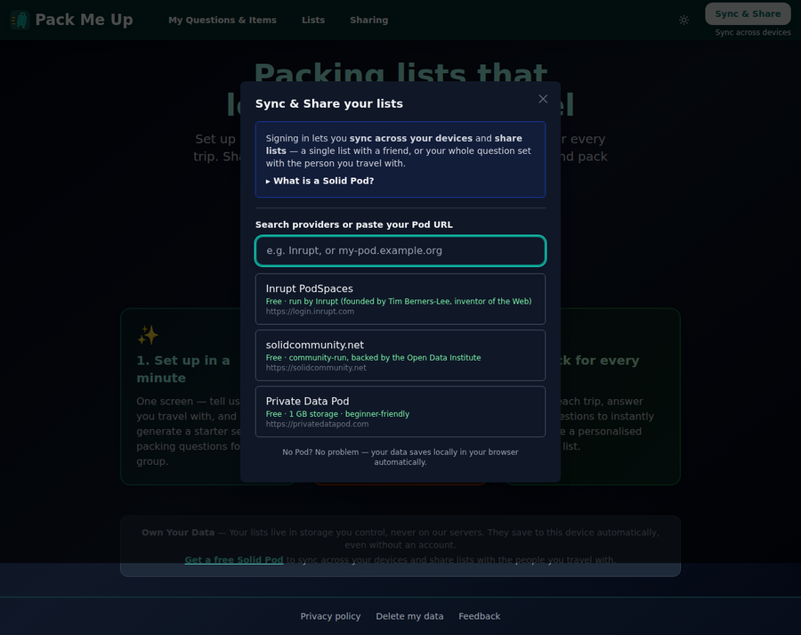

# Manual test report — issue #301: app-wide dark mode

| | |
|---|---|
| **Date** | 2026-08-24 |
| **Issue** | [#301 — App-wide dark mode with system preference and a manual toggle](https://github.com/timgent/pack-me-up/issues/301) |
| **PR** | _(linked from the PR description)_ |
| **Branch** | `claude/pack-me-up-issue-301-otqo8q` |
| **Commit under test** | `15319f6` — *Fix the light surfaces the dark-mode audit turned up* (on top of `691e3a6`) |
| **Result** | ✅ **Pass** — all five acceptance criteria met, except the native builds, which cannot be compiled in this environment (see [AC 5](#ac-5--capacitor-builds-checked)). Five contrast bugs were found during this pass and fixed before the report was written (see [Bugs found](#bugs-found)). |

---

## How it was tested

| | |
|---|---|
| Build | `npm run build` → `npm run preview` (production bundle, http://localhost:4173) |
| Solid server | Local Community Solid Server on `http://localhost:4001`, started by the e2e global setup, for the signed-in and shared-pod passes |
| Driver | Playwright with the pre-installed Chromium, driving the real built app |
| Viewports | Desktop **1280×900**, mobile **390×844** |
| OS theme | Emulated with Chromium's `prefers-color-scheme`, and changed **mid-session** where the criterion calls for it |

Three passes over the app:

1. **Dark, desktop** — every page, with a real question set and a real 56-item packing list created through the wizard.
2. **Light, desktop** — the same walk, to prove the sweep changed nothing in light mode.
3. **Dark, mobile** — the same walk at 390×844, plus the mobile menu.

Then a signed-in pass (pod account `testuser`) for the pages that only exist behind sign-in, and a
two-account pass (`muser` sharing with `collabuser`) for the shared-pod list page — the file the
issue calls out as carrying a copy of the packing-lists card code.

> The two signed-in passes were throwaway Playwright specs, run on their own with `--workers=1`, and
> deleted afterwards. They borrowed the E and M suites' pods; nothing else was running, so the pod
> isolation rule in CLAUDE.md was not at risk.

---

## AC 1 — A stored preference always wins over the OS, with a test

> *A stored preference always wins over the OS, including when the OS changes mid-session, and state
> and `localStorage` never disagree — **with a test***

This is the bug that sank #281, so it is covered twice: in unit tests, and by driving a real browser.

**Unit tests** — `src/components/ThemeContext.test.tsx`, 15 tests, including:

```
✓ keeps following the OS while the user has made no choice
✓ prefers a stored choice over the OS preference
✓ stops following the OS once the user chooses, including when the OS changes mid-session
✓ never lets the rendered theme and localStorage disagree
✓ ignores an unrecognised stored value and falls back to the OS
✓ removes its media listener when unmounted
```

**In the real browser**, with Chromium's OS theme changed mid-session:

```
PASS  OS dark preference applies with nothing stored — {"dark":true,"colorScheme":"dark","rootEmpty":true}
PASS  following the OS stores nothing — stored=null
PASS  OS change mid-session is followed while no choice is made — {"dark":false,"stored":null}
PASS  toggle switches the theme and writes the choice — {"dark":true,"stored":"dark"}
PASS  OS going light does not override the choice (#281 regression) — {"dark":true,"stored":"dark"}
PASS  state and localStorage never disagree after OS churn — {"dark":true,"stored":"dark"}
PASS  stored choice wins over the OS at first paint after reload — {"dark":true,"rootEmpty":true}
```

`rootEmpty: true` is the interesting part of the last line: the assertion runs at
`domcontentloaded`, before React has rendered anything, and the `dark` class is already on `<html>`.


The fix is structural rather than a patched-up listener: the resolved theme is *derived*
(`preference ?? systemTheme`), so a stored choice wins by construction and no OS event can overwrite
it. Writes go to `localStorage` and state together, so the two cannot drift apart.

✅ **Pass.**

---

## AC 2 — Pre-paint script is guarded and cannot throw

> *Pre-paint script is guarded and cannot throw*

Every `localStorage` access in `index.html` and in `ThemeContext` sits in its own `try`/`catch`, and
the OS fallback is reached even when the storage read throws.

Three unit tests read the actual `<script>` out of `index.html` and run it, so the test cannot drift
from the shipped markup:

```
✓ applies the stored theme
✓ falls back to the OS preference
✓ does not throw when localStorage is unavailable
```

Then in the browser, with `window.localStorage` redefined to throw on access before any app code runs:

```
PASS  cookie-blocked storage: pre-paint script still applies the OS theme
PASS  cookie-blocked storage: app still renders
```



✅ **Pass.**

---

## AC 3 — Every page audited in dark mode

> *Every page audited in dark mode, with the specific failures above fixed: packing lists (+ foreign),
> view-list progress strip, your-data, privacy-policy, provider selector*

### Packing lists — the badges, the actions and the progress track

The failure reported on #281 was `bg-white/60` badges keeping their white wash while their text went
`dark:text-gray-400`: trip dates invisible, actions undiscoverable, and an empty progress track
rendering as a solid light bar, so an untouched list looked fully packed.

Trip dates, Rename/Duplicate/Delete and the `0 / 21 (0%)` count are all legible, and the progress
track reads as **empty**:



The same page in light mode, unchanged:



### Shared lists (`foreign-packing-lists.tsx`)

`collabuser` viewing `muser`'s pod, in dark mode — the duplicated card code carries the same fix:



### View list — the sticky progress strip

`backdrop-blur-md bg-white/90` was a bright white band across a dark page. It now gets a
`dark:bg-gray-900/90` and sits in the page rather than on top of it:



With items packed, the strip, the "packed items hidden" banner and the person chips together:



The same list in light mode, unchanged:



### Your data

The page that explains what "Delete everything" destroys. The small print under each delete button —
reported as *effectively invisible* — is legible:



### Privacy policy



### Provider selector

The green provider descriptions and the pod URLs read against the dark modal, and the backdrop is a
dimming layer rather than a light slab:



### Everything else

| Page / surface | Screenshot |
|---|---|
| Landing page | [01](images/01-dark-home.png) |
| Questions & items | [04](images/04-dark-questions.png) |
| Create packing list (native date + select controls) | [05](images/05-dark-create-list.png) |
| Sharing, signed out | [12](images/12-dark-sharing-logged-out.png) |
| Sharing, signed in | [13](images/13-dark-sharing-signed-in.png) |
| Backups, signed in | [14](images/14-dark-backups-signed-in.png) |
| Account menu | [15](images/15-dark-account-menu.png) |
| Wizard | [17](images/17-dark-wizard.png) · [18](images/18-dark-wizard-generated.png) |
| Share-this-list modal | [19](images/19-dark-share-modal.png) |
| Item editor modal | [20](images/20-dark-item-editor-modal.png) |
| Reorder sections | [21](images/21-dark-section-order-editor.png) |
| Delete confirmation | [22](images/22-dark-confirm-delete.png) |
| react-select (item name) | [23](images/23-dark-react-select.png) |
| Edit people | [24](images/24-dark-edit-people-modal.png) |

**Mobile, 390×844:** [lists](images/25-dark-mobile-lists.png) ·
[menu with the theme row](images/26-dark-mobile-menu.png) ·
[list view](images/27-dark-mobile-list-view.png) ·
[your data](images/28-dark-mobile-your-data.png)

✅ **Pass** — every page and every modal I could reach was looked at in dark mode; five failures
found and fixed (below).

---

## AC 4 — The `dark:` hover slips

> *The 15 `dark:` hover slips fixed, and a grep of the pattern comes back clean*

The slip is a hover style's dark variant written without the `hover:`, so it applies at rest. It
cannot occur here: the sweep was mechanical and carried every variant prefix across, so a
`hover:bg-primary-50` gains `dark:hover:bg-primary-950/40`, never `dark:bg-primary-950/40`.

The grep from the issue, over the whole of `src/`:

```
$ grep -rnE "hover:(bg|border|text)-[^ \"'\`]+ +dark:(bg|border|text)-" src \
    --include=*.tsx --include=*.ts | grep -vc "dark:hover:"
0
```

✅ **Pass.**

---

## AC 5 — Capacitor builds checked

> *Capacitor builds checked*

`npx cap sync` completes for both platforms against the new bundle:

```
✔ Copying web assets from dist to android/app/src/main/assets/public
✔ Copying web assets from dist to ios/App/App/public
[info] Found 3 Capacitor plugins for android / ios
[info] Sync finished in 0.411s
```

Two changes were made for the native shell specifically:

- **`<html>` now paints its own background** (`#ffffff`, `#030712` under `.dark`). Without it the
  Capacitor WebView shows white while the bundle loads — the same flash the pre-paint script exists
  to avoid, one layer further out.
- **A `theme-color` meta** matching the nav (`#042f2e`). The nav is the same dark teal in both
  themes, so one value serves both and there is nothing to keep in step.

The native **status bar** needs no change for dark mode: the app draws under it through
`safe-area-top`, and what it draws there is the nav's `bg-primary-950` — dark in both themes.

⚠️ **Partial.** A native compile could not be run here: there is no Android SDK on this machine
(`gradlew assembleDebug` → *SDK location not found*) and no Xcode. What is verified is that the
sync copies the built assets into both platforms and resolves all three plugins; **the iOS and
Android app builds still want a run on a machine with the toolchains**, and dark mode inside a real
WebView with a native status bar remains unverified — as it was on #281.

---

## Automated checks

| Check | Result |
|---|---|
| `npm test` (typecheck + vitest) | ✅ **1875 passed**, 99 files — includes 15 new `ThemeContext` tests and 4 new `ThemeToggle` tests |
| `npm run build` | ✅ built in 6.45s |
| `npm run lint` | ✅ 0 errors (11 pre-existing warnings, none in the new files) |
| `npx playwright test` (full e2e) | ✅ **88 passed** in 1.9m |
| `npx cap sync` | ✅ android + ios |

---

## Bugs found

Five, all found by looking at the screenshots rather than by any test, and all fixed in `15319f6`
before this report was written. Each is a translucent-white surface whose `/opacity` suffix put it
outside the mechanical sweep's reach:

| # | Where | What it looked like |
|---|---|---|
| 1 | `Footer.tsx` — `bg-white/40` | A pale grey band across the bottom of every page in dark mode. Visible in the first pass on **every single screenshot**. |
| 2 | `SyncAcrossDevicesPrompt.tsx` — `bg-primary-50/70` | A light panel on the lists page with "Sign in" in teal on near-white. |
| 3 | `PastTripsSection.tsx` — `bg-white/60` | The past-trips toggle, same wash. |
| 4 | `questions-page.tsx` — `hover:bg-white/70` on the per-section delete | A white flash on hover over a dark section header. |
| 5 | `Modal.tsx` — `bg-gray-500 bg-opacity-75` | A flat grey slab, not a dimming layer — **in both themes**. `bg-opacity-*` is Tailwind v3 syntax and does nothing in v4, so this one was a pre-existing light-mode bug too. |

One further gap, fixed in the same commit: **react-select** paints its control and menu with inline
styles that no `dark:` class can reach, so the item-name editor would have opened a white menu on a
dark page. Its palette is now handed over in JS ([screenshot 23](images/23-dark-react-select.png)).

Nothing was found that is still outstanding.
