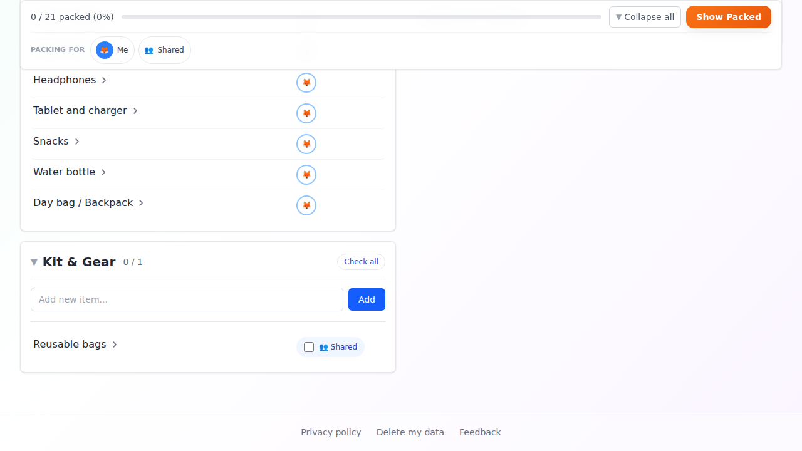
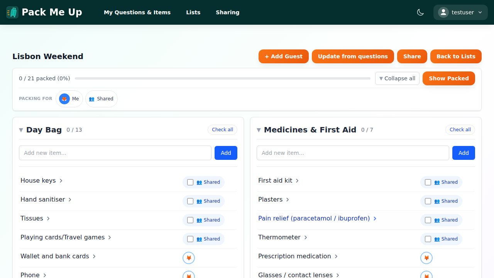
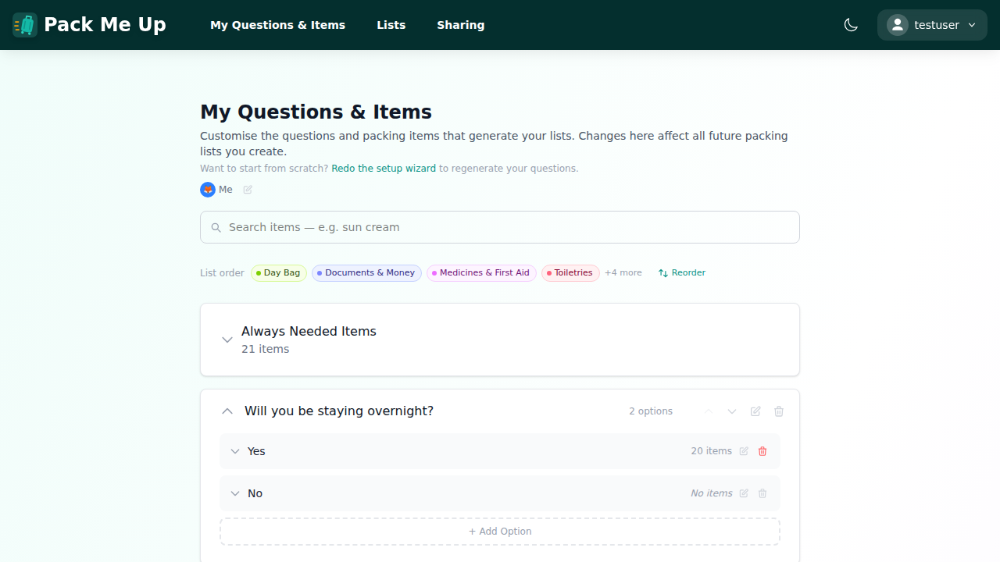
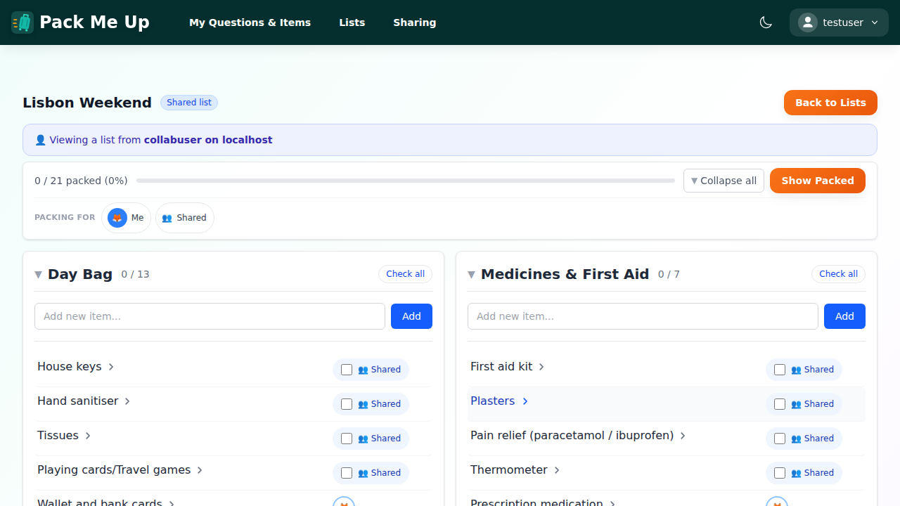
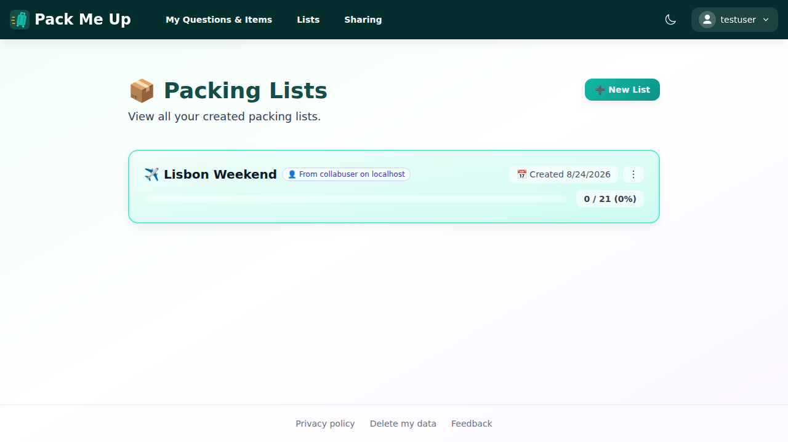
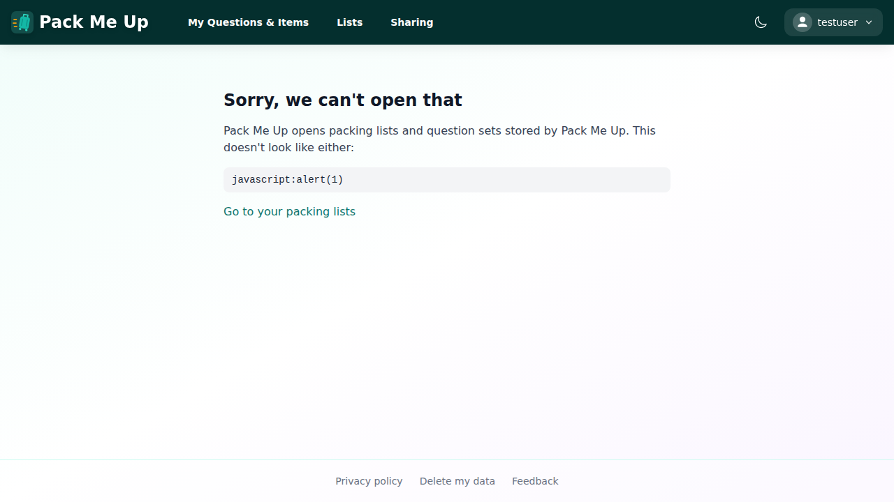
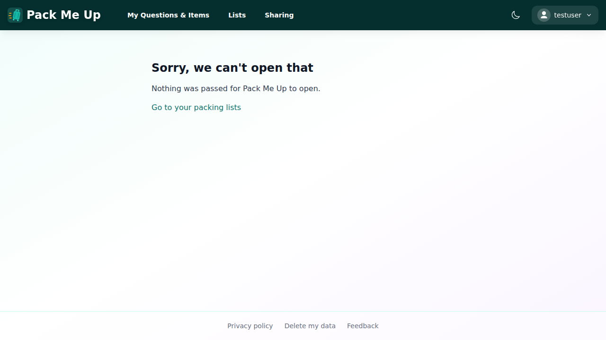
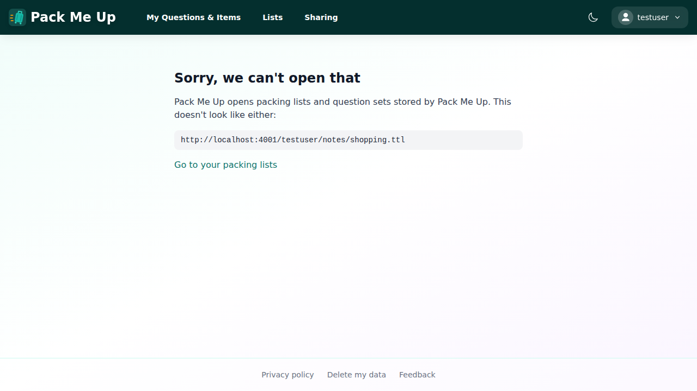
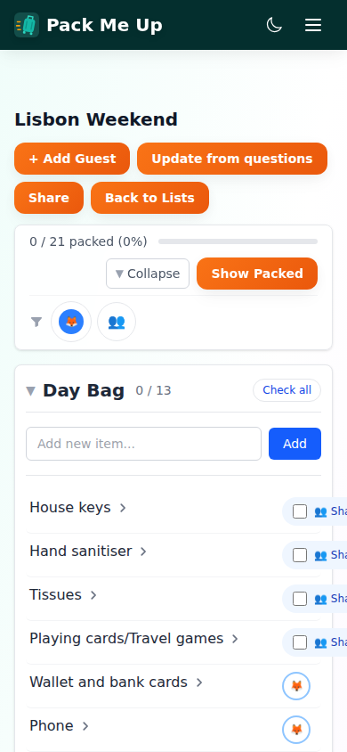
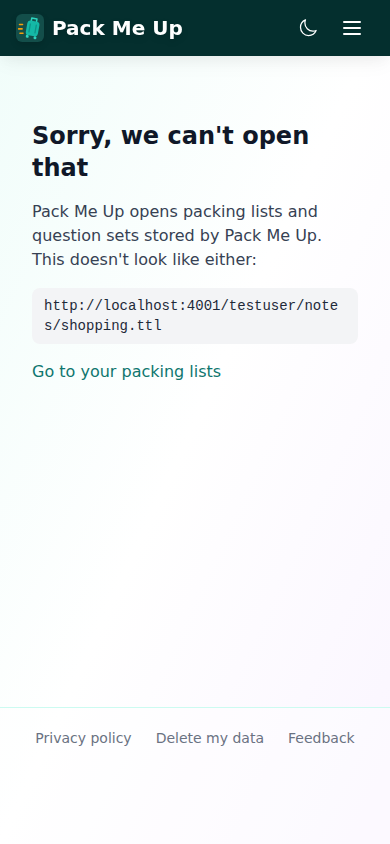

# Manual test report — issue #307: publish an Application Capability description at `/`

| | |
|---|---|
| **Date** | 2026-08-25 |
| **Issue** | [#307 — Publish an Application Capability description at / via content negotiation](https://github.com/timgent/pack-me-up/issues/307) |
| **PR** | _(not yet raised — branch pushed for review)_ |
| **Branch** | `claude/issue-307-7z2srb` |
| **Commit under test** | `da98af1` — *Explain a refused invocation instead of showing a blank page* |
| **Result** | ⚠️ **Pass, with one criterion not verifiable from here** — 6 of the 7 acceptance criteria are met and evidenced below. The seventh asks for a Vercel **preview deployment**, which this environment cannot produce; what could be done in its place is set out under [Criterion 7](#criterion-7--verified-on-a-vercel-preview-deployment). **2 bugs found and fixed** during the walkthrough. |

---

## How it was tested

| | |
|---|---|
| Build | `npm run build` → `npm run preview` (production bundle, http://localhost:4173) |
| Solid server | Community Solid Server v7 on http://localhost:4001, real OIDC sign-in, real pod writes |
| Account | `testuser` (`test@example.com`), pod at `http://localhost:4001/testuser/` |
| Driver | Playwright with the pre-installed Chromium, driving the real built app |
| Viewports | Desktop **1280×900**, mobile **390×844** |
| Data | The wizard's built-in question set for one adult, plus a generated list, **Lisbon Weekend**, pushed to the pod |

The walkthrough was a throwaway Playwright spec, run on its own and deleted afterwards, so it never
lands in the committed e2e suite. Every invocation below was made the way a consumer makes one —
by putting `#open=<percent-encoded IRI>` in the address bar of the running app — not by calling a
function.

**One thing this environment cannot do:** `middleware.ts` only runs on Vercel. Under
`vite preview` it does not exist, so `curl -H 'Accept: application/ld+json' http://localhost:4173/`
returns the SPA's HTML, exactly as the issue says it would. The negotiation was therefore exercised
by driving the real `middleware.ts` default export — the same module Vercel loads, `next()` from
`@vercel/functions` included — against real `Request` objects. That is the whole of the code path
bar the deployment; see [Criterion 7](#criterion-7--verified-on-a-vercel-preview-deployment).

---

## Criterion 1 — every capability advertised maps to a route that exists

This was the issue's headline gap: `#open-packing-list={open}` appeared nowhere in the app.

It is now `#open={open}` — the spec's own canonical template — and it is wired up. `main.tsx`
rewrites the fragment before HashRouter sees it, and `/open` works out from the IRI what it was
handed and whose pod it lives on. The remaining two templates, `#/create-packing-list` and
`#/wizard`, were already routes and still are.

### 1a. Your own packing list, opened by its pod IRI

A list was created through the UI and pushed to the pod, so the IRI below is a resource that really
exists on a real Solid server:

```
http://localhost:4001/testuser/pack-me-up/packing-lists/78b70a6c-3ac4-4c59-9509-d8d1aa5e6ecd.ttl
```



Navigating to `/#open=<that IRI, percent-encoded>` lands on the list:


The address bar afterwards was
`http://localhost:4173/#/view-lists/78b70a6c-3ac4-4c59-9509-d8d1aa5e6ecd` — your own pod, so your
own list, with no "shared list" framing.

### 1b. The same invocation arriving in a tab that is already open

A consumer may change the fragment of a tab that is already showing the app, which reloads nothing.
Starting from `#/view-lists` and setting `window.location.hash` to the invocation:



Same destination, no reload. This is the path that found **Bug 1** below.

### 1c. Your own question set, opened by its pod IRI

`#open=http%3A%2F%2Flocalhost%3A4001%2Ftestuser%2Fpack-me-up%2Fpacking-list-questions.ttl`:



This is why the question-set capability's `resourceType`/`shape` are now honest claims. In the
version the issue describes, that capability's invocation was `#/manage-questions` — it ignored
whichever resource you asked it to open and showed you your own. Both view capabilities now share
one `#invoke-open`, which is the spec's own two-capabilities-one-invocation pattern.

### 1d. Someone else's pod

The same IRI shape on a pod that is not yours takes the shared-list route instead — deliberately the
`?pod=` share-link shape rather than `/pod/…`, because a list shared on its own grants access to
that one file and the `/pod/…` routes verify access to the whole container:



Note the **Shared list** badge and the "Viewing a list from collabuser" banner — the routing is what
this shows. The list *contents* on screen are the local copy of the same id; `collabuser`'s pod does
not actually hold that resource, and falling back to the local copy is the `?pod=` route's existing
behaviour, unchanged by this work.

---

## Criterion 2 — a test parses the JSON-LD and Turtle and asserts identical triple sets

`src/capability/document.test.ts` expands the JSON-LD (through a pinned snapshot of the spec's own
context, since `https://www.w3.org/ns/ac.jsonld` is not published yet and a unit test has no
network), parses the Turtle with N3, canonicalises both to RDFC-1.0 N-Quads, and compares.
Canonicalisation is what makes the comparison sound: the inline `hydra:mapping` node and every
`sh:property` node is a blank node, so a plain set comparison would not be enough.

Checked that it actually bites, by changing one word in the Turtle only:

```
-   "<…/#requirement-clipboard> <https://www.w3.org/ns/ac#browserPermission> \"clipboard-write\" ."
+   "<…/#requirement-clipboard> <https://www.w3.org/ns/ac#browserPermission> \"clipboard-read\" ."
```

The test fails and names the offending triple. The edit was reverted.

The served documents are in this folder: [`capability.jsonld`](capability.jsonld) (219 lines) and
[`capability.ttl`](capability.ttl) (104 lines).

---

## Criterion 3 — `middleware.ts` is type-checked by `npm test` and CI

`tsconfig.middleware.json` now brings it into `tsc -b`, and `tsconfig.json` references it.
`npm test` runs `npm run typecheck` first, and CI runs `npm test`.

Checked that it bites, by putting `const bad: number = request.url` in `middleware.ts`:

```
middleware.ts(4,11): error TS2322: Type 'string' is not assignable to type 'number'.
```

Before this change, that line type-checked clean, because no project included the file.

---

## Criterion 4 — origin derived from the request, not hardcoded

`capabilityDescription(origin)` builds every IRI from the origin it is given; nothing in
`src/capability/` mentions `packmeup.tim-gent.com`. `requestOrigin()` prefers
`x-forwarded-host`/`x-forwarded-proto` (Vercel terminates TLS and proxies, so the request URL's own
host is internal), takes the first hop of a proxy chain, and refuses a forwarded host that isn't a
bare `host[:port]`.

Two independent confirmations:

- Served with `Host: preview.vercel.app`, the description's subject is
  `https://preview.vercel.app/#i` and `content-location` is `https://preview.vercel.app/`.
- In the running app, the RDFa in the footer described itself as
  `resource="http://localhost:4173/#i"` — the preview server's origin, not production's.

---

## Criterion 5 — `unverified:` terms checked against the specs

The original file flagged terms inline as `unverified:` because network access to the vocabularies
was blocked when it was written. The same block applies here — `w3.org`, `w3id.org` and
`dokieli.github.io` are all refused by this environment's egress proxy — but the spec's **source**
is reachable on `raw.githubusercontent.com`, so it was read in full (Draft Community Group Report,
17 August 2026, v0.3.1415) and every term checked against it:

| Term | Verdict |
|---|---|
| `ac:Application`, `ac:Capability`, `ac:Requirement`, `ac:UriTemplateInvocation` | ✅ Classes in §2.3's class table |
| `ac:capability`, `ac:requirement`, `ac:action`, `ac:output`, `ac:resourceType`, `ac:shape`, `ac:invocation`, `ac:cspDirective`, `ac:browserPermission`, `ac:open` | ✅ Properties in §2.3's property table |
| `hydra:template`, `hydra:mapping`, `hydra:variable`, `hydra:property` | ✅ Aliased in the spec's context |
| `odrl:use` → **now `odrl:display`** | ⚠️ Changed. `odrl:use` is a valid ODRL action, but `odrl:display` is the action the spec's own open/view examples use, and it says what this app does more precisely |
| `as:Create` (the two creation capabilities) | ✅ Kept, and now with a reason: ODRL 2.2 has no "create" action, and the spec asks for "a controlled and shared vocabulary" — the Activity Vocabulary is one, and its prefix is already bound by the spec's context |
| `dpv:ServiceProvision` | ✅ Used verbatim in the spec's own Requirement examples (§5.5) |
| `clipboard-write` | ✅ A Permissions API name, which is what `browserPermission` asks for. Re-checked against the app: `SharePackingListModal`, `sharing-settings`, `Toast` and `SignInHistory` all call `navigator.clipboard.writeText` |
| `#open-packing-list={open}` → **now `#open={open}`** | ⚠️ Changed. §5.3.1's query form pairs a variable's *name* with its value; the old template paired the name `open-packing-list` with a variable called `open` |

No `unverified:` markers remain in the file. Two further spec details were adopted while reading:
the response now names the AC profile on its `content-type`
(`profile="https://www.w3.org/ns/ac.jsonld"`, §2.3), and invocation values are treated as untrusted
input with only `http(s)` accepted (§5.3.1).

---

## Criterion 6 — Accept-matrix unit test in the repo

`src/capability/negotiate.test.ts`, 25 cases. Below is the same matrix run through the **real
`middleware.ts` default export**, `next()` and all:

| `Accept` | Response |
|---|---|
| `(no Accept header)` | **SPA** (`x-middleware-next: 1`) |
| `*/*` | **SPA** (`x-middleware-next: 1`) |
| `real Chrome` | **SPA** (`x-middleware-next: 1`) |
| `text/html` | **SPA** (`x-middleware-next: 1`) |
| `application/*` | **SPA** (`x-middleware-next: 1`) |
| `application/json` | **SPA** (`x-middleware-next: 1`) |
| `application/ld+json` | `application/ld+json; charset=utf-8; profile="https://www.w3.org/ns/ac.jsonld"` |
| `application/ld+json; profile="https://www.w3.org/ns/ac.jsonld"` | `application/ld+json; charset=utf-8; profile="https://www.w3.org/ns/ac.jsonld"` |
| `text/turtle` | `text/turtle; charset=utf-8` |
| `application/ld+json, text/html` | **SPA** (`x-middleware-next: 1`) |
| `application/ld+json;q=0.1, text/html` | **SPA** (`x-middleware-next: 1`) |
| `text/turtle;q=1, text/html;q=0.5` | `text/turtle; charset=utf-8` |
| `application/ld+json;q=0.5, text/turtle;q=0.9` | `text/turtle; charset=utf-8` |

The two rows that matter most are the boring ones: a request with no Accept header, and a bare
`*/*`, both get the app. So does a real Chrome header. And per the issue's suggestion 7, a tie now
goes to HTML — `Accept: application/ld+json, text/html` at q=1 each gets the SPA, so a link-preview
bot or an SDK default cannot land a human on a blank homepage.

---

## Criterion 7 — verified on a Vercel preview deployment

❌ **Not done, and not doable from here.** This session has no Vercel credentials and no way to
create a preview deployment. The honest statement of what *was* verified:

- The full Accept matrix, against the real `middleware.ts` export with the real `@vercel/functions`
  `next()` — the table above. This is every line of the code path except Vercel's own dispatch.
- The RDFa restatement in the actually-served HTML of the actually-built bundle (below).
- Origin derivation, by serving with a proxied host header and by reading the origin the running
  app described itself with.

**What a reviewer should still do on the preview URL**, once one exists:

```bash
curl -sI  -H 'Accept: application/ld+json' https://<preview>/    # → application/ld+json
curl -s   -H 'Accept: text/turtle'         https://<preview>/    # → Turtle, IRIs on <preview>
curl -sI  -H 'Accept: text/html'           https://<preview>/    # → the SPA
curl -sI                                   https://<preview>/    # → the SPA
curl -sI  -H 'Accept: */*'                 https://<preview>/    # → the SPA
```

…and open the preview in a real Chrome, which is the case a broken `Accept` rule would ruin.

---

## The RDFa restatement

Read out of the DOM of the running, built app:

```json
{
  "resource": "http://localhost:4173/#i",
  "capabilities": 4,
  "requirements": 3,
  "template": "#open={open}",
  "visibleText": "",
  "height": 0
}
```

Four capabilities, three requirements, the right template, and — the thing worth checking on a
component that lives in the footer of every page — no text and no height. Nothing moved:



---

## Bugs found

**Both were found by driving the app, not by the tests, and both are fixed in `da98af1`.**

### Bug 1 — an invocation arriving in an already-open tab went nowhere

The first walkthrough attempt failed outright at step 1a. The rewrite listened on `hashchange`, but
a fragment change fires `popstate` **as well**, and HashRouter listens on `popstate` — so the router
had already tried to route the raw `#open=…`, matched nothing, and rendered an empty page before
the rewrite ran. Rewriting the history entry afterwards doesn't ask the router to look again.

Fixed by listening on both events and dispatching a synthetic `popstate` after a rewrite, so the
router re-reads the corrected fragment whichever listener the browser reaches first. Screenshot 1b
above is the fixed behaviour. Two unit tests now cover it.

### Bug 2 — a refused invocation showed a blank page instead of a refusal

`#open=javascript:alert(1)` was correctly refused — but "refused" meant the fragment was left
alone, which meant HashRouter matched nothing, which meant an empty page. Same for a bare
`#open=`. A consumer can hand this app any IRI it likes, so "we don't know what that is" needs to
be an ordinary outcome with an ordinary explanation.

The scheme guard moved from parsing to resolving: parsing now answers *"was there an `open`
variable, and what did it carry"*, and judging the value belongs with the rest of that judgement in
`resolvePackMeUpResource`. Both cases now reach `/open` and get told why:





Nothing navigates to the value either way — the page prints it as text, and the walkthrough asserts
there is no `a[href^="javascript"]` anywhere on it.

An IRI that is simply not one of this app's resources gets the same treatment:



---

## Mobile — 390×844





---

## Success criteria

| # | Criterion | Result |
|---|---|---|
| 1 | Every capability advertised maps to a route that exists | ✅ Pass — `#open={open}` implemented and driven against a real pod; the other two templates are existing routes |
| 2 | A test parses the JSON-LD and Turtle and asserts identical triple sets | ✅ Pass — canonical RDFC-1.0 N-Quads, verified to fail on a one-word drift |
| 3 | `middleware.ts` is type-checked by `npm test` and CI | ✅ Pass — verified to fail on a deliberate type error |
| 4 | Origin derived from the request, not hardcoded | ✅ Pass — confirmed via a proxied host header and in the running app |
| 5 | `unverified:` terms checked against the specs | ✅ Pass — spec source read in full; two terms changed as a result |
| 6 | Accept-matrix unit test in the repo | ✅ Pass — 25 cases, plus the matrix above through the real middleware |
| 7 | Verified on a Vercel preview deployment | ❌ Not doable in this environment — commands for a reviewer given above |

## Automated checks

| Check | Result |
|---|---|
| `npm test` (typecheck + vitest) | ✅ 2091 passed, 113 files |
| `npm run lint` | ✅ 0 errors (11 pre-existing warnings, none in new files) |
| `npm run build` | ✅ Built clean |
| New tests added | 77 — `document.test.ts` (9), `negotiate.test.ts` (25), `openInvocation.test.ts` (25), `open-resource.test.tsx` (10), `ApplicationCapabilityRdfa.test.tsx` (8) |
