# Manual test report — issue #333: home CTA is stale after login

| | |
|---|---|
| **Date** | 2026-09-03 |
| **Issue** | [#333 — Home CTA is stale after login: signed-in users with a question set still see "Get Started with the Wizard"](https://github.com/timgent/pack-me-up/issues/333) |
| **PR** | [#344 — Re-check for questions when the login sync lands](https://github.com/timgent/pack-me-up/pull/344) |
| **Branch** | `claude/issue-pickup-685hm4` |
| **Commit under test** | `7ecc43d` — *Re-check for questions when the login sync lands (#333)* |
| **Result** | ✅ **Pass** — all three acceptance criteria met, evidenced below, against a real Solid pod. The bug was also reproduced on the pre-fix build for comparison. **No bugs found.** |

---

## How it was tested

| | |
|---|---|
| Build | `npm run build` → `npm run preview` (production bundle, http://localhost:4173) |
| Pre-fix build | The parent commit `40fde37` built in a `git worktree` and served on http://localhost:4174, for the before/after comparison |
| Solid server | Community Solid Server v7 on http://localhost:4001 — real OIDC sign-in, real pod reads |
| Accounts | `manual333` (after) and `manual333b` (before), each a **dedicated pod created at runtime**, so no existing e2e suite's pod was touched |
| Pod contents | A question set and one packing list, **Schema Compat Test Trip**, written to each pod as RDF before the walkthrough — so the user under test is exactly the "returning user with a pod full of questions" the issue describes |
| Viewports | Desktop **1280×900**, mobile **390×844** |
| Themes | Light and dark (dark via `prefers-color-scheme`) |
| Driver | Playwright with the pre-installed Chromium, driving the real built app through the real login flow |

**Making the window observable.** The whole bug lives in the seconds between "signed in" and "the
pod's data has landed locally", which on localhost is a few hundred milliseconds. Pod requests
(`**/pack-me-up/**`) were therefore delayed by 2.5s each, so the intermediate state could be
photographed rather than inferred. Nothing else was stubbed: the OIDC round trip, the pod reads and
the PouchDB writes are all real.

The walkthrough was a throwaway Playwright spec, run on its own and **deleted afterwards**, so it
never lands in the committed e2e suite.

---

## Before: the bug, on the pre-fix build

Same pod, same seeded question set, same walkthrough, against `40fde37`. Fifteen seconds after
signing in — long after the pod sync had finished — the home page is still telling a user with a
full pod to start the wizard:


A reload is the only thing that fixes it, which is precisely the complaint on the issue:


---

## Criterion 1 — signing in from `/home` flips the CTA once the sync completes, without a reload

Signed out, on `/#/home`, the wizard CTA is correct — this user has nothing locally yet:


Signed in via "Get a free Solid Pod" → the real CSS login and consent screens → back on `/#/home`.
The pod is still being read, so the page commits to **neither** CTA and holds the slot with a
muted, non-interactive pill:

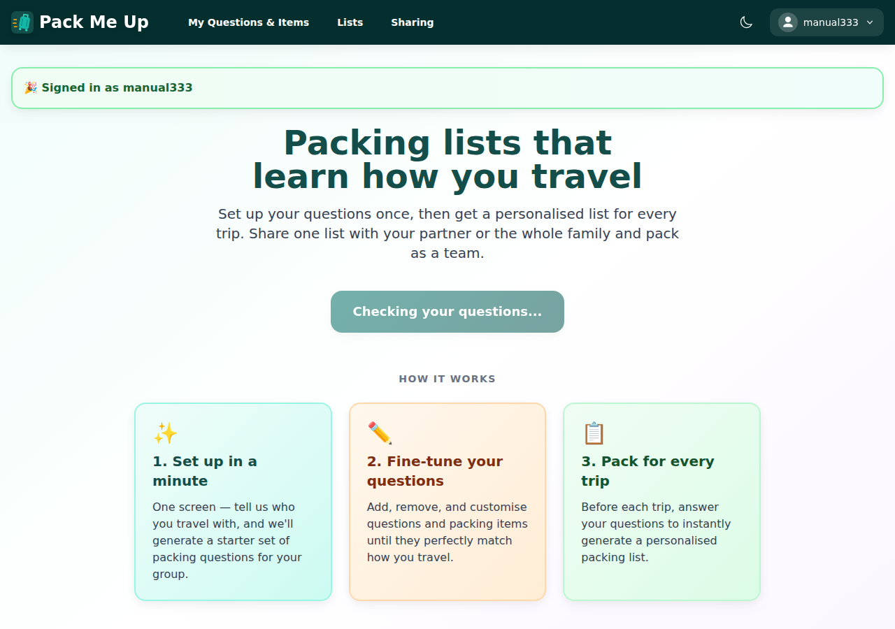

When the sync lands, the CTA resolves to "View Packing Lists" **in place**. The test recorded every
main-frame navigation between the two screenshots and asserted the list was empty, so this is a
re-render, not a reload:

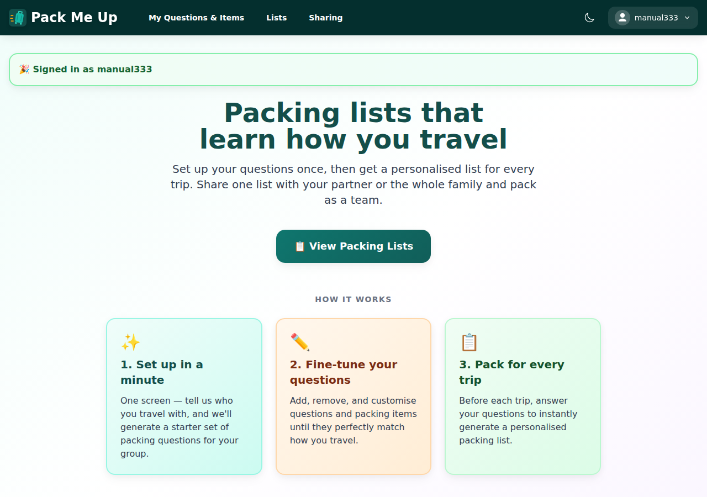

And the CTA is honest — following it shows the list that came from the pod:

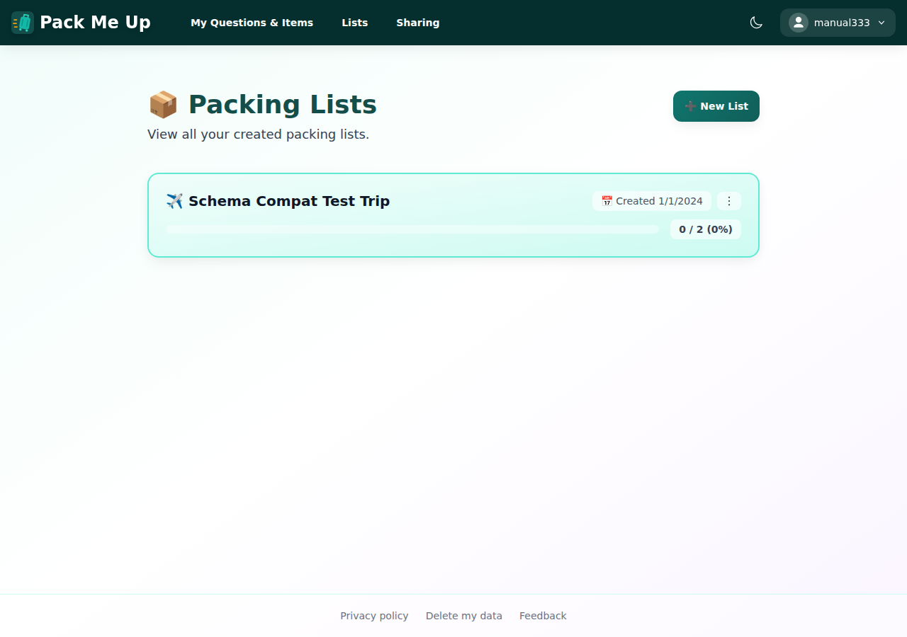

### Mobile, 390×844

Same three states on a phone-sized viewport:

| Signed out | Checking, after login | Flipped |
|---|---|---|
| 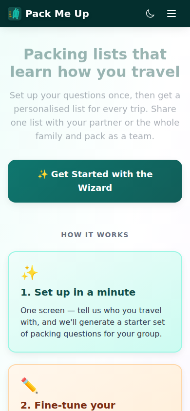 | 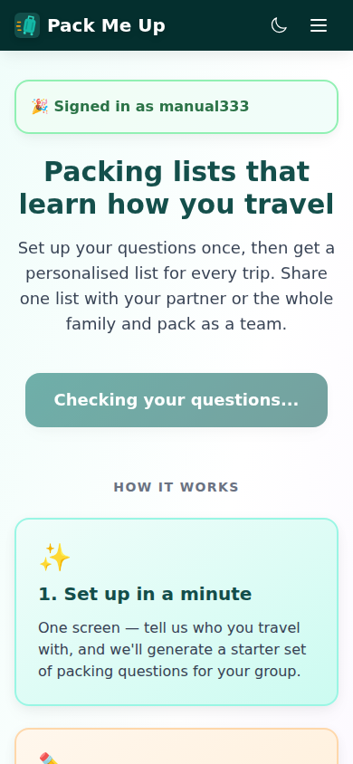 | 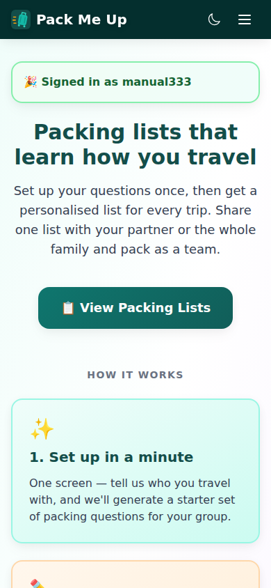 |

### Dark theme

Both new states were checked in dark, since the placeholder introduces a colour that did not exist
on this page before:

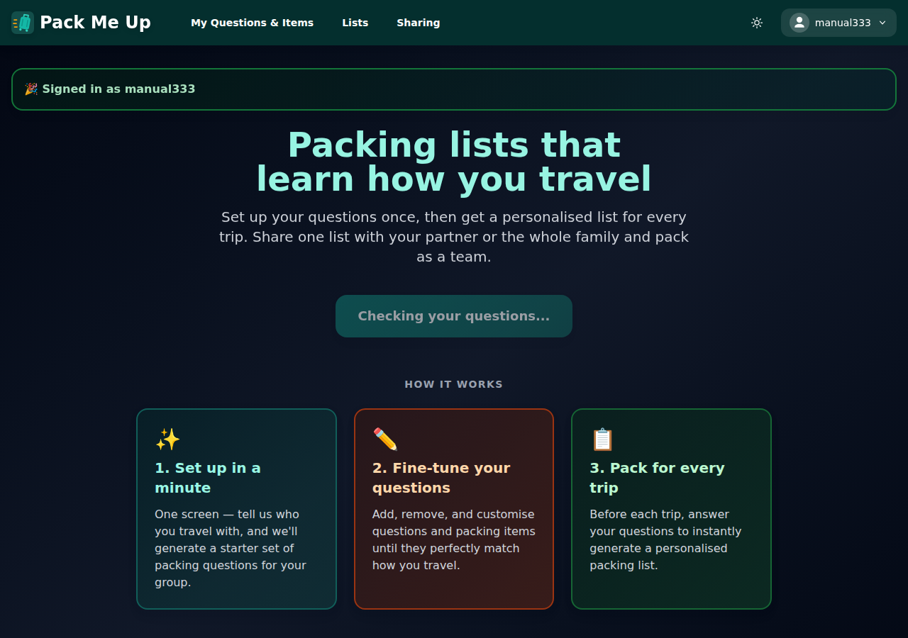

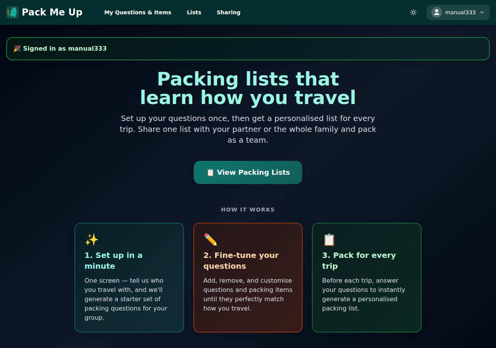

---

## Criterion 2 — no flash of the wizard CTA for a user who already has questions

A local-only user (no pod at all) generated a question set through the wizard:

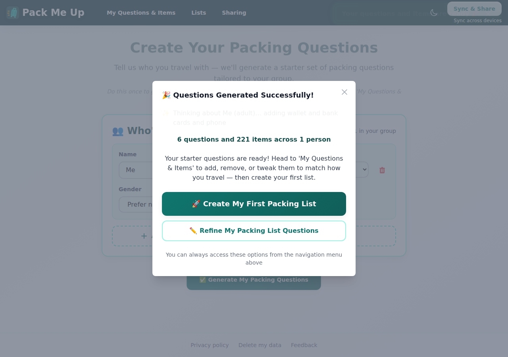

The home page was then opened again and sampled **from the first paint**, once per animation frame
for ~2 seconds, recording which CTA was on screen. The observed sequence was:

```
["checking", "LISTS-CTA"]
```

No `WIZARD-CTA` frame at any point — the wrong CTA never paints, not even for one frame. The page
settles on:

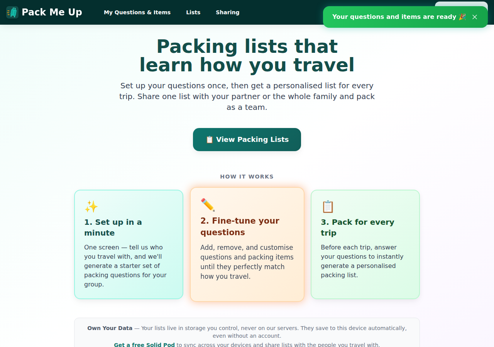

---

## Criterion 3 (regression) — a genuinely new user still gets the wizard

A brand-new browser profile, no pod, no local data. The wizard CTA appears, and the placeholder is
not on screen — the loading state resolves immediately when there is no pod to wait for:

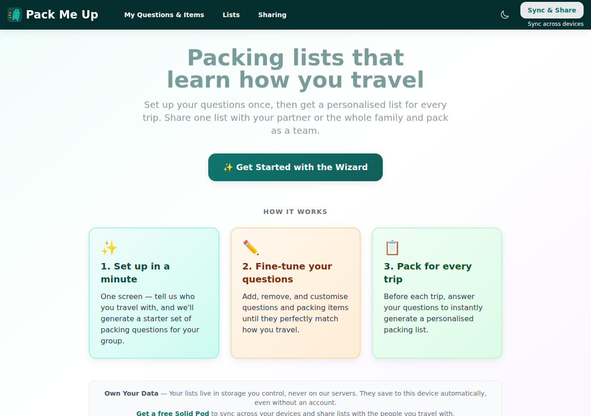

---

## Success criteria

| # | Criterion (from the issue) | Result |
|---|---|---|
| 1 | Signing in from `/home` with an existing question set on the pod flips the CTA to "View Packing Lists" once the background sync completes, without a reload | ✅ Pass — screenshots 02→03, zero navigations recorded |
| 2 | No flash of the wizard CTA on load for a user who already has questions locally | ✅ Pass — per-frame sampling recorded `["checking","LISTS-CTA"]`, no wizard frame |
| 3 | Test coverage in `landing-page.test.tsx` and/or `useHasQuestions.test.ts` for the "sync completes after mount" case | ✅ Pass — see below |
| — | (Regression) a genuinely new user still gets the wizard CTA | ✅ Pass — screenshot 12 |

---

## Automated checks

| Check | Result |
|---|---|
| `npm test` (`tsc -b` then vitest) | ✅ 121 files, **2212 tests passed** |
| `npm run lint` | ✅ 0 errors (11 pre-existing warnings, none in the changed files) |
| e2e `a-onboarding.spec.ts` (asserts both CTA names) | ✅ 7 passed |
| e2e `e-auth.spec.ts` (login/logout/session restore) | ✅ 6 passed |

New tests written for the issue, TDD, red before green:

- `useHasQuestions.test.ts` — "re-reads when the background login sync completes" (the issue's own
  case), plus four `isLoading` cases covering the first read, the found-questions short-circuit, the
  empty-while-syncing case, and the local-only user.
- `landing-page.test.tsx` — "commits to neither CTA while the question check is still resolving" and
  "keeps the CTA slot in place while the question check is resolving".

---

## Bugs found

**None.** Nothing unexpected surfaced during the walkthrough.

One observation worth recording rather than filing: the placeholder is a labelled pill reading
"Checking your questions..." rather than a blank skeleton, because on a slow pod it can be on screen
for seconds and an unlabelled grey block would be a mystery. It borrows the CTA's exact footprint,
so nothing below it moves when the answer arrives.
