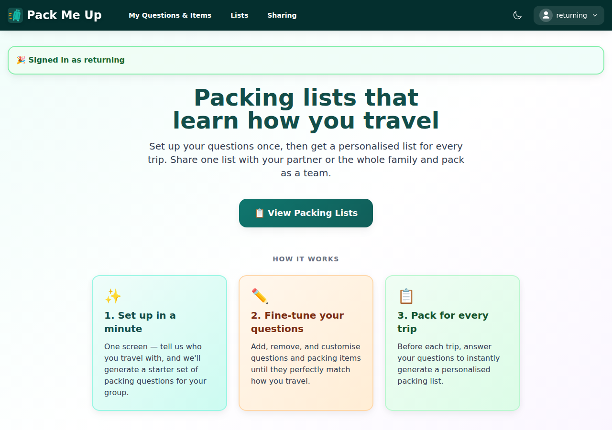
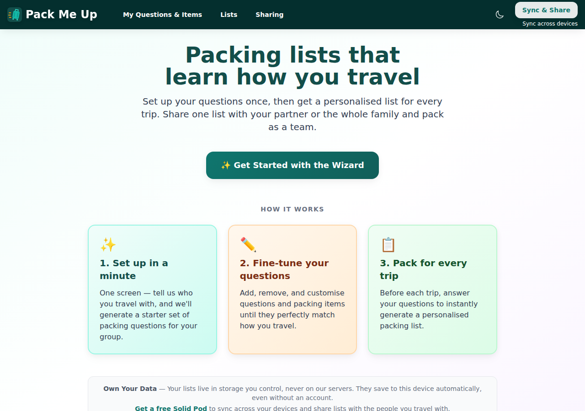
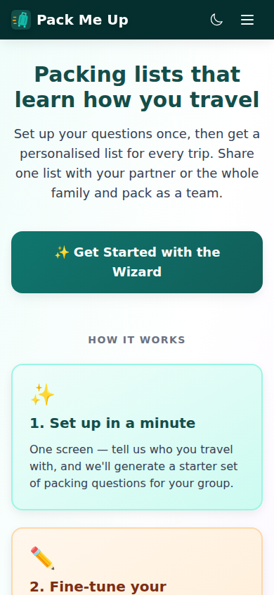
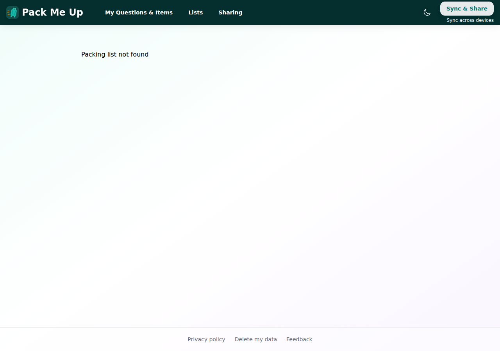
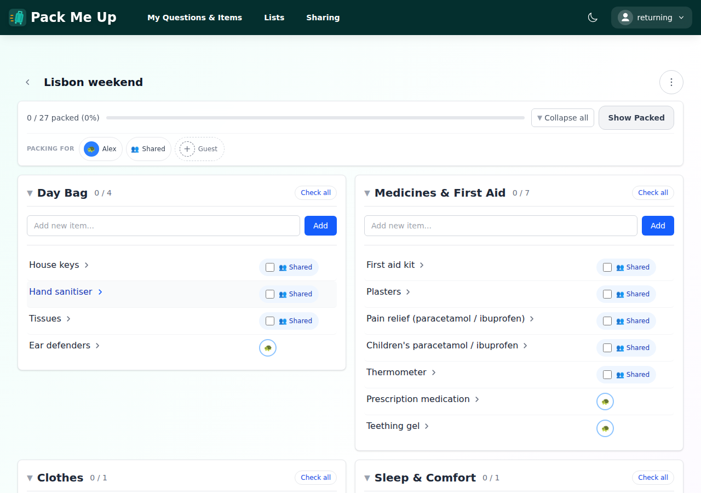
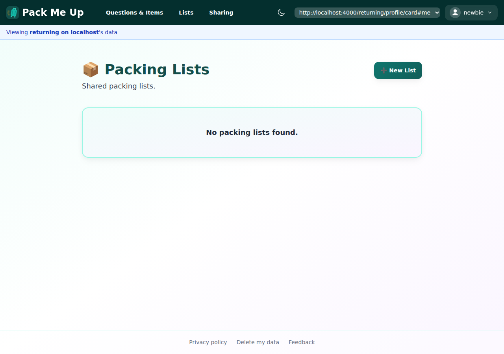
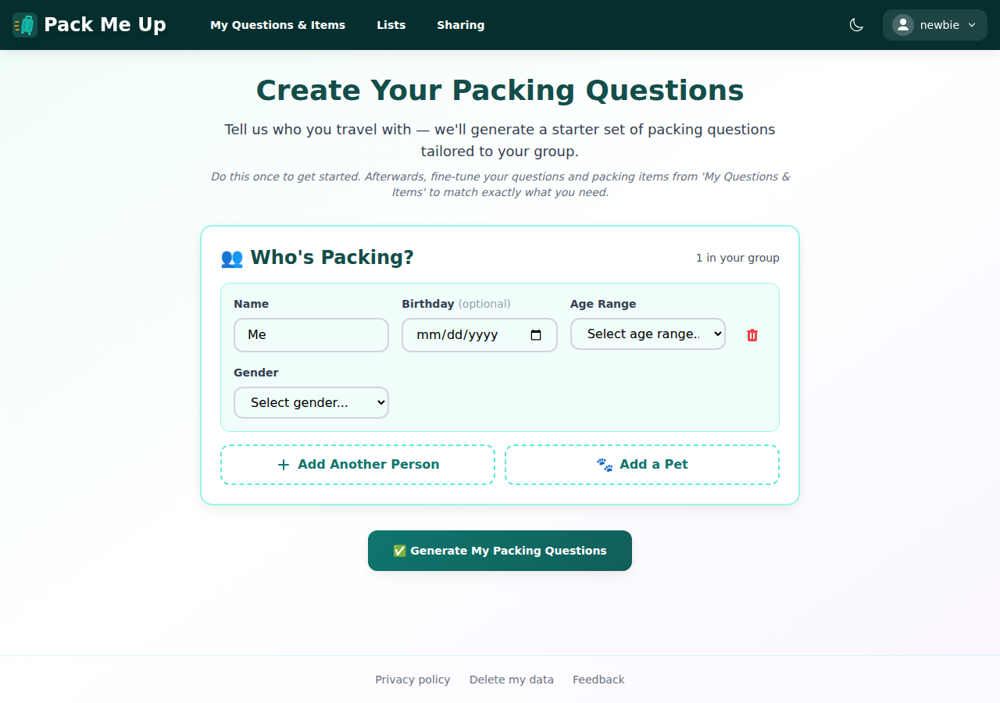
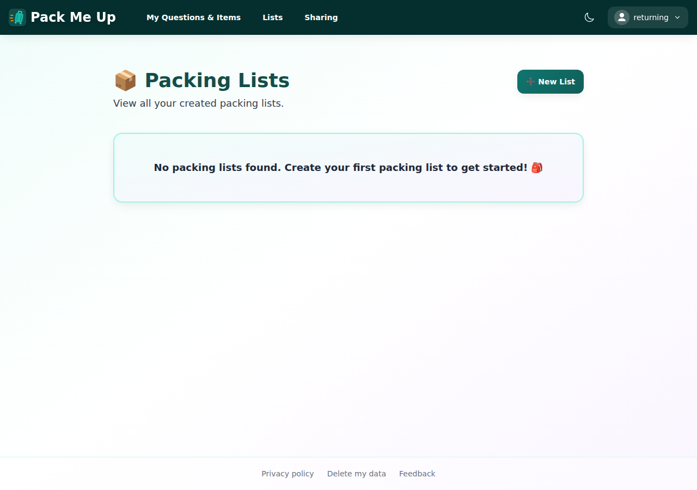

# Manual test report — issue #334: land on the suggested destination after signing in

| | |
|---|---|
| **Date** | 2026-09-04 |
| **Issue** | [#334 — After signing in from the home page, land on the suggested destination rather than back on `/home`](https://github.com/timgent/pack-me-up/issues/334) |
| **PR** | [#345 — Land on the suggested destination when signing in from a neutral page](https://github.com/timgent/pack-me-up/pull/345) |
| **Branch** | `claude/issue-pickup-ffp4bt` |
| **Commit under test** | `2eff7af` — *Land on the suggested destination when signing in from a neutral page* |
| **Result** | ✅ **Pass** — all four acceptance criteria met against a real Solid pod, with the old behaviour reproduced on the pre-fix build for comparison. **No bugs found.** |

---

## How it was tested

| | |
|---|---|
| Build | `npm run build` → `vite preview` (production bundle, http://localhost:4173) |
| Pre-fix build | The parent commit `1933158` built in a `git worktree` and served on http://localhost:4174, for the before/after comparison |
| Solid server | Community Solid Server v7 on http://localhost:4000 — real OIDC sign-in, real pod reads and writes |
| Accounts | `returning@example.com` (pod `returning`) and `newbie@example.com` (pod `newbie`), **both created at runtime for this walkthrough**, so no e2e suite's pod was touched |
| Pod contents | `returning` had a question set and one packing list ("Lisbon weekend") generated through the app's own wizard; `newbie` was left completely empty |
| Viewports | Desktop **1280×900**, mobile **390×844** |
| Driver | Playwright with the pre-installed Chromium, driving the real built app through the real CSS login and consent screens |

Every walkthrough ran in a **fresh browser context**, so at the moment the destination is chosen
the local PouchDB is empty and the question set has to arrive from the pod. That is deliberate: it
is exactly the timing hazard the issue warns about (#333), and it is the case where a naive
implementation would send a returning user into the wizard.

The walkthrough was a throwaway Playwright script kept outside the repo and **deleted afterwards**,
so it never lands in the committed e2e suite.

---

## Before: the bug, on the pre-fix build

Same pod, same account, same walkthrough, against `1933158`. Ten seconds after signing in from the
home page — long after the pod sync finished — the user is still sitting on `#/home`, being offered
a "View Packing Lists" button they have to click themselves:

`DefaultRedirect` never ran, because login restored the stored route `/home` rather than falling
through to `/`.

---

## Criterion 1 — signing in from `/home` lands on the suggested page, not back on `/home`

### Desktop (1280×900)

Signed out on `#/home`, "Sync & Share" in the nav:

After the real CSS login and consent round trip, the app lands on `#/view-lists` — no intermediate
stop on the home page, no button to press:

This user's question set lives only in the pod at this point — the browser context was fresh — so
this also shows the wait working: the redirect page held on "Logging in…" until the question check
settled, then chose the lists rather than guessing the wizard.

### Mobile (390×844)

Same account, narrow viewport. Signed out, sign-in lives behind the hamburger menu:

Same result — straight to the lists:

**Pass.**

---

## Criterion 2 — signing in from a deep link still returns to that exact route

### A packing list, `#/view-lists/:id`

The list "Lisbon weekend" was created through the app and lives in the `returning` pod. Opened
signed out in a fresh context, the deep link renders "Packing list not found" — the data is in the
pod, which needs an account:

Signing in from that page returns to **the same route**, `#/view-lists/7fa77722-…`, and the list
appears. The neutral-route substitution did not fire:

### Someone else's pod, `#/pod/:encodedPodUrl/view-lists`

Opened signed out at `#/pod/http%3A%2F%2Flocalhost%3A4000%2Freturning%2Fprofile%2Fcard%23me/view-lists`:

Signed in as a *different* account (`newbie`) and the foreign-pod route is preserved intact —
note the context switcher and the "Viewing **returning on localhost**'s data" banner. (No lists
show because `returning` has not shared anything with `newbie`; the route is what is under test.)

**Pass.**

---

## Criterion 3 — a user with no questions is not dumped into an empty list view

`newbie` is a brand-new pod with nothing in it. Signed out on `#/home`:

Signing in lands on `#/wizard` — the deliberate destination the issue allows for, with an obvious
route forward rather than an empty list index:

**Pass.**

---

## Criterion 4 — tests cover both the substitution and the deep-link preservation

Covered at three levels, all in the PR:

- `src/pages/postLoginDestination.test.ts` — 16 cases pinning which routes count as neutral
  (`/`, `/home`, `/home/`, `/home?utm=x`, empty, `null`, and the redirect page itself) and which do
  not (`/view-lists/abc123`, `/wizard`, `/pod/…/view-lists`, `/manage-questions`,
  `/create-packing-list`, `/view-lists?filter=me`).
- `src/pages/solid-pod-handle-redirect-page.test.tsx` — the substitution (`/home` → `/view-lists`),
  the new-user case (`/home` → `/wizard`), deep-link preservation even for a user with no
  questions, that nothing is navigated while the question check is still loading, and that exactly
  one navigation happens once it settles.
- `src/components/SolidPodContext.test.tsx` — the OAuth callback routes a neutral stored route
  through the redirect page and clears the key, while `/create-packing-list` is still restored
  verbatim.

**Pass.**

---

## Extra check — the back button

Not on the issue, but worth confirming since a new redirect hop was introduced. After landing on
`#/view-lists`, pressing back does **not** bounce through the "Logging in…" screen — the redirect
page navigates with `replace`, so it leaves no history entry of its own:

---

## Success criteria

| # | Criterion | Result |
|---|---|---|
| 1 | Signing in from `/home` lands the user on their suggested page, not back on `/home` | ✅ Pass (desktop + mobile) |
| 2 | Signing in from a deep link (`/view-lists/:id`, `/pod/:encodedPodUrl/view-lists`) still returns to that exact route | ✅ Pass (both) |
| 3 | A user with no questions is not dumped into an empty list view with no route forward | ✅ Pass — sent to `/wizard` |
| 4 | Tests cover both the neutral-route substitution and the deep-link preservation | ✅ Pass |

## Automated checks

| Check | Result |
|---|---|
| `npm test` (type check + vitest) | ✅ **122 files, 2234 tests passed** |
| `npm run lint` | ✅ 0 errors (11 pre-existing warnings, none in the changed files) |
| `npm run build` | ✅ Built in 9.46s |
| e2e suite | Not re-run — no spec asserts the post-login landing page; every suite navigates explicitly after `loginToCss`, and the helper itself waits only for the account menu. Verified by reading all 14 specs. |

## Bugs found

**None.**

One pre-existing observation, unrelated to this change and already tracked as
[#337](https://github.com/timgent/pack-me-up/issues/337): on a 390px viewport the "Sync & Share"
button is not on the mobile bar, so signing in means opening the hamburger menu first. The
walkthrough had to do that to reach sign-in on mobile.
