# Manual test report — issue #335

| | |
|---|---|
| **Date** | 2026-09-04 |
| **Issue** | [#335 — Replace decorative emoji with icons app-wide (keep emoji where they carry meaning)](https://github.com/timgent/pack-me-up/issues/335) |
| **PR** | _(added when raised)_ |
| **Branch** | `claude/issue-pickup-9ro5va` |
| **Commit under test** | `3d738c5` |
| **Result** | ✅ Pass — every acceptance criterion met, no bugs found in the change |

---

## How it was tested

- `npm run build` (Vite production build) served by `npm run preview` on `http://localhost:4173` — the built app, not the dev server.
- Driven with Playwright and the pre-installed Chromium, via a throwaway spec deleted afterwards (never committed to `e2e/tests/`).
- **Viewports:** desktop 1280×900 and mobile 390×844.
- **Themes:** light *and* dark on every screen that changed. The whole complaint
  was about contrast, and an emoji is a full-colour bitmap that ignores the
  theme — so a light-only pass would have proved nothing.
- **Account:** logged out throughout. Nothing in this change touches sign-in,
  sync or sharing behaviour; the sharing screens were exercised in their
  logged-out state, which is where their changed copy lives.
- Automated suites run separately (see [Automated checks](#automated-checks)).

---

## Acceptance criterion 1 — No decorative emoji in buttons, headings, or card ornaments

### Home page

The reported screen. The CTA is now words alone, and each "How it works" card
carries a monochrome heroicon in that card's own heading colour instead of a
full-colour emoji.

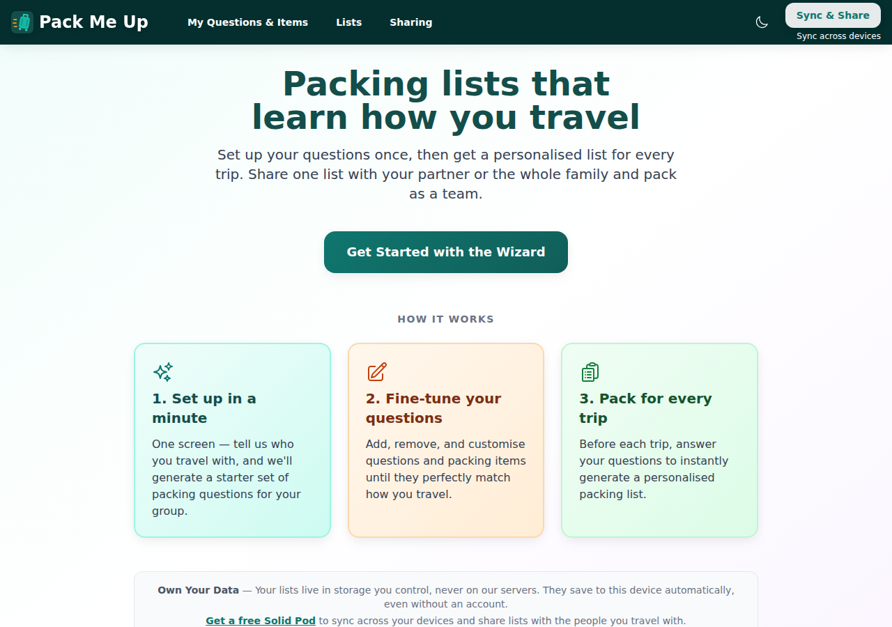

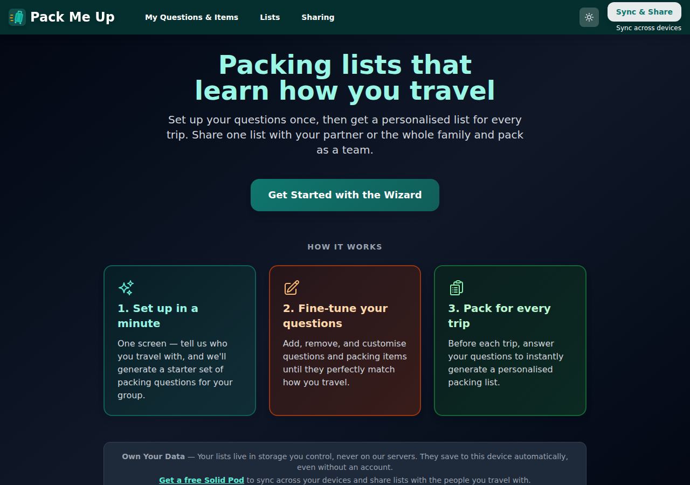

Dark is the case the emoji handled worst — ✨ and 📋 kept their light-mode
colours against a dark card. The icons are `currentColor`, so they are exactly
as visible as the heading above them.

### The wizard

Three of the four emoji Michael named are on this screen.

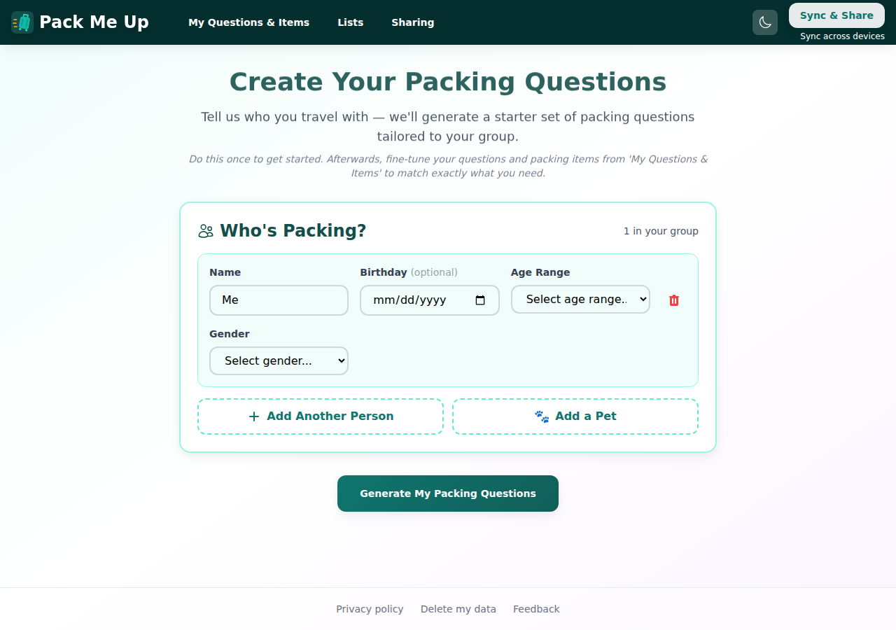

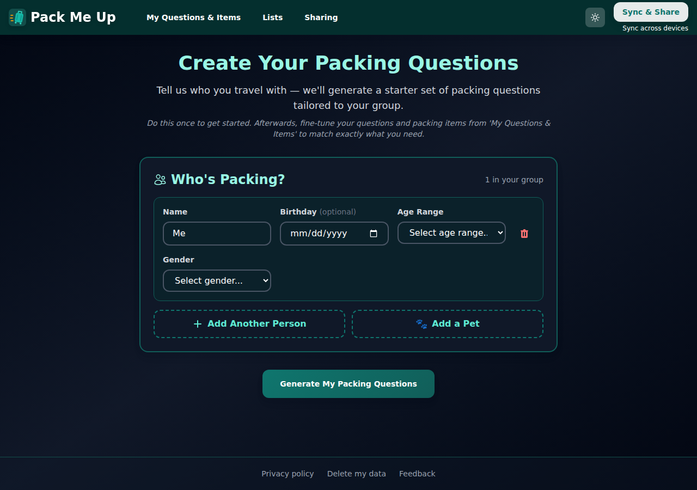

- 👥 on "Who's Packing?" → `UsersIcon`.
- 🔄 / ✅ on the submit button → gone; while generating, an `ArrowPathIcon`
  spins in their place (behind `motion-safe:`).
- 🐾 on "Add a Pet" is **kept** — see criterion 2.

### The success modal

The second screen from the report ("remove the emojis from the buttons and the
sparkles as they are barely visible").

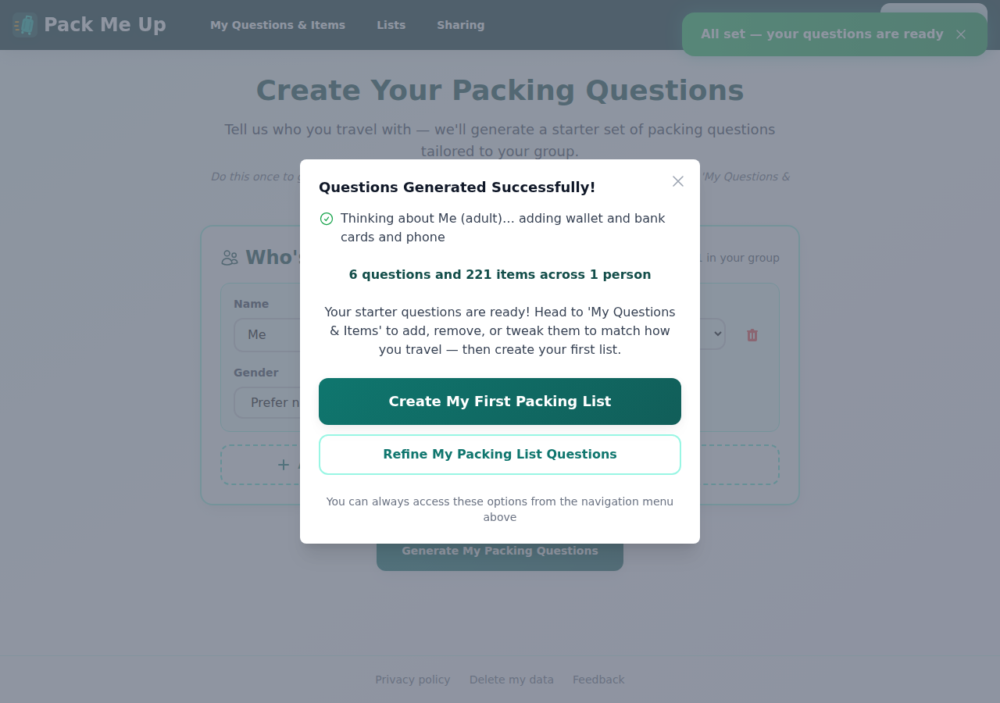

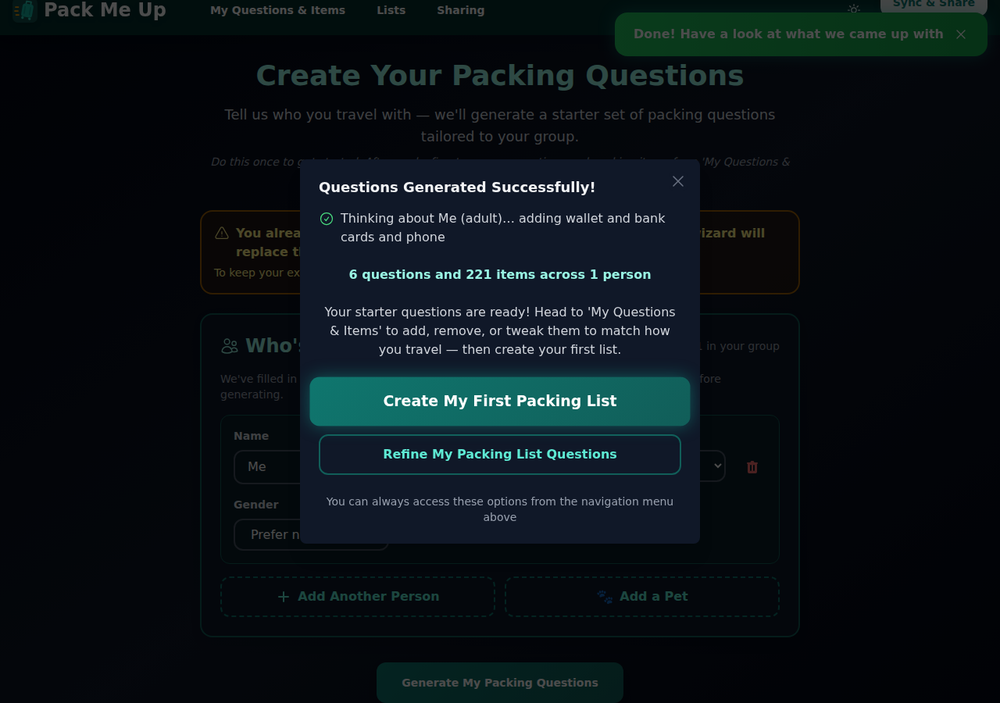

🎉 has left the title, the per-person ✨ is now a `CheckCircleIcon` in the
success colour (it marks a person as done, which is what the line says), and
both buttons are words alone.

> Note: cutting the two paragraphs and badging the celebration glyph is #339's
> job, not this one. This change deliberately removes glyphs and adds icons and
> nothing else — but it does unblock #339, see criterion 4.

### The packing list

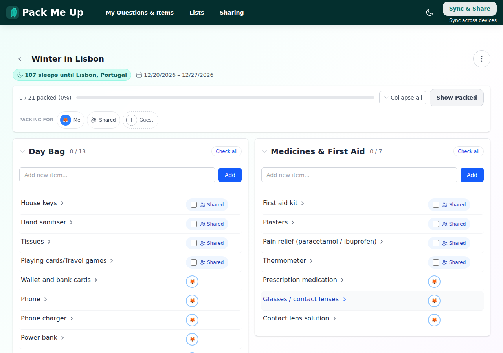

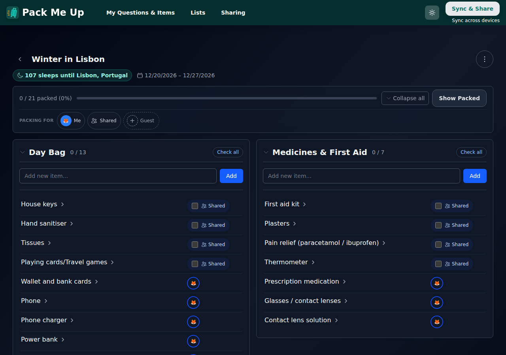

In one screen: 📍/📅 in the trip details → `MapPinIcon`/`CalendarIcon`; the
countdown badge's 🌙 → `MoonIcon`; ▼/▶ disclosure triangles on the section
headers and on "Collapse all" → `ChevronDownIcon`/`ChevronRightIcon`; 👥 on the
"Shared" chips → `UsersIcon`.

The list-actions menu's 🔗 and 🔄 become `LinkIcon` and `ArrowPathIcon` — the
`ActionMenuItem` already took a `ReactNode` icon, so nothing needed widening:

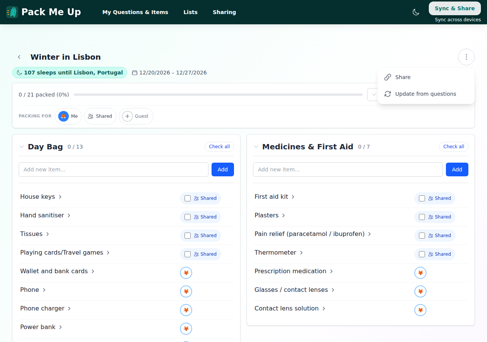

### The lists index

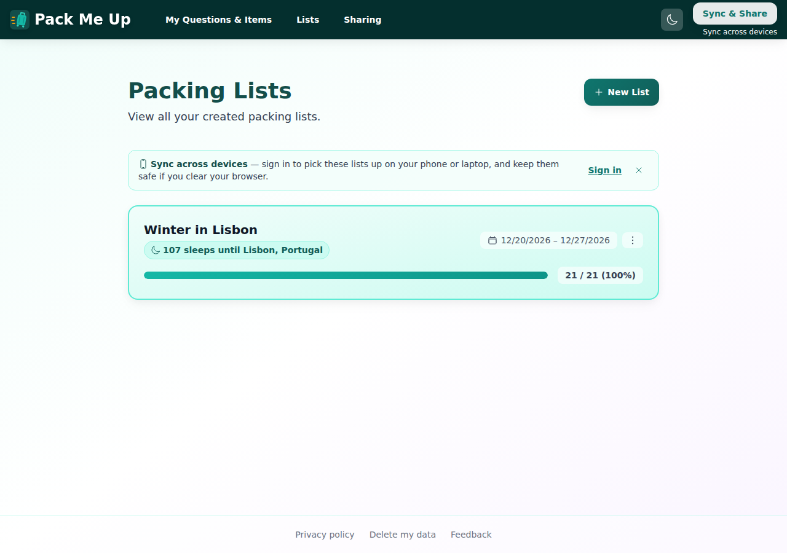

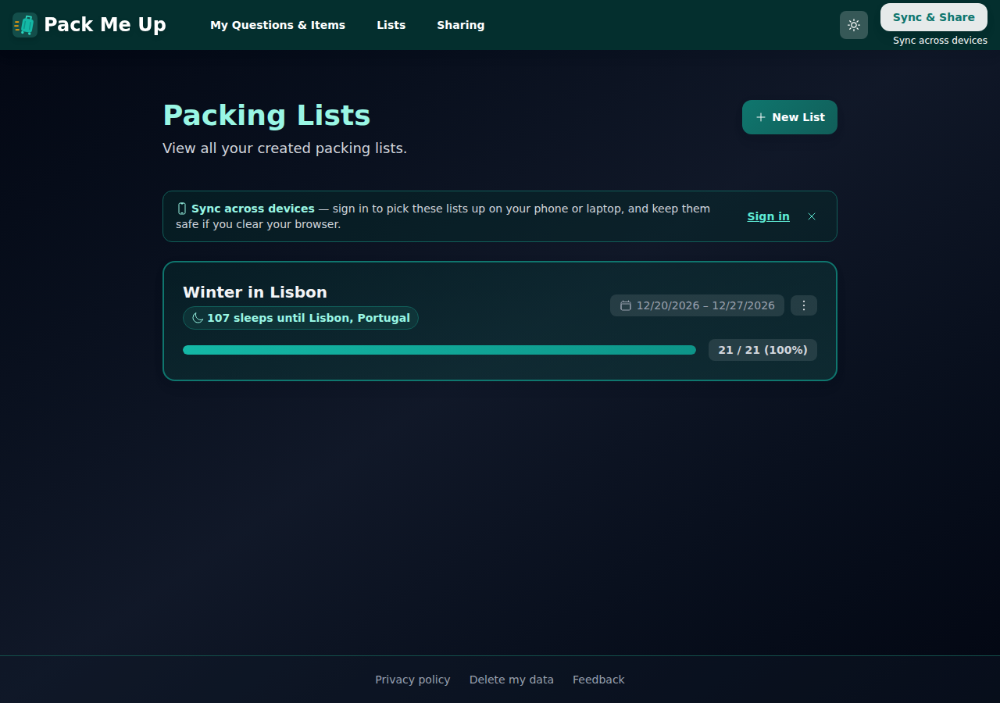

📦 has left the h1, ➕ on "New List" is a real `PlusIcon` inside the button,
✈️ has left the card title, and 📅 is a `CalendarIcon`. 📱 on the sync nudge is
a `DevicePhoneMobileIcon`.

Empty state, with 🎒 gone from the copy:

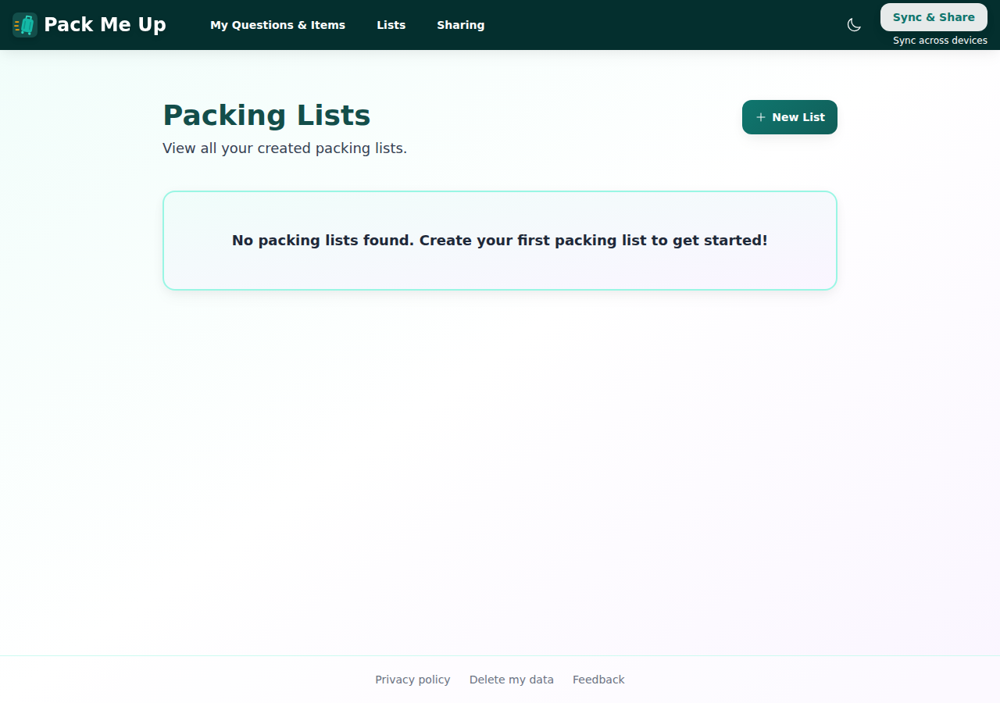

### The rest

| Screen | Screenshot |
|---|---|
| "No Questions Found" panel (📋 → `ClipboardDocumentListIcon`; ✨ / 🔄 / ✏️ card headings → icons) | [light](images/03-no-questions-light.png) · [dark](images/04-no-questions-dark.png) |
| Existing-data warning on the wizard (⚠️ → `ExclamationTriangleIcon`) | [light](images/09-wizard-warning-light.png) · [dark](images/10-wizard-warning-dark.png) |
| Sharing page, logged out (🔗 off the sign-in button) | [light](images/20-sharing-light.png) · [dark](images/21-sharing-dark.png) |
| Sign-in-to-share prompt (🔗 off `confirmLabel`) | [light](images/15-share-prompt-light.png) |
| Questions page (🧳 off the empty state; person avatars kept) | [dark](images/30-questions-page-dark.png) |

---

## Acceptance criterion 2 — Person avatars and pet markers still render their emoji

Both appear above and are unchanged:

- The 🦊 avatar beside "Me" on every item row of [the list view](images/12-list-view-light.png) and on [the questions page](images/30-questions-page-dark.png) — `person-emoji.ts`, untouched.
- 🐾 on "Add a Pet" in [the wizard](images/05-wizard-header-light.png), and the age glyphs (👶 🧒 👦/👧 🧑) in the Age Range select, visible in [the confirm-dialog shot](images/11-confirm-dialog-dark.png). These *are* the data — they distinguish a pet from a person and a baby from an adult, which is what the packing questions branch on.

The all-packed celebration is also kept, deliberately:

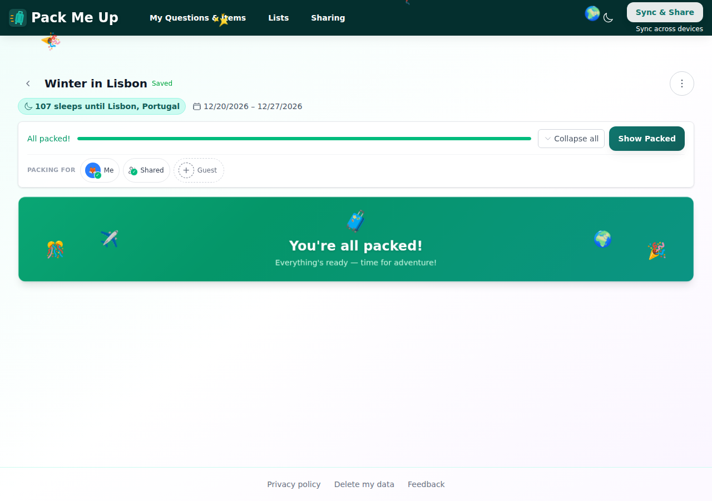

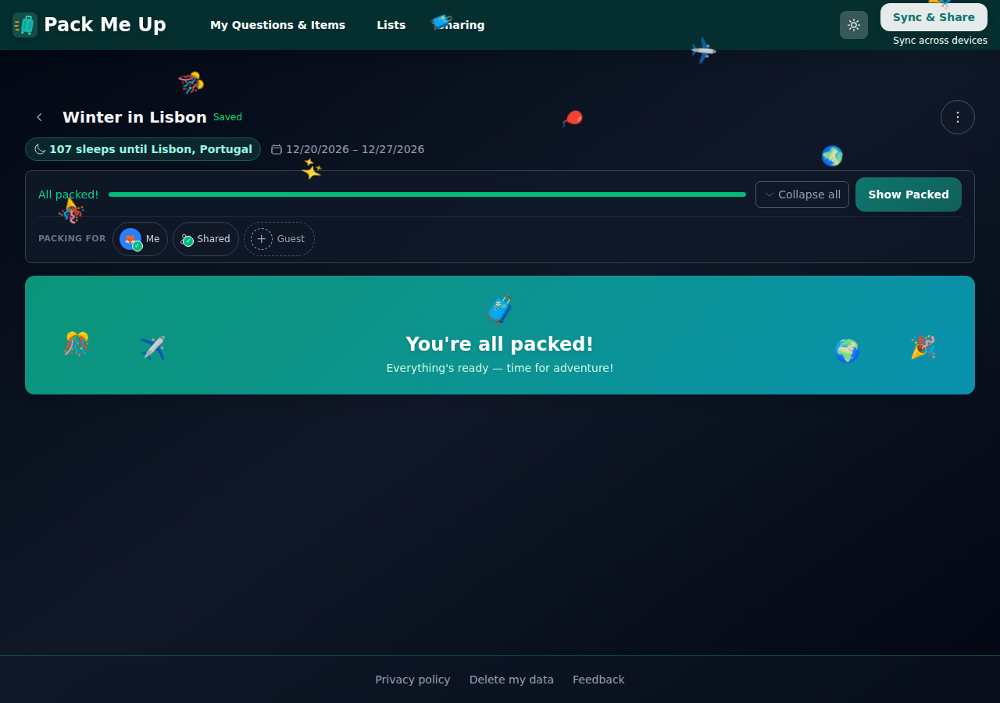

This is the one moment in the app that is *about* being colourful — confetti
falls and the suitcase pops. Both are `aria-hidden` and both stop under
`prefers-reduced-motion`. Note the progress strip beside it now reads a plain
"All packed!": the small pills were heading ornaments, the banner is the event.

---

## Acceptance criterion 3 — Icons are heroicons, `aria-hidden`, and sized consistently

- One icon set: `@heroicons/react/24/outline`, already a dependency and already
  used by `ThemeToggle`, `AccountMenu`, `Toast` and `SessionExpiredBanner`. No
  lucide, no second stroke weight.
- Every icon added carries `aria-hidden="true"`.
- Three sizes only: `h-4 w-4` inline with small text, `h-5 w-5` in buttons and
  body text, `h-6 w-6`/`h-8 w-8` in headings and card ornaments.
- Where an emoji had been a control's only visible mark, the control's existing
  `aria-label` now does the naming — this is also the accessibility improvement
  #309 asked for.

Screen-reader names were checked by driving the app through Playwright's
accessibility-tree selectors throughout: every control in this walkthrough was
reached by `getByRole(..., { name })`, so a control whose name had collapsed to
nothing would have failed the walkthrough rather than appearing in it.

---

## Acceptance criterion 4 — The split is enforced from here on

`src/decorativeEmoji.test.ts` walks every non-test file under `src/` and asserts
the **exact** set of emoji left, file by file, against an allowlist with a
comment per entry saying why that file is semantic. It fails two ways:

- a new decorative emoji anywhere → an unexpected file, or an unexpected glyph
  in a listed one;
- a semantic emoji deleted by accident → a missing glyph.

It found two of my own strays during this work (emoji I had written into code
*comments* while explaining the change), which is a fair demonstration that it
catches what a reviewer scanning a 33-file diff would not.

Also landed, because #339 and #338 need it: `Modal` and `ConfirmationDialog` now
take a `ReactNode` `title`. Callers had been smuggling glyphs into the title
string (`"⚠️ Existing Data Found"`) because that was the only way to get a mark
into a header. It is now an element:

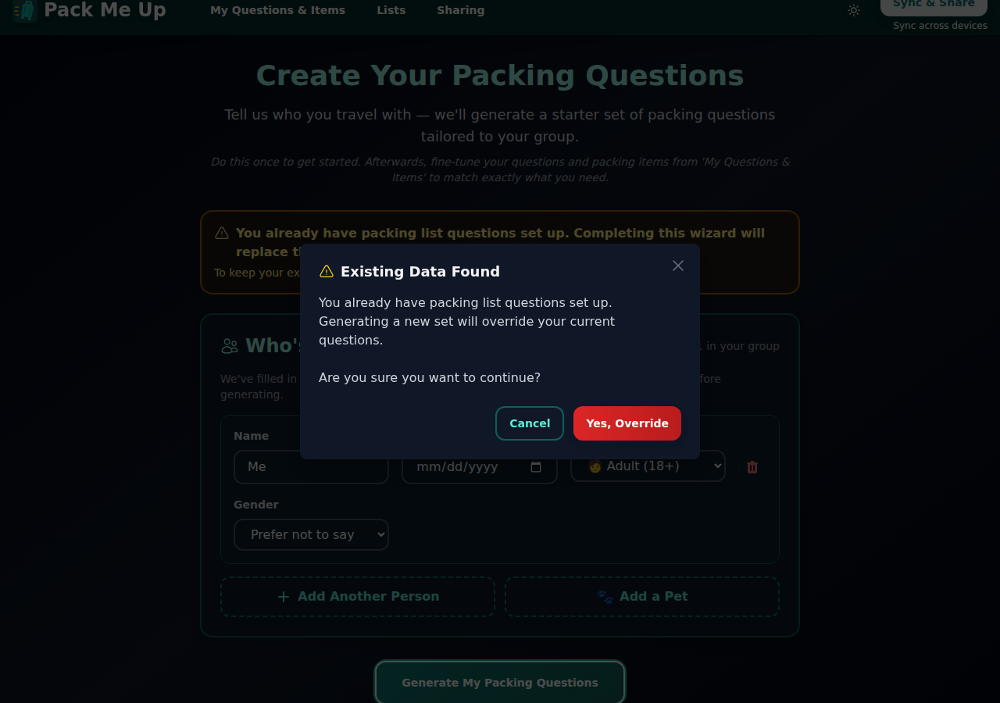

---

## Mobile

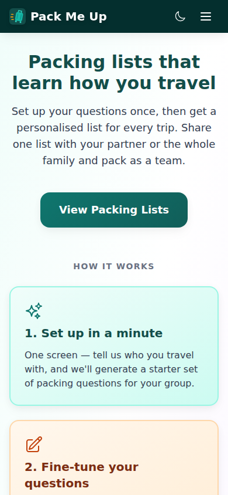

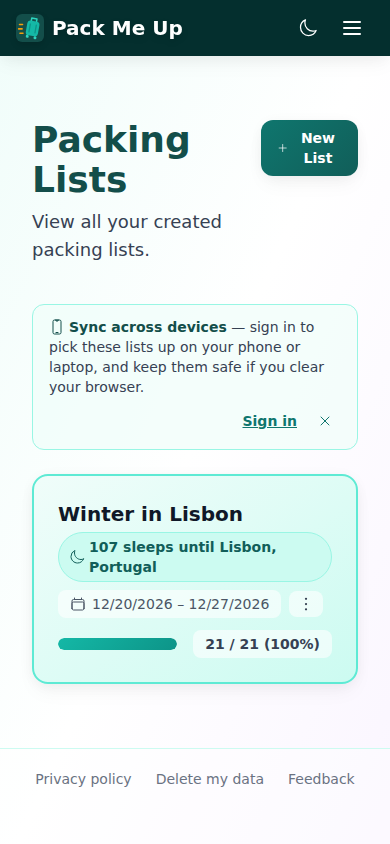

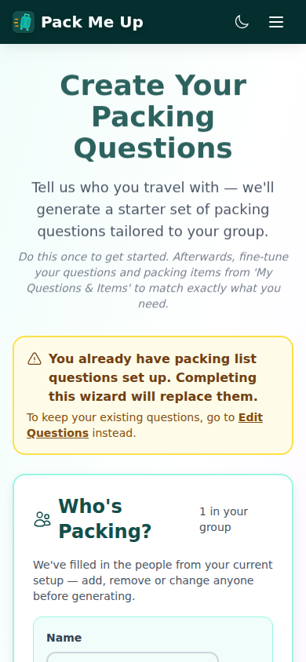

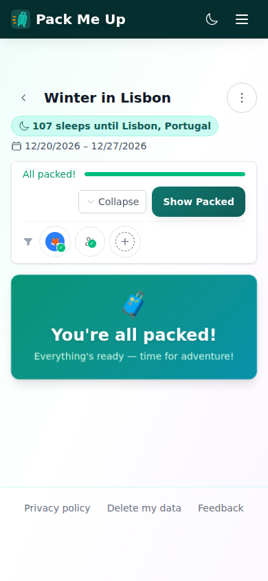

Dark on the phone: [home](images/26-mobile-home-dark.png) · [lists](images/27-mobile-lists-dark.png)

### One thing worth checking, and its answer

On a 390px screen the "New List" button wraps onto two lines. It is fair to
suspect the `PlusIcon` caused that, so I checked against `main` at the same
viewport:

| Before (`main`) | After (this branch) |
|---|---|
| 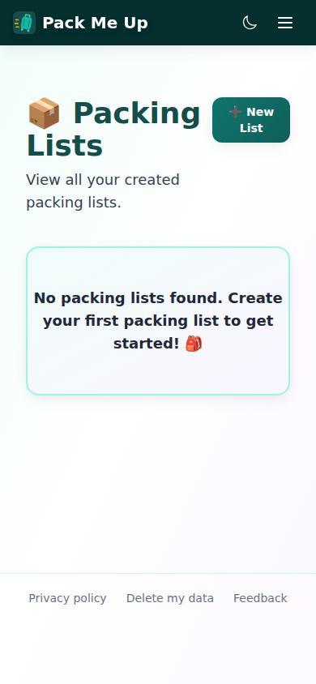 | 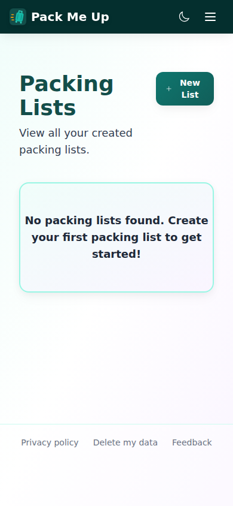 |

It wrapped identically before — "➕ New List" is the same width problem. The
change in fact makes the header *less* cramped, since 📦 no longer pushes
"Packing Lists" onto two lines.

---

## Success criteria

| # | Criterion | Result |
|---|---|---|
| 1 | No decorative emoji remain in buttons, headings, or card ornaments | ✅ Pass |
| 2 | Person avatars and pet markers still render their emoji | ✅ Pass |
| 3 | Icons are heroicons, `aria-hidden`, and sized consistently | ✅ Pass |
| 4 | `npm test` green (type check + vitest), e2e suites unaffected | ✅ Pass |
| — | Light *and* dark checked on every changed screen | ✅ Pass |
| — | Desktop (1280×900) and mobile (390×844) checked | ✅ Pass |

## Automated checks

| Command | Result |
|---|---|
| `npm test` (`tsc -b` then vitest) | ✅ 123 files, **2237 tests passed** |
| `npx playwright test` (full suite) | ✅ **95 passed** |
| `npm run lint` | ✅ 0 errors (11 pre-existing warnings, unchanged) |

One e2e assertion needed fixing rather than merely updating, and it is worth
calling out because it was a latent problem the emoji had been hiding:
`"Anyone with the link"` is the label of **two** things in the share modal — the
Current-access row and the share-mode toggle above it. Only the 🌐 on the row
told them apart, so a bare `getByText` matched both once it was removed, and the
"row is gone after revoke" assertion failed against a toggle that never goes
away. Both the e2e spec and the unit test now filter by `listitem`, which is
what they always meant.

---

## Bugs found

**None in this change.**

One incidental observation, unrelated to the diff and not caused by it: while
scripting the walkthrough, the wizard's "you already have questions" warning
intermittently failed to appear on a revisit immediately after generating,
even though the questions had in fact saved (the questions page showed them,
and a reload made the warning appear). It looks like a race between
`db.saveQuestionSet` and the wizard's own `db.getQuestionSet()` mount check in
`src/pages/wizard.tsx`. I reproduced it on a throwaway script only; a spot
check of the same script against `main` passed, but on too few runs to call it
pre-existing with confidence. Nothing in this diff touches `DatabaseContext`,
PouchDB, or that effect. Flagging it here rather than filing an issue, since I
could not characterise it properly.

One screen could not be photographed: the **offline banner** (📴 →
`SignalSlashIcon`) only renders when a signed-in session cannot reach its Pod
(`isReconnecting`), which this logged-out walkthrough cannot reach. Its change
is a one-line glyph swap covered by `OfflineBanner.test.tsx` and by the
decorative-emoji guard.
