# Manual test report — issue #337

| | |
|---|---|
| **Date** | 2026-09-05 |
| **Issue** | [#337 — Move the theme control out of the navbar into the account menu (with a System option), and surface sign-in on the mobile bar](https://github.com/timgent/pack-me-up/issues/337) |
| **PR** | _see the PR that links to this report_ |
| **Branch** | `claude/issue-pickup-lq22te` |
| **Commit under test** | `abc81c7` |
| **Result** | ✅ Pass — all five acceptance criteria met. Two issues found and fixed during this pass; one pre-existing bug found and left alone (out of scope). |

## What changed, and one deviation from the issue

The issue proposed the **account menu** as the theme control's new home, and noted that
"if a real `/settings` page is preferred, that's a bigger call and worth saying so on this
issue before starting."

It is preferred, and the reason showed up as soon as the account menu was considered
seriously: **that menu only exists when you are signed in.** Putting the only theme control
there would leave a signed-out user with no way to change the theme at all — strictly worse
than today. So the control went to a real `/settings` route, reachable from the footer
(every page, every auth state), the account menu, and the mobile hamburger.

Everything else follows the issue as written.

## How it was tested

- **Build**: `npm run build` → `npm run preview` on `http://localhost:4173` (the built app,
  not the dev server).
- **Solid server**: Community Solid Server on `http://localhost:4000`, pod `test`,
  `test@example.com`. Sign-in went through the real OIDC flow — CSS login form, consent
  screen, callback — not a mock.
- **Browser**: pre-installed Chromium, driven by a throwaway Playwright script (deleted
  afterwards; it was never committed to `e2e/`).
- **Viewports**: desktop **1280×900** and phone **390×844**.
- **Accounts**: signed out, and signed in as `test` (WebID
  `http://localhost:4000/test/profile/card#me`).

> Note on setup: `.claude/skills/solid-dev/start.sh` **does not currently create the pod or
> the password login**. Lines like `POD_URL=$(curl …) | head -1` run the assignment inside a
> pipeline subshell, so `POD_URL` and `PASSWORD_URL` are empty in the parent shell and the
> two POSTs that follow go nowhere. The server starts, but `/test/profile/card` 404s. The
> account for this pass was provisioned by calling `createCssAccount` from
> `e2e/helpers/css-api.ts` directly. Worth a separate fix to the skill.

---

## AC1 — No theme control in the desktop or mobile top bar

Zero elements matching `switch to dark/light mode` anywhere in the nav, signed in or out,
at either viewport. The mobile hamburger menu no longer carries a "Dark mode" / "Light mode"
row either.

Desktop, signed out — the bar is the logo, the three links, and Sync & Share:

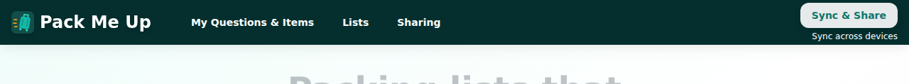

Desktop, signed in — account menu only, no toggle beside it:

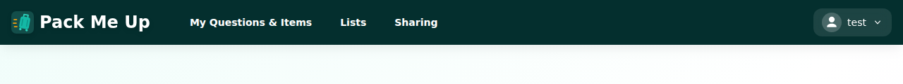

## AC2 — Sign-in (logged out) / profile (logged in) reachable from the mobile top bar

The bar's two slots are now **Sign in + hamburger** when logged out:

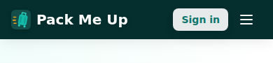

Tapping "Sign in" opens the provider chooser directly — no hamburger, one tap:

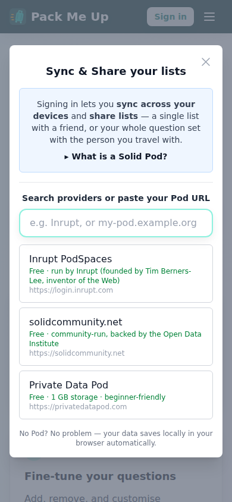

Once signed in, that slot holds the profile avatar (falling back to the generic icon, as
this pod's card names no photo):

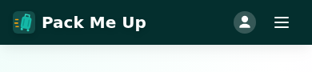

Tapping it opens the account section — WebID, Backups, Logout:

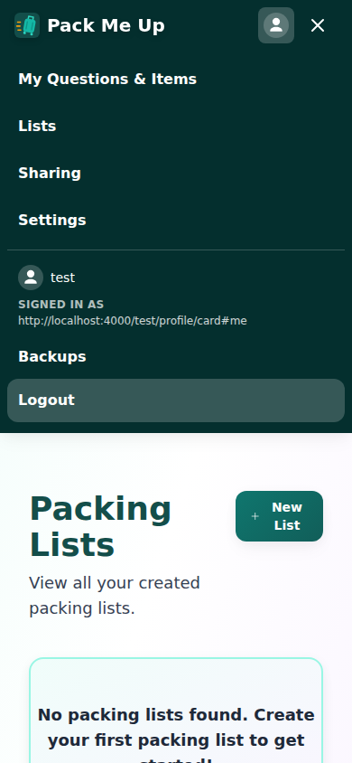

This also holds while **reconnecting** (signed in, pod unreachable): the bar keeps the
profile rather than falling back to a sign-in prompt, which is the #342 rule. Covered by
`Navigation.test.tsx` → "keeps the profile in the mobile bar while reconnecting"; the
offline state was not reproduced by hand in this pass.

## AC3 — Theme settable to Light, Dark or System from both layouts

Desktop:

Phone (the three sit on one even row — see "Issues found" below):

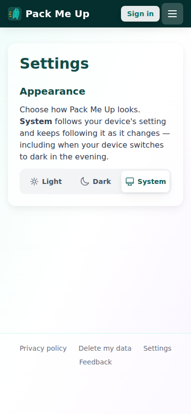

Choosing Dark applies immediately and is stored (`localStorage.theme === "dark"`):

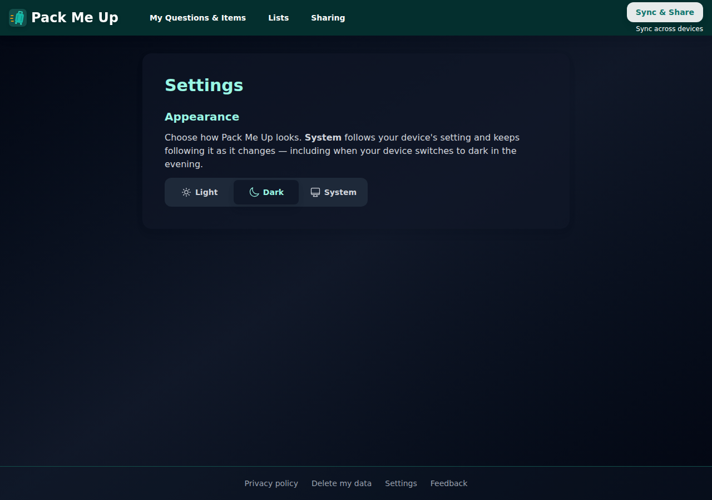

And survives a reload with no flash — the pre-paint script in `index.html` reads the same
key, so it needed no change:

Mobile, dark:

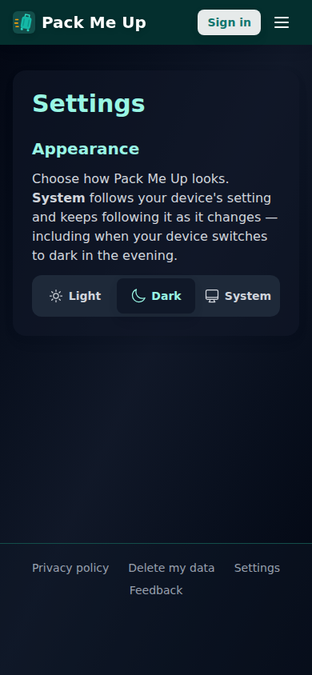

Reachable from the account menu when signed in:

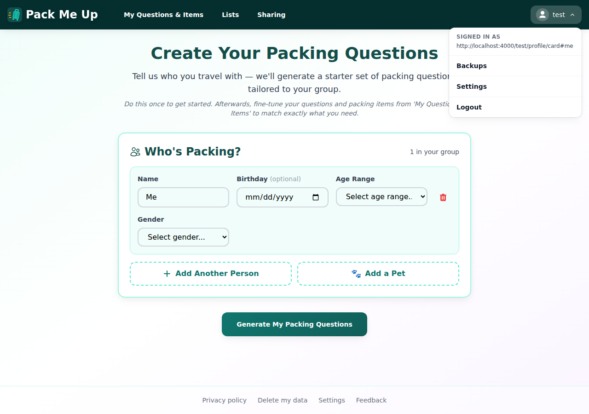

…from the mobile hamburger:

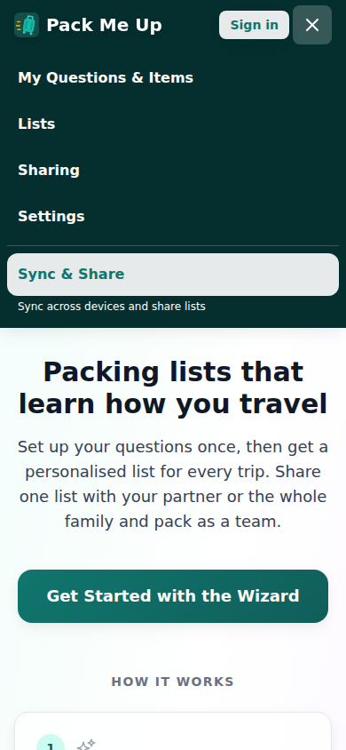

…and from the footer, which is what a **signed-out desktop user** has instead of a menu:

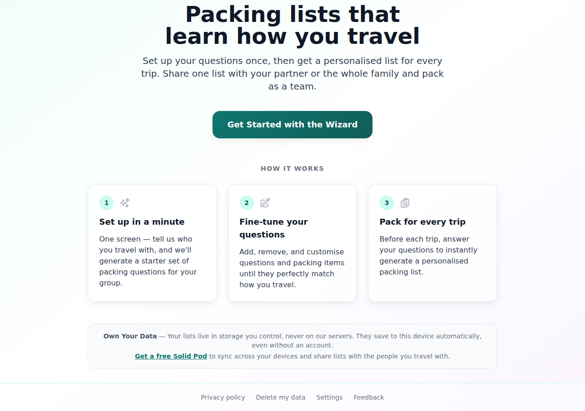

## AC4 — Choosing System clears the stored preference and resumes tracking the OS live

Starting from a stored `dark`, choosing System removed the key
(`localStorage.theme === null`) and the app went light to match the OS:

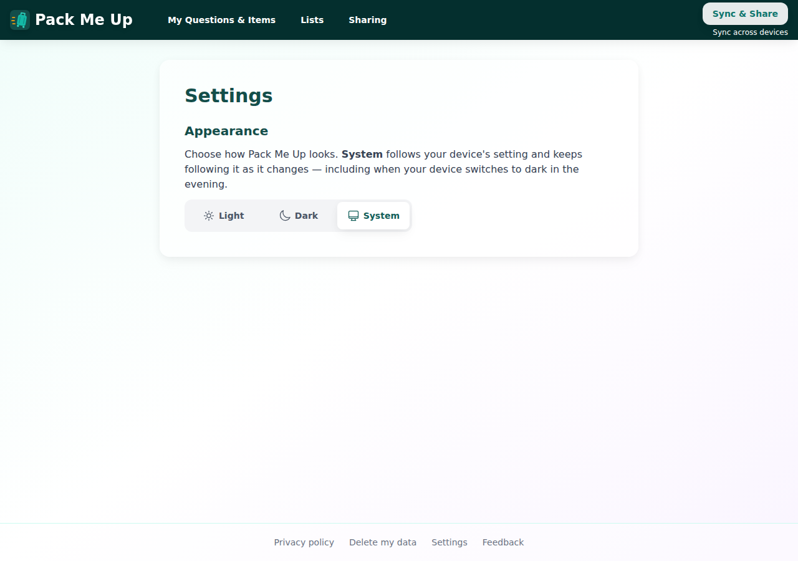

Then the OS colour scheme was flipped to dark **with no reload and no further interaction** —
the app followed, and still stored nothing:

Flipping the OS back to light brought the app back to light. This is the behaviour that was
unreachable before: `useSystemTheme` existed in `ThemeContext` since the #281 follow-up and
nothing in the UI called it, so one tap on the old toggle opted you out of your device
setting permanently.

## AC5 — Tests updated

`ThemeToggle.tsx` and `ThemeToggle.test.tsx` were deleted, replaced by `ThemeChoice` and its
tests. `ThemeContext.tsx` and `ThemeContext.test.tsx` are untouched — the storage-throws
guards and the pre-paint-script tests still pass unchanged, which was the point of making
"System" the *absence* of a stored value rather than a new stored string.

## Unhappy paths

| Path | Result |
|---|---|
| `/settings` opened by direct URL while signed out | Renders fully; no session needed |
| Choose Dark, then browser Back | Theme stays dark, still stored — the choice is not tied to the page |
| Open the provider chooser from the mobile bar, then dismiss it | Dialog closes, still on `/home`, no leftover overlay |
| Keyboard: focus "Light", press → | Moves to "Dark" and selects it — real radios, so arrow keys work with no roving-focus code |

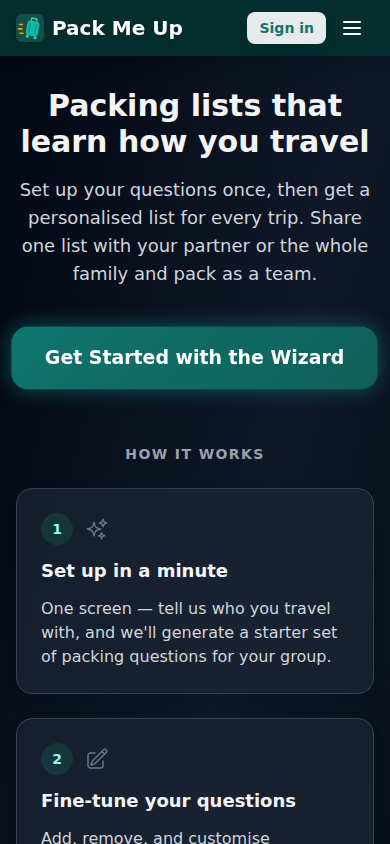
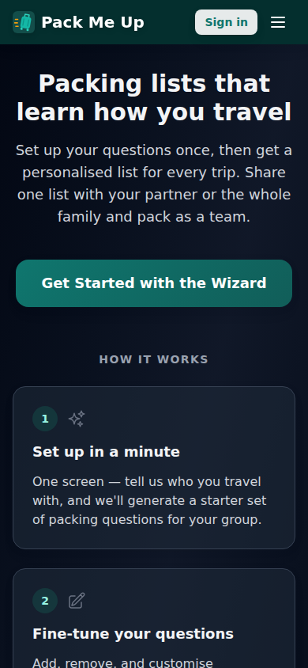
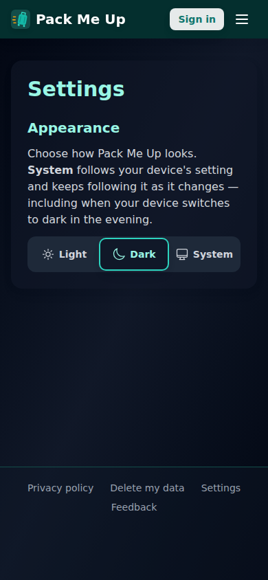

---

## Success criteria

| # | Criterion | Result |
|---|---|---|
| 1 | No theme control in the desktop or mobile top bar | ✅ Pass |
| 2 | Sign-in (logged out) / profile (logged in) reachable from the mobile top bar without opening the hamburger | ✅ Pass |
| 3 | Theme settable to Light, Dark or System from the account menu, in both desktop and mobile layouts | ✅ Pass — via `/settings`, linked from the account menu, the mobile menu and the footer (see the deviation note above) |
| 4 | Choosing System clears the stored preference and resumes tracking OS changes live | ✅ Pass |
| 5 | `ThemeToggle.test.tsx`, `ThemeContext.test.tsx` and `Navigation.test.tsx` updated; the storage-throws guards keep working | ✅ Pass — `ThemeToggle` deleted and replaced by `ThemeChoice`; `ThemeContext` untouched |

## Automated checks

| Check | Result |
|---|---|
| `npm test` (typecheck + vitest) | ✅ 124 files, **2259 tests** passed |
| `npx playwright test` (e2e) | ✅ **95 passed** (2.4m) — no suite referenced the theme toggle |
| `npm run lint` | ✅ 0 errors (11 warnings, all pre-existing) |

## Issues found

**Two, both found by driving the app and both fixed in this branch** (commit `abc81c7`):

1. **No visible keyboard focus indicator.** The radios are `sr-only`, so a keyboard user
   tabbing into the control saw nothing at all. The label now draws the ring, using the
   same `has-[:focus-visible]:` treatment the item chips already use in
   `CategoryItemGrid.tsx`. Only caught by using the keyboard on the real page — the jsdom
   tests click the input directly and never render a focus ring.
2. **The control wrapped badly at 390px.** As a wrapping flex row, "System" dropped onto a
   second line on its own, which reads as a different *kind* of option than the other two.
   Now a three-column grid, so the three sit evenly at any width.

**One pre-existing bug found, deliberately left alone:**

3. **`Modal` has no Escape handler.** `src/components/Modal.tsx` closes on the ✕ button and
   on a backdrop click, but nothing listens for the Escape key — pressing it leaves the
   dialog open. This is app-wide (every modal, including the provider chooser), predates
   this change, and fixing it would widen the PR well past #337. Worth its own issue.

## Bugs found in the shipped change

**None.** Items 1 and 2 above were caught during this pass and are fixed in the commit under
test; item 3 is pre-existing and unrelated.
