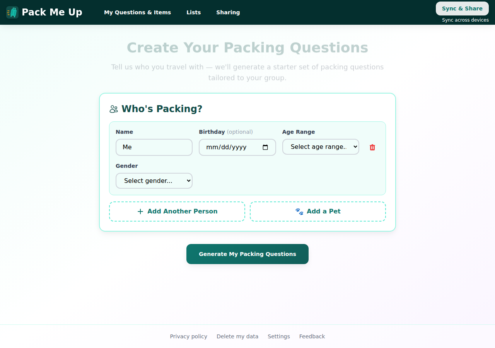
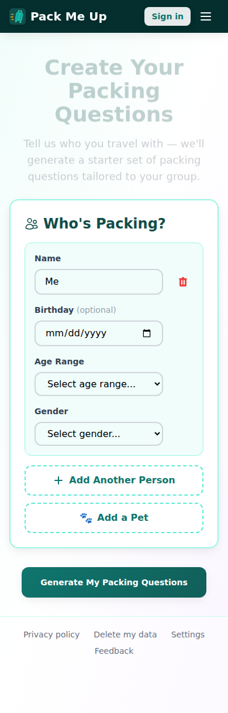
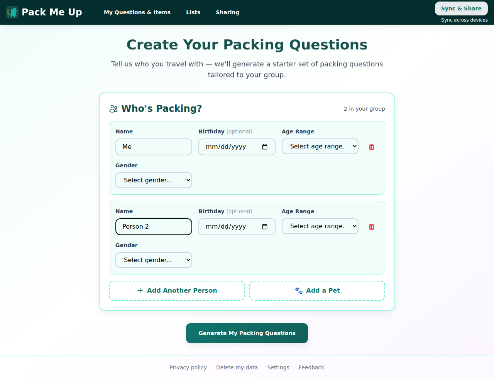
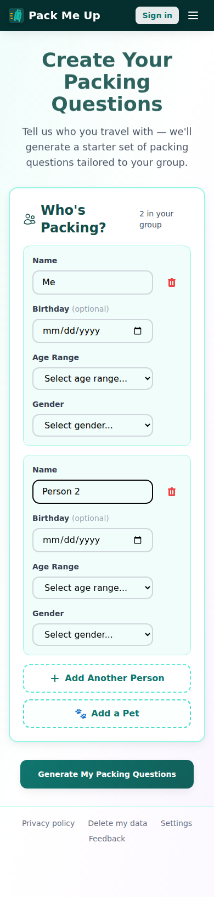
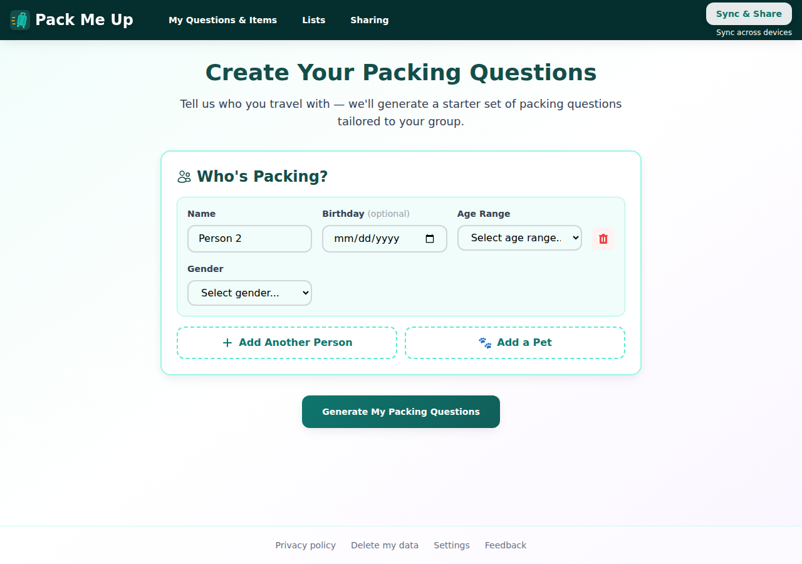
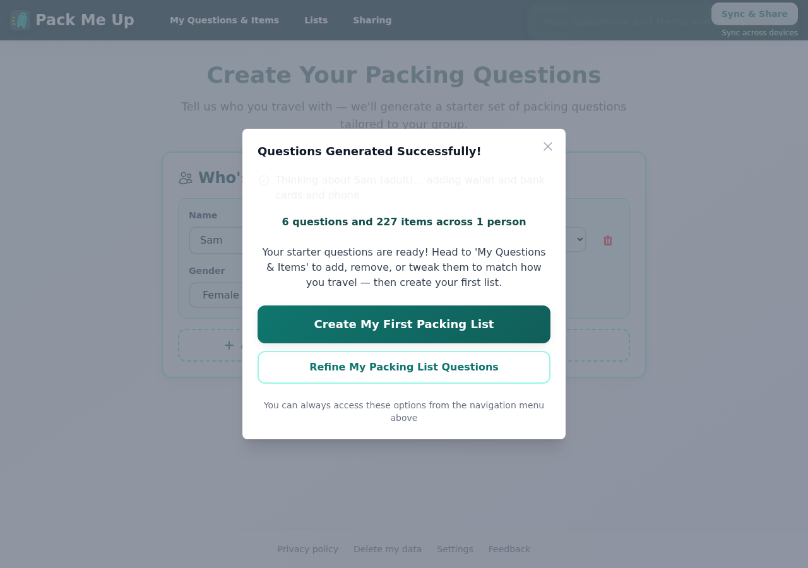
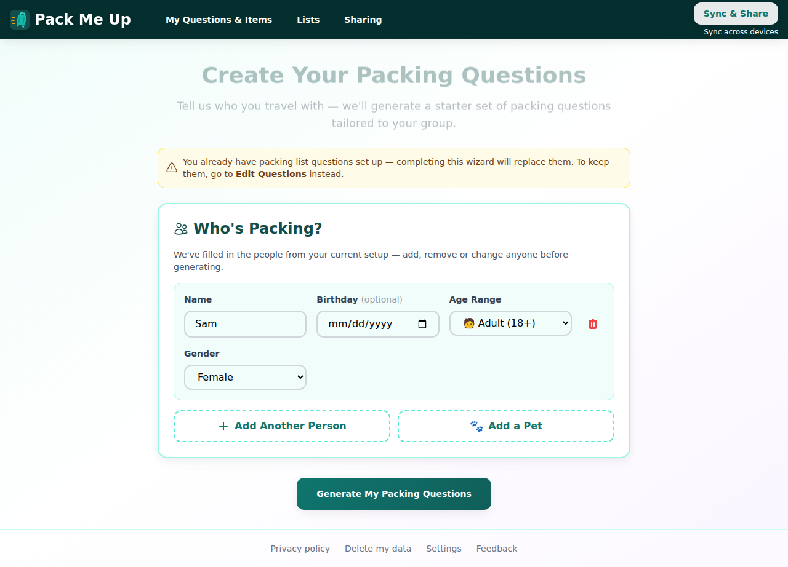
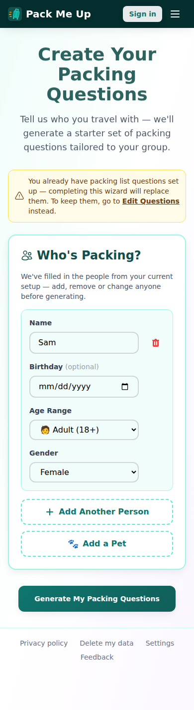
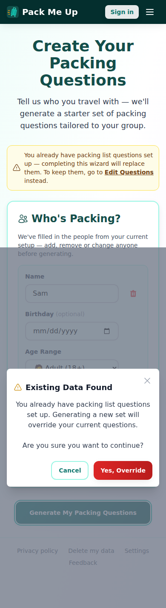

# Manual test report — issue #338

| | |
|---|---|
| **Date** | 2026-09-08 |
| **Issue** | [#338 — Trim the wizard header: merge the two sub-headings and hide the group counter when there's one person](https://github.com/timgent/pack-me-up/issues/338) |
| **PR** | _see the PR that links to this report_ |
| **Branch** | `claude/issue-pickup-2g2zm0` |
| **Commit under test** | `2d4a42b` |
| **Result** | ✅ Pass — all four acceptance criteria met. No bugs found. |

## What changed

All three pieces of design feedback from the issue, in `src/pages/wizard.tsx`:

1. The two sub-headings under the `h1` are merged into one paragraph — the second, italic
   "Do this once to get started… fine-tune your questions" note is dropped entirely, since
   it describes a step the user hasn't reached and the success modal (#339) says the same
   thing on the very next screen.
2. The "N in your group" counter next to "Who's Packing?" now only renders once
   `fields.length > 1`, at every breakpoint — no more "1 in your group" for the default
   single-row case.
3. The existing-data warning collapses from a two-paragraph, `border-2` panel into a single
   flex row: icon, warning sentence and the "Edit Questions" link all on one line.

No deviations from the issue as written.

## How it was tested

- **Build**: `npm run build` → `npm run preview` on `http://localhost:4173` (the built app,
  not the dev server).
- **Solid server**: not needed — the wizard requires no sign-in (onboarding never asks for
  one), so this pass was local-only (PouchDB), no CSS instance running.
- **Browser**: pre-installed Chromium, driven directly via `playwright-core` (a standalone
  script, not the `@playwright/test` runner, to skip the e2e suite's `global-setup.ts` —
  which spins up a full Community Solid Server and seeds several pod accounts that this
  change has no need of). The script lived outside the repo and was deleted after the run;
  nothing was added to `e2e/`.
- **Viewports**: desktop **1280×900** and phone **390×844**.
- **State**: fresh (no existing data) and returning user (existing question set already
  saved locally).

> Note on tooling: a hash-only `page.goto()` to the same route (e.g. `/#/wizard` →
> `/#/wizard`) is a same-document navigation in this HashRouter app — it does **not**
> remount `Wizard`, so its mount-time `useEffect` (which checks for existing data) never
> re-runs. Getting the "returning user" state to show up for real required `page.reload()`
> instead of a second `page.goto()`. Not a bug in the app, just a gotcha for scripting this
> kind of check.

---

## AC1 — One paragraph under the h1

Fresh user, desktop — a single sentence, no second italic line:

Same on mobile:

`screen.queryByText(/do this once to get started/i)` returns null in the updated test, and
manually — that string does not appear anywhere on the page in either screenshot.

## AC2 — The group counter appears only at two or more entries

At 1 person (the default "Me" row) the counter is absent, both above. Clicking "Add Another
Person" brings it in at exactly 2:

Removing back down to 1 hides it again — not a one-way reveal:

## AC3 — Existing-data warning reduced to a single line

Generated a question set as a fresh user first (screenshot below), then reloaded `/wizard` to
see the returning-user state: one row — icon, sentence, inline "Edit Questions" link — instead
of the old two stacked paragraphs.

The "Edit Questions" link still resolves to `/manage-questions`, and the confirm dialog on
submit is unaffected by the rewrite — still fires with the same copy:

## AC4 — `wizard.test.tsx` updated

- The old "shows the one-time setup note" test (asserting on the now-removed copy) was
  rewritten to assert the merged paragraph is present *and* the dropped copy is gone.
- A new test covers the counter's boundary directly: absent at 1, `'2 in your group'` once a
  second person is added.
- The existing "keeps the default single row when the existing set has nobody left" test
  (1-person case from a wiped existing set) now also asserts the counter is absent.
- The pre-existing 3-person counter test (`'3 in your group'`) was left untouched — still
  correct behaviour above the 1-person threshold.

## Unhappy paths

| Path | Result |
|---|---|
| Add a 2nd person then remove them again | Counter appears at 2, disappears back to nothing at 1 — not sticky |
| Returning user dismisses nothing and clicks Generate directly | Confirm dialog still fires ("Existing Data Found" / "Yes, Override") before any data is replaced |
| Mobile, returning user, long callout text | Wraps to 3 lines on a 390px screen but stays one visual block (flex row), not two differently-styled paragraphs |

## Success criteria

| # | Criterion | Result |
|---|---|---|
| 1 | One paragraph under the h1 | ✅ Pass |
| 2 | The group counter appears only at two or more entries | ✅ Pass |
| 3 | Existing-data warning reduced to a single line | ✅ Pass |
| 4 | `src/pages/wizard.test.tsx` updated — assertions on the removed copy checked | ✅ Pass |

## Automated checks

| Check | Result |
|---|---|
| `npm test` (typecheck + vitest) | ✅ 124 files, **2260 tests** passed |
| `npm run build` | ✅ clean production build |

e2e (`playwright test`) was not run for this pass — the change is UI-only, covered by the
updated component tests, and running the full suite would have required standing up the
Community Solid Server for no additional coverage relevant to this change.

## Bugs found

None.
