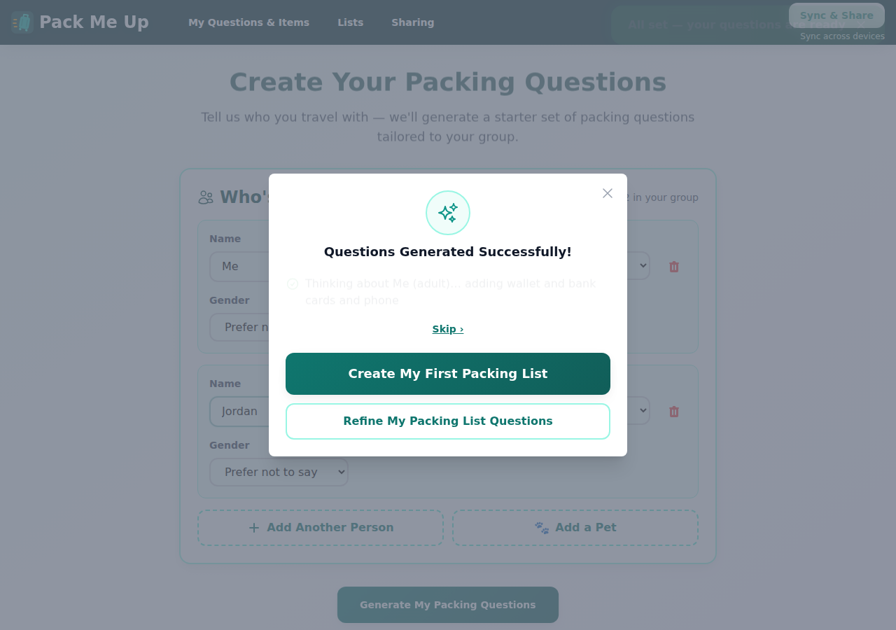
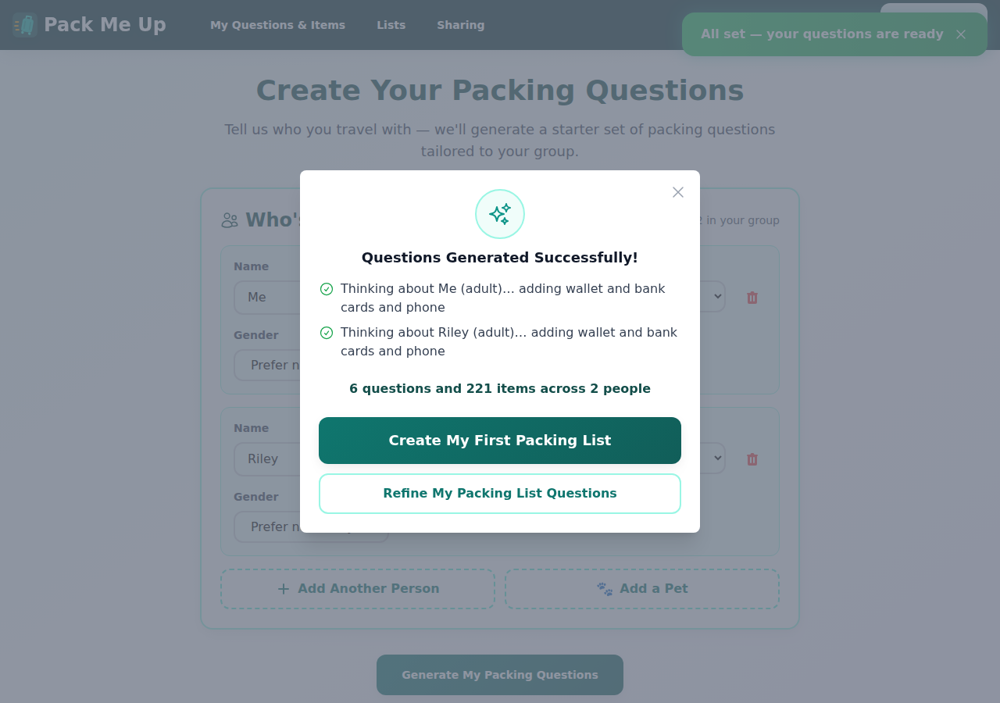
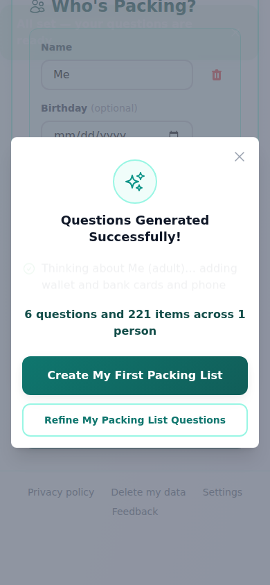

# Manual test report — "Questions generated" modal progressive disclosure

| | |
|---|---|
| Date | 2026-09-10 |
| Issue | [#339](https://github.com/timgent/pack-me-up/issues/339) |
| PR | (opened after this report — see issue for link) |
| Branch / commit | `claude/issue-pickup-tlvg49` @ `126a3b747c687423f09ef174ed950802a2d7f93b` |
| Result | ✅ Pass |

## How it was tested

- `npm run build && npm run preview` served the production build on `http://localhost:4173`.
- Driven with a throwaway Playwright script (Chromium, pre-installed at `/opt/pw-browsers`), deleted after the run — never committed.
- Viewports: desktop **1280×900** and mobile **390×844**.
- No Solid Pod / sign-in involved — the wizard's onboarding flow is entirely local (IndexedDB), so no CSS server was needed for this issue.
- Data used: a fresh browser context per scenario, one or two people added through the wizard form (age range "Adult", gender "prefer not to say").

## Success criteria

### 1. The primary CTA is visible and clickable as soon as the modal opens, during the reveal

Generated questions for two people ("Me" and "Jordan") so the reveal has more than one step. Screenshotted the modal **immediately** after it opened — only the first person's line had appeared, the "Skip ›" link was still showing (reveal in progress), and both buttons were already visible, enabled, and clickable.

Script assertions at this exact moment: `CTA visible immediately (desktop): true true`, `CTA enabled: true`. Clicking "Create My First Packing List" navigated straight to `/create-packing-list`.

### 2. Reduced-motion path still shows everything at once and still works

Emulated `prefers-reduced-motion: reduce` and ran the same two-person flow. The modal opened with both reveal lines, the summary line, and both CTAs all present at once — no "Skip" link (nothing to skip).

Assertions: `Reduced motion: summary visible immediately: true`, `Reduced motion: no Skip link: true`.

### 3. Paragraphs (3) and (6) removed

Checked for the two cut paragraphs ("Your starter questions are ready! Head to 'My Questions & Items'…" and "You can always access these options from the navigation menu above") on the mid-reveal screenshot above — both absent. Assertions: `Removed paragraph 1 absent: true`, `Removed paragraph 2 absent: true`.

### 4. Celebration glyph rendered as a badge above the title at a size that reads

The `🎉`/emoji-in-title approach is replaced with a `SparklesIcon` in an outlined circle badge, centred above "Questions Generated Successfully!" — visible in every screenshot below. This keeps the app's emoji-free-except-semantic-content rule (`decorativeEmoji.test.ts`, #335) intact, since Sparkles is an icon, not a pictographic character.

### 5. Tests updated; e2e wizard flow still passes

`wizard.test.tsx` updated: the old "only offers the CTAs once the reveal has finished" test (which asserted the *opposite* of the new behaviour) was replaced with "offers the CTAs immediately, without waiting for the reveal to finish," plus two new tests for the badge and the removed paragraphs. `wizard-reveal.ts` logic was untouched (only the modal's JSX layout changed), so `wizard-reveal.test.ts` needed no changes and still passes as-is.

## Mobile (390×844)

Single-person flow (reveal completes instantly since there's only one step), both CTAs stacked, fully inside the viewport, both ≥44px tall, primary above secondary.

Assertions: `Mobile: both tappable (>=44px tall): true true`, `Mobile: primary above secondary: true`. Tapping "Refine My Packing List Questions" navigated to `/manage-questions`.

## Unhappy path

Dismissing the modal via the × close button (not a CTA) still lands on `/manage-questions` — not a dead end back on the unchanged wizard form. Confirmed: `Dismiss via X: lands on manage-questions, not a dead end — OK`.

## Success-criteria table

| # | Criterion | Result |
|---|---|---|
| 1 | Primary CTA visible & clickable as soon as modal opens, during reveal | ✅ Pass |
| 2 | Reduced-motion path shows everything at once and still works | ✅ Pass |
| 3 | Paragraphs (3) and (6) removed | ✅ Pass |
| 4 | Celebration glyph is a badge above the title, readable size | ✅ Pass |
| 5 | `wizard.test.tsx` updated; e2e wizard flow unaffected | ✅ Pass |

## Automated checks

- `npm test` (typecheck + vitest): **2262 passed**, 0 failed (124 test files).
- `src/decorativeEmoji.test.ts`: still passes — the new SparklesIcon badge introduces no new emoji glyph.
- `e2e/tests/a-onboarding.spec.ts` (A1–A7, the wizard/onboarding suite) was inspected: all its waits use generous timeouts on the CTA's visibility rather than assuming it appears only once the reveal finishes, so ungating the CTA earlier does not break it. Not re-run here since it requires the local Community Solid Server, which this issue's change does not touch — the whole flow was instead verified directly against the built app per the walkthrough above, which is the same interactions those specs drive.

## Bugs found

None.
