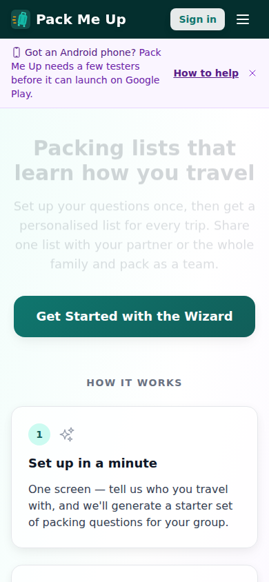
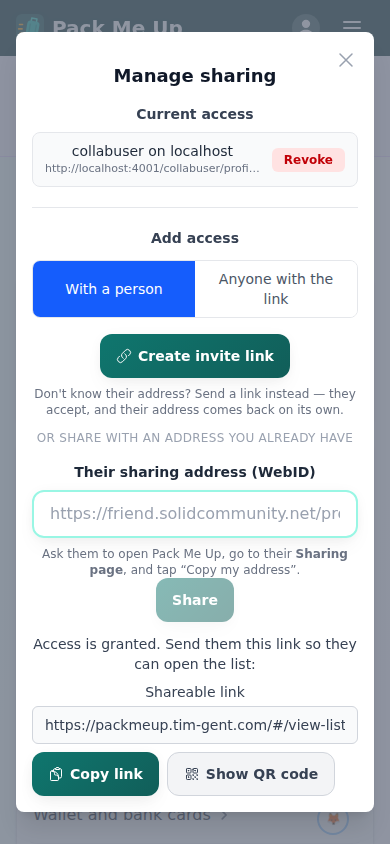
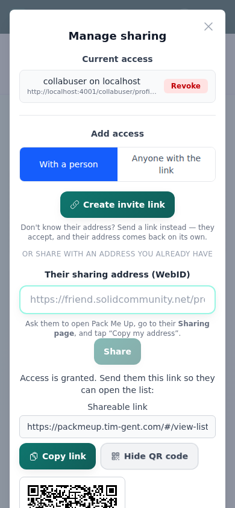
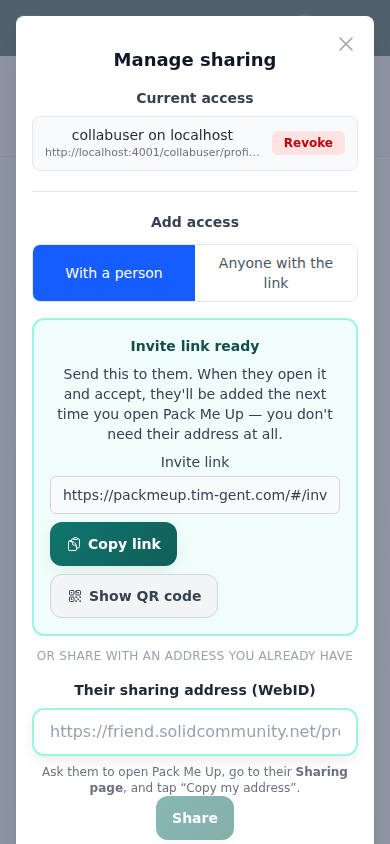
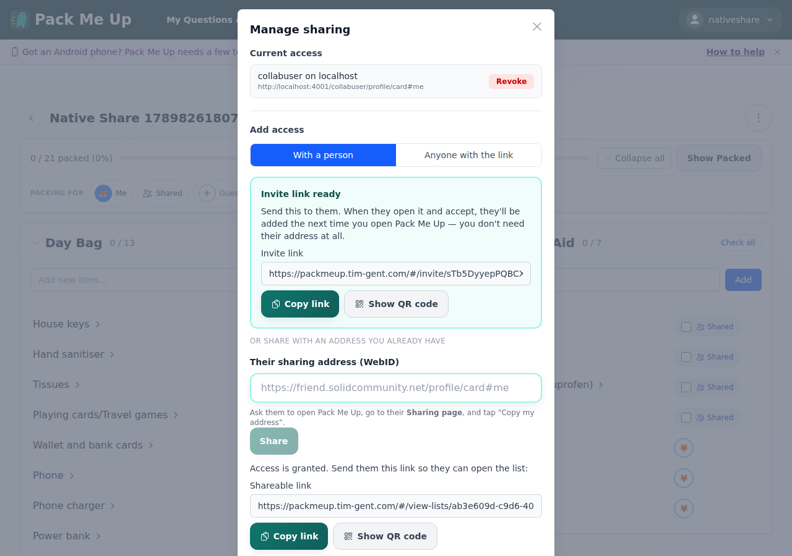
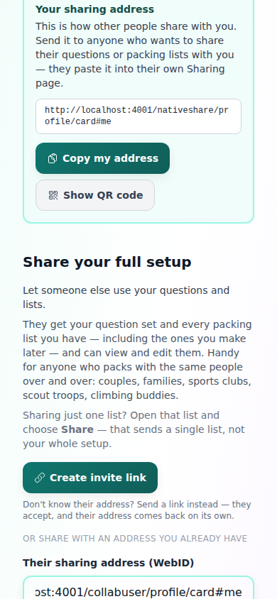
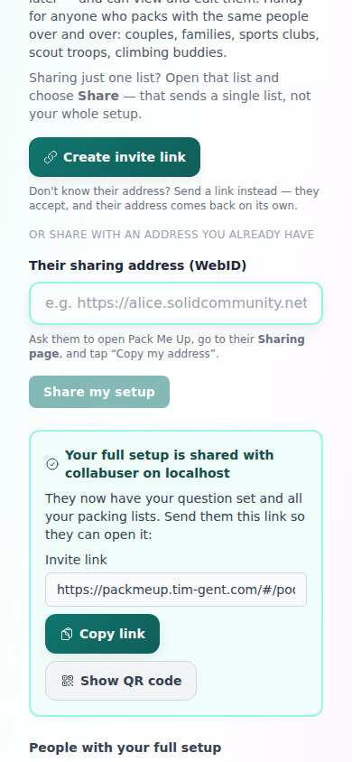
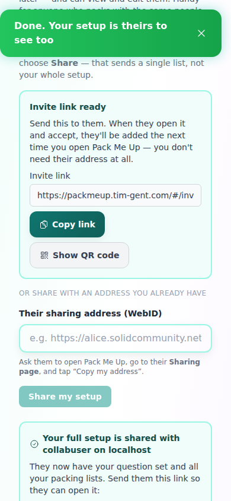
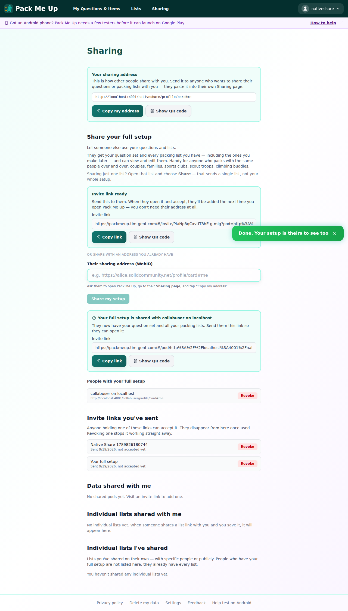

# Manual test report — share links created in the native app

| | |
|---|---|
| Date | 2026-09-19 |
| Issue | [#357](https://github.com/timgent/pack-me-up/issues/357) |
| PR | (opened after this report — see issue for link) |
| Branch / commit | `claude/issue-357-ax4d9m` @ `33dd9bc00778a3e49b57c7c3515a7dac7f4b6d98` |
| Result | ✅ Pass |

## What the issue is

Both share flows produced links starting `https://localhost/#/…` when used from the
Android or iOS app. The grants behind them were always correct — only the address was
wrong, which is why the tester reasonably concluded sharing was local-only.

`https://localhost` is the runtime origin Capacitor gives the native shell
(`capacitor.config.ts` sets the https scheme on both platforms). The share-link builders
read `window.location.origin`, which is the app's public address on the web and the
phone itself in the shell.

## How it was tested

The interesting condition is *the origin the app is served from*, so the built app was
served over HTTPS on port 443 — making the page origin exactly `https://localhost`, with
no port, the same string Capacitor produces. Nothing was stubbed in the app: it was
asked, in the browser, what its origin was, and it answered `https://localhost`.

- `npm run build`, served from a local Node HTTPS server on port 443 with a self-signed
  certificate and SPA fallback.
- A real Solid Pod: Community Solid Server on `http://localhost:4001`, with a dedicated
  account (`nativeshare`) created for this run so no e2e suite's pod was touched. Signed
  in for real through the CSS OIDC flow — no mocked session.
- Driven with a throwaway Playwright spec (Chromium, pre-installed at `/opt/pw-browsers`),
  deleted after the run and never committed.
- Viewports: mobile **390×844** for the share flows (this is a phone bug), desktop
  **1280×900** for the same surfaces.
- Sign-in itself was driven at desktop width: the account menu — the signed-in sentinel
  every suite waits for — only renders in `nav-bar-desktop`. Nothing about signing in
  differs; all four share surfaces were then exercised at phone width.

The app really is running at the native origin, and the banner and layout are the phone's:



## Success criteria

The issue names two share flows. Since it was filed, a third and fourth surface arrived
on `main` (invite links, #365) — both built their links the same way, so both are
covered here.

### 1. Sharing one list produces a link that is not `localhost`

Shared a packing list with `collabuser`'s WebID from the list's Share dialog. The
Shareable link field reads `https://packmeup.tim-gent.com/#/view-list…`:



Full value logged during the run:

```
https://packmeup.tim-gent.com/#/view-lists/ab3e609d-c9d6-4038-9e3f-94a48d29ca8d?pod=http%3A%2F%2Flocalhost%3A4001%2Fnativeshare%2F&owner=http%3A%2F%2Flocalhost%3A4001%2Fnativeshare%2Fprofile%2Fcard%23me
```

The `pod=` and `owner=` parameters still point at the Pod on `localhost:4001` — correct,
and worth being explicit about: the *app* origin is what changed, not the Pod address.
Against a real Pod those are that Pod's public URLs.

### 2. The QR code carries the same corrected link

The QR code is the other way the link leaves a phone, and it encodes the same string
`ShareActions` is given:



### 3. An invite link for one list

"Create invite link" is the share path that needs nothing from the other person, so its
link is by definition opened on somebody else's device:



```
https://packmeup.tim-gent.com/#/invite/sTb5DyyepPQBCXLtLX0vnQ?pod=http%3A%2F%2Flocalhost%3A4001%2Fnativeshare%2F&owner=…&kind=list&label=Native+Share+…
```

The same dialog at desktop width:



### 4. Sharing the whole setup produces a link that is not `localhost`

From the Sharing page, granted `collabuser` access to the full setup:





```
https://packmeup.tim-gent.com/#/pod/http%3A%2F%2Flocalhost%3A4001%2Fnativeshare%2F/view-lists?owner=http%3A%2F%2Flocalhost%3A4001%2Fnativeshare%2Fprofile%2Fcard%23me
```

### 5. An invite link for the whole setup

Created from the same page, below the grant:



```
https://packmeup.tim-gent.com/#/invite/PIaNp8qCxvtIT8hE-g-mIg?pod=http%3A%2F%2Flocalhost%3A4001%2Fnativeshare%2F&owner=…&kind=full-setup
```

The whole page at desktop width:



### 6. Your own sharing address is unaffected

Worth checking, because it sits next to the links that changed: "Your sharing address"
shows `http://localhost:4001/nativeshare/profile/card#me` — the Pod's WebID, which is not
built from the app origin and correctly did not change (visible in screenshot 06).

### 7. A web origin still links to itself

The fix must not point a preview deploy or a dev build at production, or a reviewer can
never open what they just shared. Covered by the e2e suites below, which run at
`http://localhost:4173` and navigate the links they generate — they still pass, which
they could not do if the links had been rewritten to the public host.

## Success criteria table

| # | Criterion | Result |
|---|-----------|--------|
| 1 | Single-list share link is not `localhost` | ✅ Pass |
| 2 | QR code carries the corrected link | ✅ Pass |
| 3 | Single-list invite link is not `localhost` | ✅ Pass |
| 4 | Whole-setup share link is not `localhost` | ✅ Pass |
| 5 | Whole-setup invite link is not `localhost` | ✅ Pass |
| 6 | Own sharing address (a Pod WebID) unchanged | ✅ Pass |
| 7 | A web origin still links to itself | ✅ Pass |

## Automated checks

| Check | Result |
|-------|--------|
| `npm test` (typecheck + 145 files) | ✅ 2485 passed |
| `npx eslint` on the changed files | ✅ clean |
| E2E: L (sharing), M (collaboration), N (invite links), Z (offline share) | ✅ 20 passed (40.3s) |
| Throwaway native-origin spec (3 scenarios above) | ✅ 3 passed |

The regression guard the issue asked for is `src/services/shareLinks.test.ts`: it stubs
`window.location.origin` to `https://localhost`, runs every builder of a link that leaves
the device, and asserts none of them leaks it. Because `buildInviteLink` takes its origin
as an argument, a list of builders cannot catch a call site that passes the wrong one, so
`CreateInviteLink.test.tsx` renders the component with the origin stubbed and fails if the
rendered link carries it. That test was confirmed to fail when the fix is reverted.

## Bugs found

**One, and it is fixed in this branch.** The invite-link feature (#365) merged into `main`
while this issue was being worked on, and `CreateInviteLink` built its link with
`window.location.origin` — the identical defect on a surface that did not exist when #357
was filed. Both invite surfaces (list and whole setup) were affected. Found by re-reading
the merged code after rebasing, fixed in commit `33dd9bc`, and now covered by the guard
above.

Nothing else surprising. Two notes from driving it:

- The Sharing page has two fields both labelled "Invite link" once a setup has been shared
  *and* an invite created — the granted share's and the invite's. Not a bug (they are in
  clearly labelled panels) but it makes them awkward to tell apart by accessible name.
- The whole-setup grant takes a noticeable few seconds against CSS, with the button in a
  "Sharing…" state throughout. It is doing real ACL work on several containers, and the
  UI does say so.
