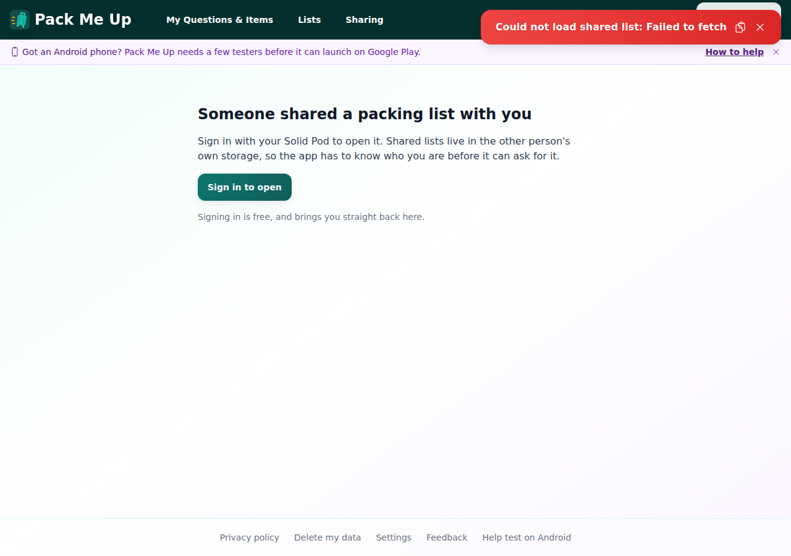
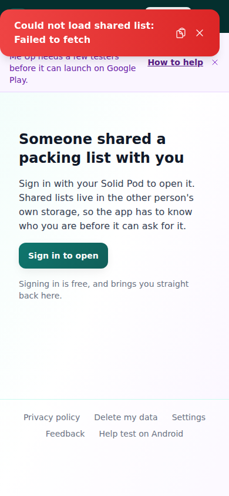
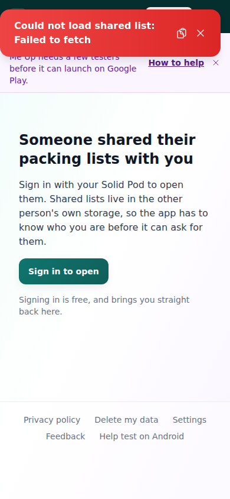

# Manual test report — Issue #359: Handle deep links so shared links open in the installed app

| | |
|---|---|
| Date | 2026-09-26 |
| Issue | https://github.com/timgent/pack-me-up/issues/359 |
| PR | (opened after this report — see PR description for link) |
| Branch / commit | `claude/issue-pickup-kj775f` @ `054d63715c2994dc73a675f5d97734109cf0c78b` |
| Result | **Pass, with a real limitation stated below** |

## What this feature is, and why the test approach is unusual

This issue is about getting Android/iOS to route a tapped share link into the
installed app instead of the browser, and about the app then turning that
incoming link into the right in-app route. The first half (an Android
`intent-filter` + `assetlinks.json`, an iOS Associated Domains entitlement +
`apple-app-site-association`) is OS-level behaviour that only exists on a
real device/emulator with the app actually installed and signed. **This
sandbox has no Android SDK/emulator and no macOS/Xcode** (confirmed:
`adb`/`emulator` are not on `PATH`, no `ANDROID_HOME`, no iOS simulator), so
that half cannot be exercised here — this is stated plainly rather than
glossed over, per the instruction to say so explicitly when something can't
be tested.

What *can* be verified in this sandbox, and was:

1. The pure routing logic (`routeFromDeepLink`/`installDeepLinkHandler` in
   `src/services/deepLinks.ts`) that turns an incoming URL into a hash
   HashRouter can act on — via automated tests (below) plus manual inspection
   of the wiring in `main.tsx`.
2. That the two destination routes any deep link would ultimately land on
   still behave exactly as before — driven for real in a built, served
   version of the app.
3. That the two new static files the OS fetches to verify domain ownership
   are actually served, with the right content.

## How it was tested

- Build: `npm run build` (production build, same as CI/deploy).
- Server: `npm run preview` on `http://localhost:4173`.
- Driver: Playwright (pre-installed Chromium at `/opt/pw-browsers/chromium`),
  via a throwaway script — not a committed e2e spec, deleted after the run.
- Viewports: 1280×900 (desktop) and 390×844 (mobile).
- No Solid pod/account needed — both destination routes render their
  signed-out state, which is exactly what's being checked (see below).

## Automated checks

- `npm test` (typecheck via `tsc -b`, then the full vitest suite): **149
  test files, 2515 tests, all passing**, including the 11 new tests in
  `src/services/deepLinks.test.ts` written test-first (red confirmed before
  `deepLinks.ts` existed, green after).

## Success criteria

The issue lists two payoffs and a suggested four-step approach. Going
through each:

### 1. A `VIEW` intent-filter + `assetlinks.json` for Android

Added to `android/app/src/main/AndroidManifest.xml` (a separate
`autoVerify="true"` filter, kept apart from the `MAIN`/`LAUNCHER` one per
Android App Links convention) and `public/.well-known/assetlinks.json`.
Verified the manifest XML is well-formed (`xmllint --noout`, passed) and that
the JSON file is actually reachable once built and served:

```
$ curl -o /dev/null -w "%{http_code}\n" http://localhost:4173/.well-known/assetlinks.json
200
```

**Not verifiable here**: real App Links *verification* (the OS confirming the
claim) needs the app signed with real Play App Signing credentials — the
`sha256_cert_fingerprints` value is a placeholder (see `docs/deep-linking.md`
for exactly what's needed and how to check verification once it's real).

### 2. iOS Associated Domains + `apple-app-site-association`

Added `ios/App/App/App.entitlements` (declares
`applinks:packmeup.tim-gent.com`) and wired `CODE_SIGN_ENTITLEMENTS` into
both the Debug and Release build configs in `project.pbxproj` — verified by
grepping the result and confirming brace/paren balance is unchanged (no
Xcode available in this sandbox to do a real build check). Added
`public/.well-known/apple-app-site-association` plus a new `vercel.json`
header rule, since the AASA file has no extension and would otherwise be
served as `application/octet-stream`:

```
$ curl -o /dev/null -w "%{http_code}\n" http://localhost:4173/.well-known/apple-app-site-association
200
```

**Not verifiable here**: same reasoning as Android — needs a real Apple Team
ID and Xcode's signing UI, neither available in this sandbox.

### 3. `appUrlOpen` listener mapping the incoming URL onto the router

`src/services/deepLinks.ts`'s `installDeepLinkHandler`, wired into
`main.tsx`. Covered by 11 unit tests mirroring the existing
`appResume.test.ts` (Capacitor mocking) and
`capability/openInvocation.test.ts` (`installOpenInvocationHandler`'s
`history.replaceState` + synthetic `popstate` pattern, reused rather than
reinvented) styles. All pass — see Automated checks above.

### 4. The two sharing entry points still work when reached this way

`ForeignPodLayout` (`/pod/:encodedPodUrl/view-lists`) and `view-packing-list`
with `?pod=` (`/view-lists/:id?pod=...`) needed no code changes — the deep
link handler only changes *how* the hash gets set, not what the router does
with it. Confirmed by navigating directly to both routes in the built,
served app, signed out, on both viewports:

**Desktop, `/view-lists/:id?pod=...`** (the shape a shared-list link
resolves to):



**Desktop, `/pod/:id/view-lists`** (the shape a shared-setup link resolves
to):


**Mobile, `/view-lists/:id?pod=...`**:



**Mobile, `/pod/:id/view-lists`**:



All four show `SharedAccessHelp`'s signed-out state ("Someone shared a
packing list/their packing lists with you" → "Sign in to open"), matching
current, unchanged behaviour. The red "Could not load shared list: Failed to
fetch" toast in the list screenshots is pre-existing behaviour from
`pod.example.com` not existing — not something this change touched, and it
doesn't interfere with `SharedAccessHelp` rendering.

## Success-criteria table

| Criterion | Result |
|---|---|
| Android `VIEW` intent-filter + `assetlinks.json` added, manifest well-formed, JSON served | ✅ Pass |
| iOS Associated Domains entitlement + `apple-app-site-association` added, wired, JSON served with correct content-type | ✅ Pass |
| `appUrlOpen` → router wiring, TDD, unit-tested | ✅ Pass (11/11 new tests) |
| Existing sharing destination routes unaffected (desktop + mobile) | ✅ Pass |
| Full test suite green | ✅ Pass (2515/2515) |
| Real on-device App Links / Universal Links verification | ⛔ Not testable in this sandbox (no Android SDK/emulator, no macOS/Xcode) — see `docs/deep-linking.md` for the concrete follow-up steps and device-testing recipe once real signing credentials are in place |

## Bugs found

None.
