# Manual test report — issue #360: controls before their explanations

| | |
|---|---|
| **Date** | 2026-09-26 |
| **Issue** | [timgent/pack-me-up#360](https://github.com/timgent/pack-me-up/issues/360) |
| **PR** | [timgent/pack-me-up#375](https://github.com/timgent/pack-me-up/pull/375) |
| **Branch / commit** | `claude/keen-bardeen-cdykrn` @ `09ca5ec` |
| **Result** | ✅ Pass |

## How it was tested

- `npm run build` + `vite preview` (http://localhost:4173), the production bundle.
- A local Community Solid Server on port 4001, started by the e2e global setup, so sign-in and the full-setup grant were real rather than mocked.
- Signed in as `luser`, and shared with `collabuser` by address. Afterwards the grant and the invite were both revoked, so the Pod was left as it was.
- Viewports: desktop 1280×900 and phone 390×844.
- Driven by a throwaway Playwright script, which was deleted and not committed.

## 1. Settings: the theme control sits straight under its heading

The three lines about how System works are gone. The control's own labels carry it.

| Desktop | Dark selected | Phone |
|---|---|---|
| 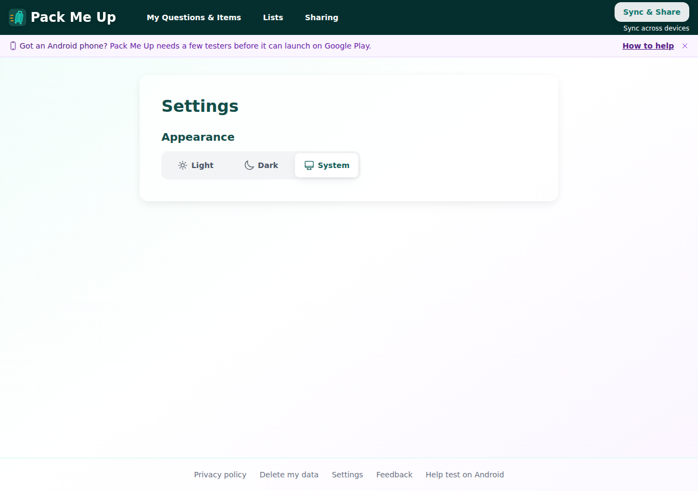 | 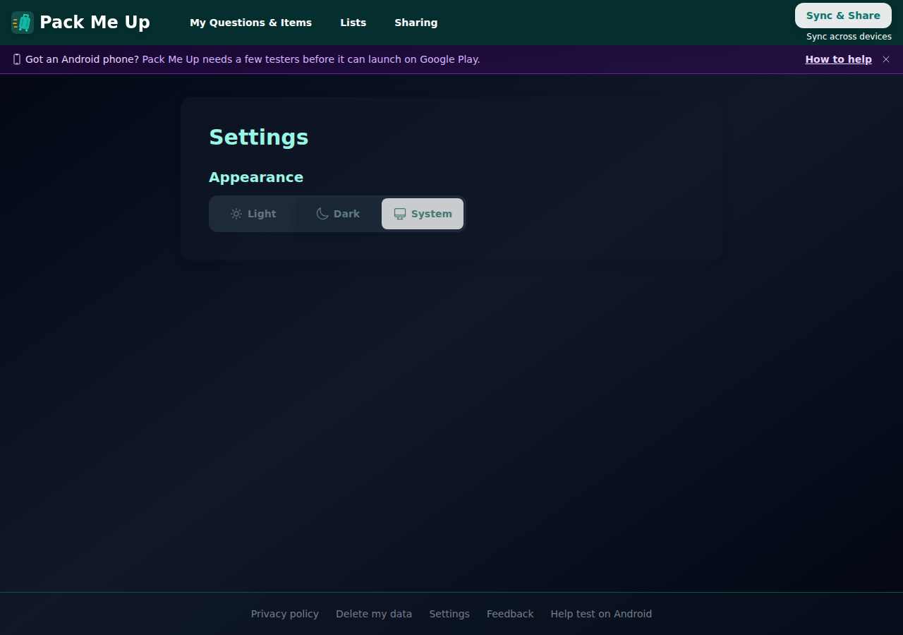 | 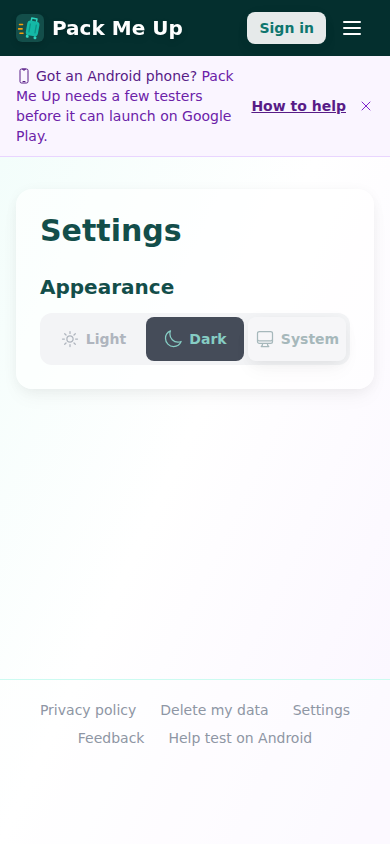 |

## 2. Sharing, signed out: the button comes first

*Sign in to share your setup* sits directly under the heading. What gets shared, and the "stays on this device" reassurance, follow it as secondary text.

| Desktop | Phone |
|---|---|
| 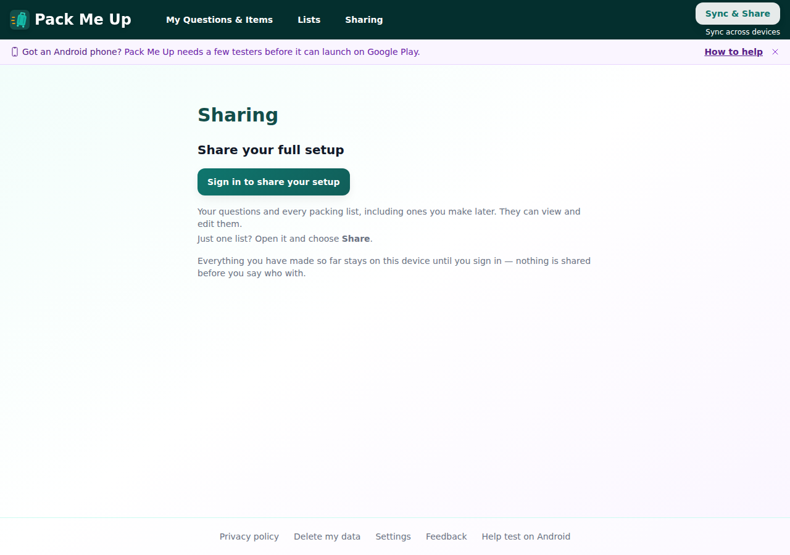 | 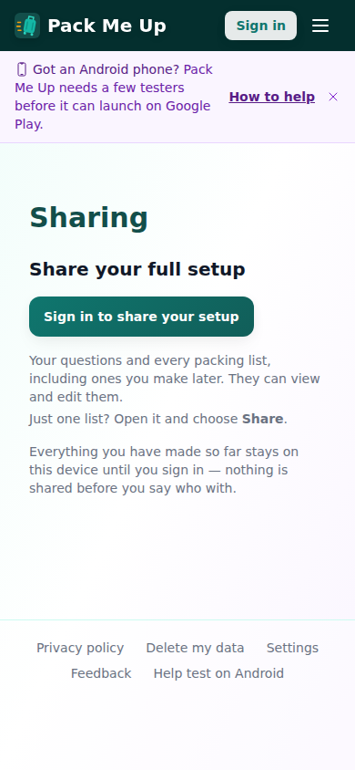 |

## 3. Sharing, signed in: the button comes first

*Create invite link* sits directly under the heading. Two sentences follow it as secondary text: "including ones you make later", "They can view and edit them" and "Just one list?". I kept them because the page can't convey these any other way.

| Desktop | Phone |
|---|---|
| 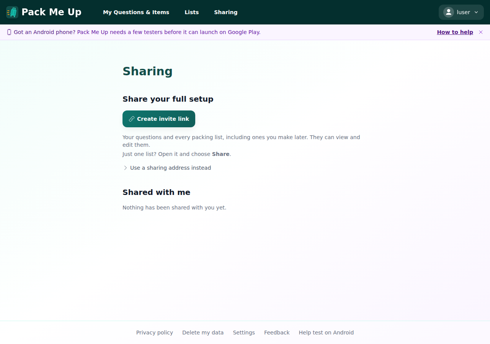 | 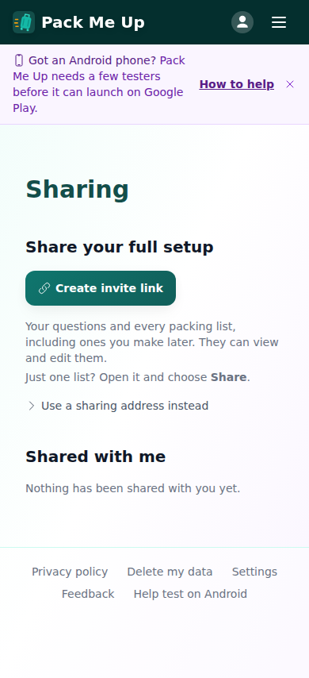 |

## 4. Invite link ready: the link first, then the wait

The link and its Copy/QR buttons come first. Under them: "Once they accept, they're added the next time you open Pack Me Up." I dropped "Send this to them." because the buttons already say it.

| Desktop | Phone |
|---|---|
| 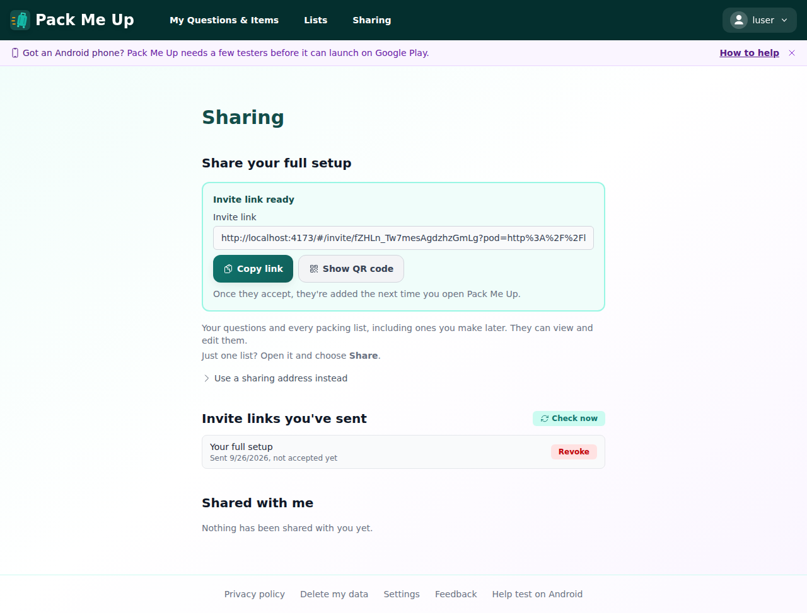 | 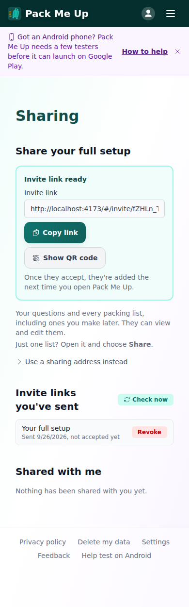 |

## 5. Share by address: your own address, then the confirmation

"Your own address" now shows the address and its buttons before the sentence explaining it. After *Share my setup*, the banner names the person and shows the link, with "Send them this link so they can open it." underneath. The old restatement, "They now have your question set and all your packing lists", is gone because the banner heading says it.

| Your own address | Shared (desktop) | Shared (phone) |
|---|---|---|
| 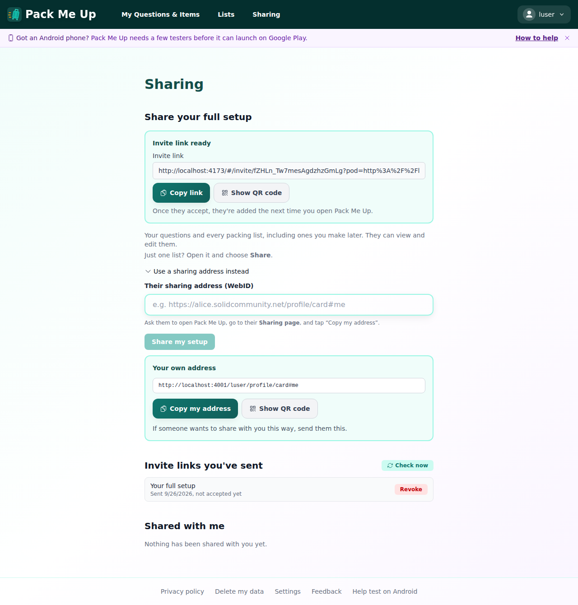 | 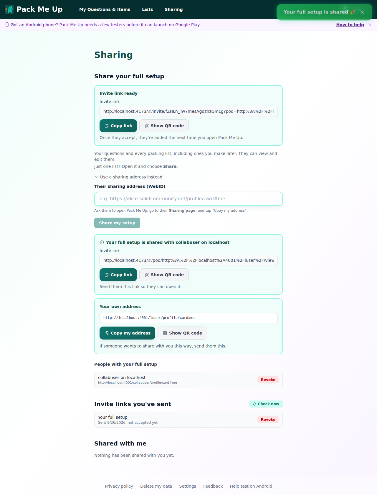 | 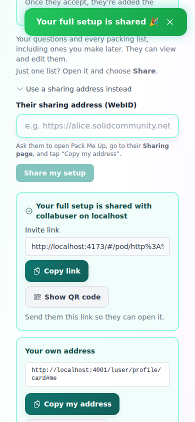 |

## 6. Unhappy path / cleanup: revoke

Revoking the collaborator cleared the banner, and revoking the invite removed the "Invite links you've sent" section.

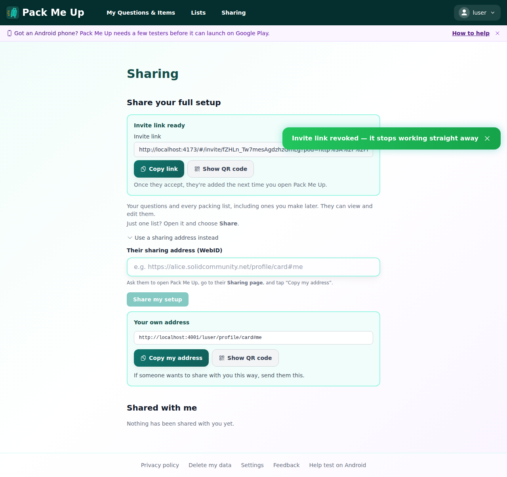

## Success criteria

| Criterion (from the issue) | Result |
|---|---|
| Settings: the Appearance paragraph is removed and the control speaks for itself | ✅ |
| Sharing: control first, explanation as secondary text below | ✅ |
| Sharing: sentences that teach something you can't guess are kept (later lists, edit access, single-list sharing, the invite wait) | ✅ |
| Sharing: redundant restatements are demoted or removed | ✅ |
| Not an app-wide copy pass: only these two pages and the components they render | ✅ |
| Works at desktop and phone widths, with no overflow | ✅ |

## Automated checks

- `npm test` (typecheck + vitest): **153 files, 2608 tests passed**
- New ordering tests: `settings.test.tsx`, `sharing-settings.test.tsx` (×3), `CreateInviteLink.test.tsx`, `YourSharingAddress.test.tsx`. All were seen failing before the change.
- e2e C17 was updated for the reworded intro. I didn't run the full e2e suite, only this walkthrough against the same CSS setup.

## Bugs found

None.
