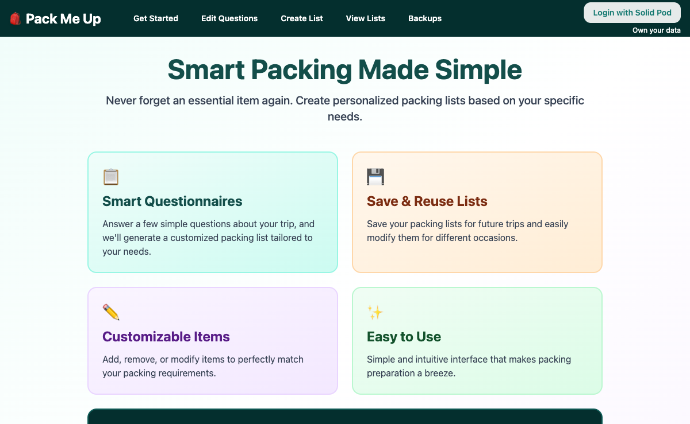
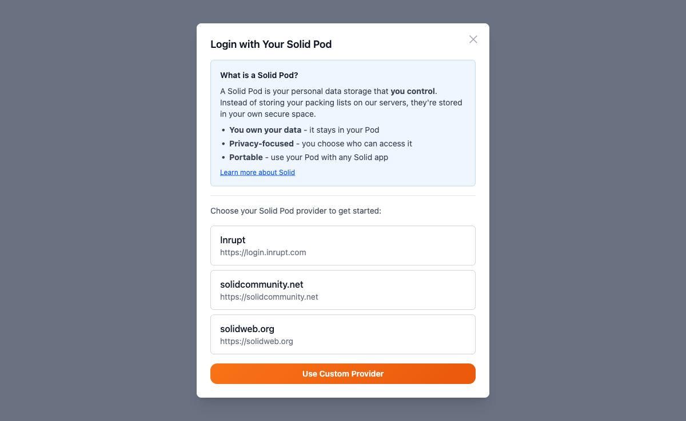
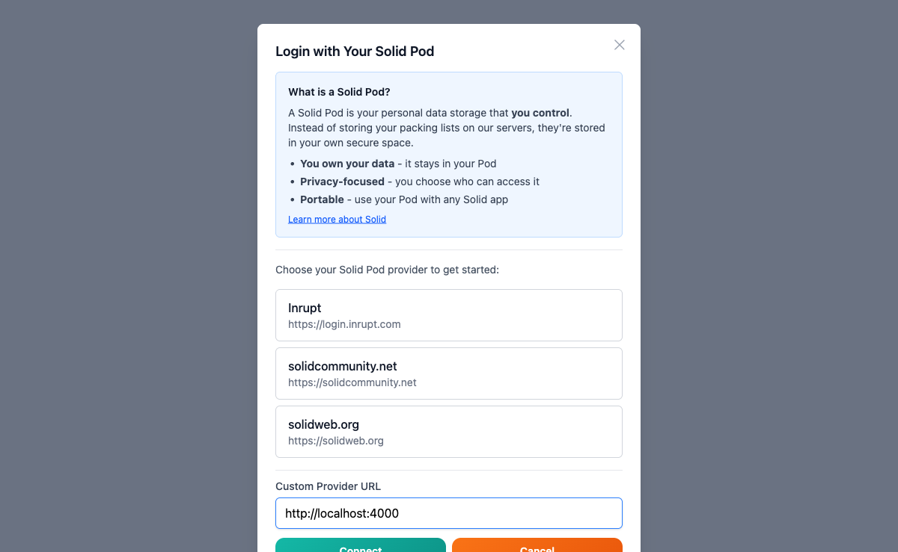
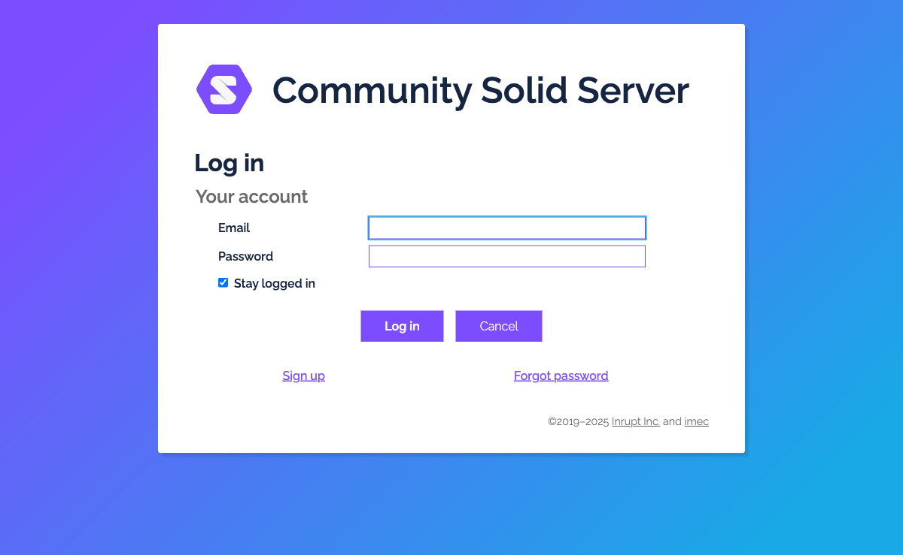
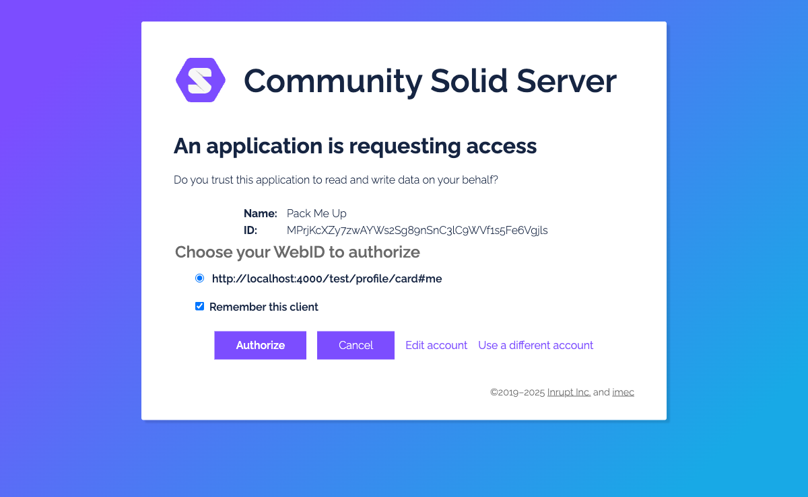
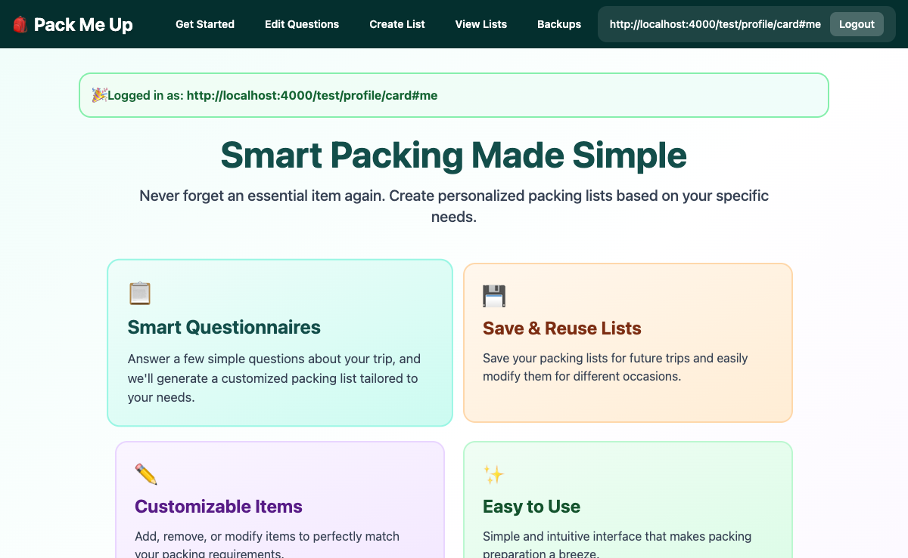

# Login Flow — Manual E2E Test

**Date:** 2026-03-18
**Environment:** Local — Vite dev server (port 5173) + Community Solid Server in-memory (port 4000)
**Test account:** `test@example.com` / `test1234`
**WebID:** `http://localhost:4000/test/profile/card#me`

---

## Setup

Started using the `solid-dev` skill, which runs Community Solid Server and provisions a test account automatically. See `.claude/skills/solid-dev/`.

> **Note:** The CSS v7 account registration API differs from what `start.sh` currently uses — the script needs updating to use account-specific URLs (see [issue](#known-issues)). Account was provisioned manually for this test run.

---

## Steps & Results

### 1. Landing page (logged out)

Navigated to `http://localhost:5173`. The app loads correctly with a "Login with Solid Pod" button in the top-right corner.

**Result:** PASS

---

### 2. Provider selector modal

Clicked "Login with Solid Pod". A modal appears explaining what a Solid Pod is and offering three pre-configured providers plus a "Use Custom Provider" option.

**Result:** PASS

---

### 3. Custom provider URL entry

Clicked "Use Custom Provider". A text field appears inline. Entered `http://localhost:4000` and clicked "Connect".

**Result:** PASS

---

### 4. CSS login page (OIDC redirect)

The app redirected to the Community Solid Server login page at `http://localhost:4000/.account/login/password/`. The full OIDC redirect flow is working correctly.

**Result:** PASS

---

### 5. Consent screen

After entering `test@example.com` / `test1234` and clicking "Log in", CSS displayed a consent screen asking to authorize "Pack Me Up" to read/write data on behalf of WebID `http://localhost:4000/test/profile/card#me`.

**Result:** PASS

---

### 6. Logged in — landing page

After clicking "Authorize", the app redirected back to `http://localhost:5173` and displayed:
- WebID in the nav bar: `http://localhost:4000/test/profile/card#me`
- A "Logout" button replacing the login button
- A success banner: "🎉 Logged in as: http://localhost:4000/test/profile/card#me"

**Result:** PASS

---

### 7. Logout

Clicked "Logout". The session was cleared, the nav bar reverted to the "Login with Solid Pod" button, and the app returned to the logged-out state.

**Result:** PASS

---

## Known Issues

### `start.sh` uses outdated CSS v7 account API

CSS v7 changed the account registration flow. The current `start.sh` sends `POST /.account/` and `POST /.account/pod/` but those endpoints no longer work as expected. The correct v7 flow is:

1. `POST /.account/account/` — create account, get `authorization` token
2. `POST /.account/account/{id}/login/password/` — register email/password using that token
3. `POST /.account/account/{id}/pod/` — create pod using that token

The `start.sh` script should be updated to use this three-step flow.

### "Session expired" toast on intentional logout

Immediately after clicking Logout, a toast briefly appeared saying _"Your Solid session has expired. Your data is saved locally — log in again to sync with your Pod."_ This is the wrong message for an intentional logout (though it disappeared quickly). This may be a pre-existing race condition between the logout event and session-expiry detection.

---

## Summary

| Step | Result |
|---|:---:|
| Landing page loads | PASS |
| Login modal opens | PASS |
| Custom provider URL accepted | PASS |
| OIDC redirect to CSS | PASS |
| Login with email/password | PASS |
| Consent screen shown | PASS |
| Redirect back and session established | PASS |
| Logout clears session | PASS |
